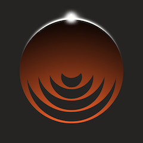

# Phathom

<p align="center">
  
</p>

**Phathom** is a **local-first iOS “personal brain”**: capture links, notes, and media into your own library, run **on-device** analysis with **Llama.cpp**, and manage a capped **Focus Stack** for what you’re committed to read now—without sending your content to the cloud.

**For agents:** start at **[`AGENTS.md`](AGENTS.md)** → **[`docs/agents/product-state.md`](docs/agents/product-state.md)** (what shipped now). Domain glossary: **[`CONTEXT.md`](CONTEXT.md)**.

## Tab bar

**Library · Notebook · Focus · Add New** — the **Focus** tab replaced the former Chat placeholder (see [Roadmap](#roadmap)).

## Product features

- **Capture**: Add items from the in-app **Add New** flow and the **PhathomShare** share extension (URLs, text, images). Web captures can be saved offline-first and finish when the network is back.
- **Library & detail**: Browse saved content with filters (**type**, **read status**, **category**), clear **processing status** (queued → fetch → summarize → tags, and related states), and open a **detail** view with summaries, tags, category (optional edit separate from filing), extracts, and **source** text or markdown where available.
- **Focus Stack**: A capped workbench (**7 items max**) for articles you’ve committed to engage with now. Add or remove from **Detail**; complete with outcomes (**Reference**, **Takeaway**, **Revisit**, **Release**). **Focus** tab lists active commitments (reorder, stale nudge, weekly check-in). Library rows show a trailing **scope** icon when in Focus or a **clock** when a **Revisit** is due.
- **Highlights & notes**: In detail **source**, select text to create a **highlight**; optional **per-highlight note**.
- **On-device LLM**: After ingest, the pipeline runs **summarization**, **auto-tagging**, and **structured extracts** using a **primary GGUF** you choose in Settings. You can optionally pick a **second GGUF** used only for tagging (ingest + **Regenerate tags**); if it is missing or fails to load, tagging uses the primary model.
- **Privacy**: All data stays on device; no CloudKit or sync in the current design.
- **Library backup / restore**: Settings exports non-archived items as versioned JSON (**format v4**, including Focus membership and outcome history) for recovery after reinstall or device migration.
- **Archive & recovery**: **Archive** behaves like delete in the library, with **undo** and **Recently Deleted** under Settings (time-limited retention).
- **System integration**: **Spotlight** search and an **Open in Phathom** App Intent surface library items system-wide.

## Roadmap

| Track | Doc | Status |
| ----- | --- | ------ |
| **Focus Stack v1** | [`docs/handoff/index.md`](docs/handoff/index.md) · [brief](docs/handoff/focus-stack.md) | **Shipped** (Phases A + B + **A+**) — Focus tab, outcomes, cap/swap, stale treatment, revisit clock, weekly prompt, Library long-press |
| **Focus — follow-ups** | [`focus-stack-delivery.md`](docs/handoff/focus-stack-delivery.md) (opt-in) | **Phase C** Connect / Thread (v2) — not started |
| **RAG / Chat** | [`docs/handoff/phase-3-rag-chat.md`](docs/handoff/phase-3-rag-chat.md) | **Deferred** — standalone Chat tab removed; no open RAG until explicitly re-scoped (likely thread-scoped assist, not a tab) |

**History:** Product priority shifted from a **Chat / RAG** tab to **Focus Stack** (2026-06). `ChatThread` / `ChatMessage` models remain in schema for a possible future assist path; there is no Chat surface in the app today.

## Requirements

- **Xcode** and **iOS SDK** matching the deployment target set in **`Phathom/Phathom.xcodeproj`** (open the project to see the current value).
- A **physical device** is recommended for realistic Llama performance (Neural Engine / GPU path). The **simulator** runs Llama **CPU-only** and is mainly useful for UI and light testing.
- **Supported run targets:** **iPhone 16 Pro or newer** (simulator or physical). Use an **iPhone 16 Pro** (or newer Pro-line) simulator in Xcode, or deploy to a real **iPhone 16 Pro or newer** for Metal-backed inference.

## Building the app

1. Clone the repository.
2. Open **`Phathom/Phathom.xcodeproj`** in Xcode.
3. Select the **Phathom** scheme. Set the run destination to an **iPhone 16 Pro or newer** simulator, or to a connected **iPhone 16 Pro or newer** device.
4. Build and run (**⌘R**).

**Command-line checks** (same targets the project expects):

```bash
bash scripts/build-phathom.sh sim   # Routine: iOS Simulator (Pro-first destination list)
# bash scripts/build-phathom.sh device   # generic iphoneos — device signing / device-only checks
# bash scripts/build-phathom.sh all      # sim then device — xcframework refresh / pre-release only

bash scripts/test-phathom.sh            # PhathomTests on simulator (--list / --grep / --test)
```

The repo expects a vendored framework at:

**`Phathom/vendor/llama/llama.xcframework`**

If that folder is missing in your checkout, you need a compatible **llama.cpp** build packaged as an **XCFramework** (device + simulator slices). This repo includes a helper script that **copies** a framework from another local checkout (paths inside the script are editable):

```bash
bash scripts/setup-llama-xcframework.sh
```

The script’s comments point at a typical source (`intrai-llama`); you can also produce **`llama.xcframework`** from upstream **llama.cpp** using the same packaging approach your team uses for iOS static libraries + headers. **Bridging expectation:** statically link **`llama.xcframework`**, **`import llama`** from Swift, toolchain links **`-lc++`** — no alternate Swift wrappers. More detail: [AGENTS.md](AGENTS.md).

## Llama.cpp: setup and use

### Weights (GGUF)

- The app **does not ship** a model. You obtain a **`.gguf`** file (for example Llama 3.x instruct variants) from a source you trust.
- In **Settings**, pick a **primary** `.gguf` for summaries, extracts, Library semantic search, and related-item ranking. Optionally pick a **tagging** `.gguf` for auto-tags and **Regenerate tags** only; if unset or unreadable, tagging uses the primary file.
- Use **Select … from Files…** for each role. Phathom stores **security-scoped bookmarks** so weights can stay under **On My iPhone** (or similar); they are **not** copied into the app sandbox. Files must remain **locally available**; iCloud-only or evicted blobs can fail or stall background work.
- Prompts assume a **Llama 3–style chat template**; other families may run but are not officially supported in v1.

### Runtime behavior

- The model loads for a pipeline pass or Settings test, then unloads when the session ends (including error and cancel paths).
- **Device:** GPU/ANE path enabled. **Simulator:** CPU only.
