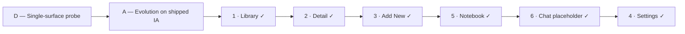

# App UI Evolution — Design Hand-off (Discovery)

> **Status:** **Discovery locked · Swift shipped** (Phases 0–4b, May 2026). Locked §3 reference; execution complete — **[`ui-evolution-implementation-plan.md`](ui-evolution-implementation-plan.md)** [§15 rollout status](ui-evolution-implementation-plan.md#15-cold-start--rollout-complete).
>
> **Authority:** This document captures **locked design choices** from HTML mocks and review sessions. **Shipped May 2026** — on conflict: **code > [`docs/decisions.md`](../decisions.md) > this archive doc**.
>
> **Historical baseline:** Prior v1 refresh archived in [`ui-design-refresh.md`](ui-design-refresh.md).

**Session:** May 2026 · Discovery + implementation **complete** · Phases **0–4b shipped**

**Canonical mocks (visual reference — SwiftUI is the ship target):** [Library](design-mocks/library-ad-search-b-toolbar.html) · [Detail](design-mocks/detail-ad-full-hairline-a.html) · [Add New](design-mocks/add-new-ad-filled-card-a.html) · [Notebook](design-mocks/notebook-ad-hairline-feed-a.html) · [Chat placeholder](design-mocks/chat-ad-placeholder-a.html) · [Settings](design-mocks/settings-ad-grouped-a.html) — open in Safari; see [§2.2](#22-html-mocks--swiftui-target).

| Locked surface | Doc | Mock |
|----------------|-----|------|
| Library | [§3](#3-locked-decisions-library) | `library-ad-search-b-toolbar.html` |
| Detail | [§3.6](#36-locked-decisions-detail) | `detail-ad-full-hairline-a.html` |
| Add New | [§3.7](#37-locked-decisions-add-new) | `add-new-ad-filled-card-a.html` |
| Notebook | [§3.8](#38-locked-decisions-notebook) | `notebook-ad-hairline-feed-a.html` |
| Chat (placeholder) | [§3.9](#39-locked-decisions-chat-placeholder) | `chat-ad-placeholder-a.html` |
| Settings | [§3.10](#310-locked-decisions-settings) | `settings-ad-grouped-a.html` |

**Related code (current shipped):** [`LibraryTab.swift`](../../Phathom/Phathom/Views/Library/LibraryTab.swift) · [`DetailView.swift`](../../Phathom/Phathom/Views/Detail/DetailView.swift) · [`AddNewTab.swift`](../../Phathom/Phathom/Views/AddNew/AddNewTab.swift) · [`NotebookTab.swift`](../../Phathom/Phathom/Views/Notebook/NotebookTab.swift) · [`ChatTab.swift`](../../Phathom/Phathom/Views/Chat/ChatTab.swift) · [`SettingsTab.swift`](../../Phathom/Phathom/Views/Settings/SettingsTab.swift) · [`MainTabView.swift`](../../Phathom/Phathom/Views/MainTabView.swift) · [`AppPalette.swift`](../../Phathom/Phathom/Helpers/AppPalette.swift)

---

## 1. Goals

### North star (overarching)

**One cohesive, polished, high-end product feel across every surface** — unified layout rhythm, spacing, typography scale, and material language so Library, Detail, Notebook, Chat, Settings, and remaining surfaces read as the same “expensive” daily app, not a patchwork of per-screen styles.

| Principle | What it means in practice |
|-----------|---------------------------|
| **Consistency** | Same **22px** horizontal rhythm, hairline vocabulary, section-header scale, and accent restraint everywhere probes land |
| **Polish** | Generous air, optically aligned type, hairline structure over filled-card density — editorial gallery, not cockpit or template UI |
| **Cohesion** | Decisions on one surface (e.g. Library gallery rows) propagate to related surfaces (Detail highlights, Notebook feed) unless explicitly forked |
| **Evolution, not rewrite** | Shipped IA, flows, and tab bar preserved — refine execution, not navigation graph |

### Surface goals

| Goal | Rationale |
|------|-----------|
| **Unified top chrome + spacing rhythm** | Reduce ad-hoc offsets and split identity (`Phathom` nav vs `Library` content title) |
| **Surface-by-surface probes** | **Complete** — Library · Detail · Add New · Notebook · Chat placeholder · Settings locked |
| **Preserve shipped tab bar** | iOS 26 liquid-glass floating pill, four tabs, SF symbols — see [§3.5](#35-tab-bar--preserved) |

**Explicit non-goals (discovery + implementation):** RAG / conversational Chat **functionality** ([`phase-3-rag-chat.md`](phase-3-rag-chat.md)), Share extension UI, CloudKit/sync CTAs.

**In scope for discovery mocks (HTML only):** all surfaces in [§2.1](#21-surface-probe-roadmap). Chat **placeholder shell** locked [§3.9](#39-locked-decisions-chat-placeholder) (visual/cohesion only, not Phase 3 behavior).

---

## 2. Process & probe path

| Step | Choice |
|------|--------|
| **Swing size** | **D → A** — probe one surface at a time, evolve tokens/layout; do not rethink tabs or nav graph |
| **Discovery artifact** | Static HTML/CSS in [`.design-mocks/`](design-mocks/) (side-by-side frames where useful) — **not** the shipping UI |
| **Mock build workflow** | Global skill **`design-mock-probe`** — grill / lock in **main session**; **`<mock-handoff>` packet** → subagent HTML; see [`design-mock-probe-pointer.md`](../agents/design-mock-probe-pointer.md) |
| **Carry forward** | Each probe applies the same ideas locked on Library: editorial stack, hairline/gallery material, 22px rhythm, preserved tab bar, warm dark palette |

### 2.2 HTML mocks → SwiftUI target

HTML/CSS probes are **visual and behavioral guidance only**. Implementation lands in **SwiftUI** under **`Phathom/`**, using existing patterns where they already match the north star.

| Do in Swift | Do **not** port from HTML |
|-------------|---------------------------|
| Spacing rhythm (**22px** inset), palette tokens, typography scale, section order, hairline vs fill **decisions**, enabled/disabled CTA states | DOM structure, class names, Geist web font, device chrome (status bar, Dynamic Island), side-by-side review layout |
| Idiomatic SwiftUI: `TabView` liquid glass, `.safeAreaInset`, `LibraryFilterBar` popovers, `TextField`/`TextEditor`, overlays for pinned search | Literal CSS (`position: fixed`, `backdrop-filter` approximations) as copy-paste layout |
| Shipped logic unchanged unless this hand-off explicitly changes UX (search service, pipeline, capture save rules) | Mock-only demo copy (lorem, example URLs) as product strings |

**Mock CSS conventions (all canonical HTML):** Global `a { text-decoration: none; color: inherit; }` — SwiftUI `NavigationLink` / button rows have **no underline**; do not port browser default link styling.

**Authority at implementation:** **`Phathom/`** code + locked §3 tables ([§3](#3-locked-decisions-library)–[§3.10](#310-locked-decisions-settings)) + mocks for **look and feel**. When mock and code disagree on **behavior**, code wins until product updates the hand-off.

**Typography:** Mocks use **Geist** for speed; app uses **SF Pro** at equivalent sizes/weights ([§4](#4-visual-tokens-evolution-baseline)).

### 2.3 Agent inference (mocks are not exhaustive)

HTML probes **do not** depict every interaction (tag editing, category picker, sheets, navigation pushes, swipe actions, etc.). Pipeline control **is** drawn in the Library canonical mock (§3.2.1). When a behavior is **not** drawn in a mock, infer from this order:

1. **Locked tables** in [§3](#3-locked-decisions-library)–[§3.10](#310-locked-decisions-settings) for the surface being built.
2. **Shipped Swift** entry in [§2.1](#21-surface-probe-roadmap) — preserve semantics unless the hand-off explicitly changes UX.
3. **Related locked surface** for shared components (e.g. Detail §3.6 highlight rows → Notebook §3.8).
4. [`docs/decisions.md`](../decisions.md) for product invariants.

| Inference rule | Meaning |
|----------------|---------|
| **Mock silent ≠ cut feature** | If shipped code supports it and this hand-off does not reject it, **keep behavior**; only restyle to match locked material/chrome. |
| **Mock silent + hand-off says “not v1” / out of scope** | Do **not** add UI (e.g. Notebook search, Chat RAG). |
| **Mock silent + “resolve at implementation”** | Choose the option that matches north star + nearest locked surface; document in PR if ambiguous. |
| **Cross-surface editors** | Tag edit, category, read status, summarize/archive, source web highlight — **Detail (and Settings)** only unless a probe adds them elsewhere. |
| **Shared components** | One hairline highlight row for Detail + Notebook when §3.6 + §3.8 align — do not fork fill/rail/typography per tab. |

**Notebook-specific (preserve at implementation — not required in HTML mock):** [`NotebookHighlightsQuery`](../../Phathom/Phathom/Services/NotebookHighlightsQuery.swift) grouping/sort; header tap → `DetailView` push; highlight tap → [`HighlightNoteEditSheet`](../../Phathom/Phathom/Views/Detail/HighlightNoteEditSheet.swift); **no** Library search/filters/swipe/Settings; **no** tag/category UI on Notebook; empty-state copy; `quotedLineLimit: 3` / `noteLineLimit: 2` on feed only; do not load `sourceMarkdown` in list rows. Historical v1 spec: [`docs/archive/notebook-tab.md`](../archive/notebook-tab.md).

### 2.1 Surface probe roadmap

Ordered queue for HTML mocks and design review. **Complete** — all surfaces shipped in Swift (May 2026).

| # | Surface | Status | What the probe stress-tests | Shipped code entry |
|---|---------|--------|----------------------------|-------------------|
| **1** | **Library** | **Done** — decisions locked [§3](#3-locked-decisions-library) | Filters, Search B, gallery rows, bulk/select chrome, processing badges | [`LibraryTab.swift`](../../Phathom/Phathom/Views/Library/LibraryTab.swift) |
| **2** | **Detail** | **Done** — locked [§3.6](#36-locked-decisions-detail) | Full hairline A + Option **5** AI zone parent header | [`DetailView.swift`](../../Phathom/Phathom/Views/Detail/DetailView.swift) |
| **3** | **Add New** | **Done** — locked [§3.7](#37-locked-decisions-add-new) | Filled capture card, capsule CTA, mode pill, 22px rhythm | [`AddNewTab.swift`](../../Phathom/Phathom/Views/AddNew/AddNewTab.swift) |
| **4** | **Settings** | **Done** — locked [§3.10](#310-locked-decisions-settings) | Grouped filled surfaces; editorial title; disclosures preserved; three side-by-side states | [`SettingsTab.swift`](../../Phathom/Phathom/Views/Settings/SettingsTab.swift) · pushed from Library |
| **5** | **Notebook** | **Done** — locked [§3.8](#38-locked-decisions-notebook) | Hairline feed, full-width group separators, editorial chrome | [`NotebookTab.swift`](../../Phathom/Phathom/Views/Notebook/NotebookTab.swift) |
| **6** | **Chat (placeholder)** | **Done** — locked [§3.9](#39-locked-decisions-chat-placeholder) | Coming-soon shell; Notebook Empty editorial parity; **not** RAG ([`phase-3-rag-chat.md`](phase-3-rag-chat.md)) | [`ChatTab.swift`](../../Phathom/Phathom/Views/Chat/ChatTab.swift) |

**After all probes:** Token sheet ✓ · Implementation plan **approved** ✓ · **Shipped:** Phases 0–4b ([rollout complete](ui-evolution-implementation-plan.md#15-cold-start--rollout-complete))

---

## 3. Locked decisions (Library)

### 3.1 Chrome pattern — **A + D (Editorial stack + Gallery list)**

| Layer | Decision |
|-------|----------|
| **Top actions** | Minimal row: **Select** (leading); **Pipeline** pause/play when in-flight or paused/queued (trailing, before Search); **Search** + **Settings** (trailing). No persistent search field in the editorial stack. |
| **System nav** | **No `Phathom` principal** on Library or pushed Detail — editorial / content owns identity (§3.6 back + share only). |
| **Screen title** | Large left-aligned **Library** (`~34pt`, semibold, tight tracking) below the actions row — screen owns the title, not the system nav brand. |
| **List material** | **Gallery rows** — hairline dividers, **no filled card background**, 64×64 thumbs, generous vertical padding (`~19px`), content scrolls with editorial chrome. |
| **Horizontal rhythm** | **22px** (`--rhythm`) content inset; align title, filters, and row text to this grid. |

**Rejected chrome alternative:** **C — Compact brand bar** (`Phathom` wordmark bar, no screen title, filled card rows). Deleted mock; denser / less editorial.

### 3.2 Search — **Pattern B (toolbar icon)**

| State | Behavior |
|-------|----------|
| **At rest** | Magnifying glass in the top actions row (beside Settings). **No** in-stack search field. **No** SwiftUI `.searchable` drawer as the target UX. |
| **Active** | Search bar **pins** over the actions band (covers Select + icon row). **No layout shift** on title, filters, or list when search opens. |
| **Scroll** | Pinned bar behaves like **`position: fixed`**: title, filters, and rows **scroll underneath** the search bar (see canonical mock **Search active** frame). |
| **Field** | Placeholder: **`Search title, tags, source text`** (matches shipped search semantics). Accent-bordered nested field + leading magnifier; **Cancel** trailing. |
| **Dismiss** | **Cancel** exits search (required). **Keyboard dismiss** only while search stays active — swipe-down on field dismisses keyboard, not search mode. **No** tap-outside / tap-content dismiss (conflicts with scroll-under). |

**Rejected search alternative:** **A — Native drawer** (`.searchable`-style pull-down). Deleted mock; keeps extra chrome hidden but less aligned with editorial “quiet at rest” goal.

### 3.2.1 Pipeline control — **Actions row trailing**

| State | Behavior |
|-------|----------|
| **Placement** | **`pause.circle.fill` / `play.circle.fill`** in top actions row — trailing, **before Search**, same slot for pause vs resume |
| **Visibility** | Shown when pipeline in-flight, foreground drain active, user paused, or manual kickoff available — preserve shipped `LibraryPipelineControl` semantics |
| **Search active** | Hidden under pinned search overlay with rest of actions row (no layout shift) |
| **Editorial title** | **No** pipeline beside **Library** title — title band stays clean |

**Rejected pipeline alternatives:** Beside editorial title (shipped B) · filter-band trailing (C).

### 3.3 Filters — **Preserve shipped `LibraryFilterBar` layout**

Locked layout invariants (already implemented in code; mocks mirror screenshots):

| Invariant | Value |
|-----------|-------|
| **Label placement** | Static labels **above** value-only capsules (**Type**, **Status**, **Category**) |
| **Column split** | **27.5% / 27.5% / 45%** of usable row width (minus **10pt** gaps) |
| **Bar height** | **72pt** stable height |
| **Width anchor** | Category column sized so **`Uncategorized`** reads **without truncation** at a glance |
| **Picker UX** | **`popover`** attachment (not `Menu`) — preserve shipped pattern to avoid UIKit reparenting warnings |
| **Demo / mock state** | Type **Media**, Status **Read**, Category **Uncategorized** |

**Rejected filter alternatives:**

| Alternative | Why skip |
|-------------|----------|
| Equal thirds | Category truncates |
| Inline `Type: Media` chips | Label steals capsule width |
| Icon-only / collapsed filters | Hides applied state |
| Single “Filters (3)” chip | Extra tap; no at-a-glance values |

### 3.4 Gallery row content (Library list)

| Element | Spec |
|---------|------|
| **Thumb** | 64×64, 6pt radius, cover fit; fallback monogram on surface color |
| **Title** | 16pt medium, 2-line clamp, primary text |
| **Unread** | 7pt paprika dot beside title when `readStatus == new` |
| **Source line** | 13pt secondary, single-line ellipsis (domain / source label) |
| **Meta row** | Date (12pt muted) + processing badge when in-flight (`GENERATING`-style chip on `#401F12`) |
| **Separators** | 1px hairline `rgba(255,252,242,0.12)` between rows — **not** card fill |

**Behavior preserved from shipped (mock shows pipeline in actions row when processing):** leading swipe read-state, trailing swipe archive, bulk select, Dive deeper footer, empty states, pipeline-driven badges.

### 3.5 Tab bar — **Preserved**

Do **not** redesign the tab bar in this evolution.

| Property | Shipped / mock alignment |
|----------|-------------------------|
| **Pattern** | iOS **26 liquid glass** floating inset pill |
| **Tabs** | Library · Notebook · Chat · Add new (4 tabs) |
| **Icons** | SF Symbols — `photo.on.rectangle.angled`, `highlighter`, `bubble.left.and.bubble.right`, `plus` |
| **Colors** | Paprika selected · floral white / dust unselected (`AppPalette` / `AppAppearance`) |
| **Selection** | Inner pill on active tab |
| **Scroll** | List content extends under bar; bottom inset ~**104px** so glass samples scrolling content |

Implementation reference: [`MainTabView.swift`](../../Phathom/Phathom/Views/MainTabView.swift), mock `.tab-bar-dock` / `.tab-bar-glass` CSS.

---

## 3.6 Locked decisions (Detail)

**Canonical mock:** [`.design-mocks/detail-ad-full-hairline-a.html`](design-mocks/detail-ad-full-hairline-a.html)

### Material language — **A (Full hairline)**

| Layer | Decision |
|-------|----------|
| **Section material** | **No filled `#403d39` card wrappers** on highlights, summary, category, or actions — extend Library A+D hairline/gallery language |
| **Highlights** | Hairline rows + **4px left paprika accent bar**; quote + note; row separators — **not** `HighlightCardView` surface fill |
| **Summary** | Flush bullets under section header — no surface card |
| **Metadata** | Category + read status as **inline / hairline** rows (no category capsule box) |
| **Horizontal rhythm** | **22px** content inset (up from shipped 16px) |
| **Tags** | Chip pills on `#401F12` allowed; no enclosing surface card |
| **Actions** | Hairline-bordered full-width buttons (accent + neutral); **20pt** below section hairline (same rhythm as last Key Figures row → line above actions) |
| **Nav (pushed)** | **`DetailPushNavBar`** — **22pt** horizontal inset (back chevron aligns with body text); flat accent back + flat secondary share — **no** center wordmark · **not** system toolbar / liquid glass |
| **Header block** | Web **host** (accent) · editable **title** · **timestamp** only — **no** source-preview snippet under title (source lives in collapsible **Source Content**) |
| **Section order** | Matches shipped `DetailView` — Hero → header → source → read status → category → highlights → **AI zone** → tags → summary → actions |
| **AI analysis zone break** | **Option 5 — Zone parent header** — **17pt semibold** “AI analysis” owns zone (token sheet §4; plan §0 tie-breaker — not mock CSS `font-weight: 700`); Tags / Summary / Key Figures use **15pt medium secondary** (`DetailAISubsectionHeader` tier). Hairline separates subsections. **Replace** shipped `DetailAIAnalysisDivider`. |

**Rejected Detail alternatives (mocks deleted):** Hybrid **B** (filled highlight/summary cards) · AI zone **2** (whisper label) · **7** (center interrupt) · **5+6** (accent rule).

### Detail — resolve at implementation

| Item | Status |
|------|--------|
| **Processing badge placement** | Not shown in mock — preserve shipped behavior |
| **`DetailAIAnalysisDivider.swift`** | **Done (Phase 4a)** — replaced by `ZoneSectionHeader` + demoted subsections; file removed |

---

## 3.7 Locked decisions (Add New)

**Canonical mock:** [`.design-mocks/add-new-ad-filled-card-a.html`](design-mocks/add-new-ad-filled-card-a.html) — **six frames** (per mode: **Starting** + **Filled**): Web · Note · Photo. Legend + mode groups label states; Starting = empty/disabled Save; Filled = valid input + enabled capsule Save.

**Shipped entry:** [`AddNewTab.swift`](../../Phathom/Phathom/Views/AddNew/AddNewTab.swift)

### Chrome & layout

| Layer | Decision |
|-------|----------|
| **Screen title** | Editorial **Save** large title only — **no subtitle** (Library parity). |
| **Horizontal rhythm** | **22px** content inset (up from shipped 16px). |
| **Mode switcher** | **Keep shipped segmented pill** — Web · Note · Photo in bottom `captureModeBar` (surface outer shell, nested active pill on `surfaceNested`). **22px** inset; ~26pt outer radius + 4pt inner inset. **Do not** use hairline tabs or Library filter chips. |
| **Mode bar stack** | Fixed above liquid-glass tab bar; scroll content uses bottom inset for bar + mode pill — spacing **locked as mocked**. |
| **Processing hints** | **Remove** per-mode footnotes under Save (not in target UI). |

### Capture card & fields

| Layer | Decision |
|-------|----------|
| **Capture card** | **Filled `#403d39`** outer card (14px radius, 16px pad) + **`#353330` nested wells** — form work area; **not** full hairline-flat (exception to list/Detail gallery material). |
| **Field order** | **Mode-specific** — preserve shipped: Web URL → optional title; Note optional title → editor; Photo picker → optional title. |
| **Placeholders** | Web URL well: light placeholder (`https://...`), empty at rest. Photo picker label: muted **Choose photo** when empty; primary **Replace photo** when filled. **Note editor: no placeholder** (empty well only). Optional title: muted placeholder when empty; primary text when filled. |
| **Mock frames** | **Starting** — empty required input, disabled Save. **Filled** — Web: valid URL; Note: lorem body; Photo: preview + title + Replace photo; enabled Save. Six frames + legend in canonical mock. |

### Save CTA

| Layer | Decision |
|-------|----------|
| **Shape** | **Filled paprika capsule** — matches Detail hero **Visit Site** pill (`border-radius: 100px`), **full-width**, **50pt** min-height, **17pt** semibold + trailing arrow. |
| **States** | Enabled: accent fill + primary text. Disabled: `surfaceNested` fill + secondary text (~85% opacity). |
| **vs Detail actions** | Detail bottom actions stay **hairline-bordered**; Add New Save is the **sole primary** filled control on the screen. |

**Rejected Add New alternatives:** Hairline / inline mode tabs · hairline-flat capture card · editorial subtitle · processing hint footnotes · 14px rectangular Save CTA.

### Add New — resolve at implementation

| Item | Status |
|------|--------|
| **`AddNewTab` horizontal inset** | 16px → **22px** |
| **Save button corner radius** | Shipped 14px continuous → **capsule** per mock |
| **Processing hint views** | Remove `processingHint` copy from layout |
| **Note `TextEditor` placeholder** | Remove overlay placeholder; empty editor only |
| **Photo picked state** | **Filled** mock frame shows preview + Replace photo; preserve shipped `PhotosPicker` behavior at implementation |

---

## 3.8 Locked decisions (Notebook)

**Shipped entry:** [`NotebookTab.swift`](../../Phathom/Phathom/Views/Notebook/NotebookTab.swift) · [`NotebookItemGroup.swift`](../../Phathom/Phathom/Views/Notebook/NotebookItemGroup.swift) · [`NotebookHighlightsQuery.swift`](../../Phathom/Phathom/Services/NotebookHighlightsQuery.swift) · **`HairlineHighlightRow`** (shared highlight row)

**Canonical mock:** [`.design-mocks/notebook-ad-hairline-feed-a.html`](design-mocks/notebook-ad-hairline-feed-a.html) — frames **Empty** + **Populated**

### Chrome (locked)

| Layer | Decision |
|-------|----------|
| **Title band** | **Editorial** — screen-owned **Notebook** large title (Library parity); **22px** inset; **no** `Phathom` in content chrome band. |
| **System nav** | Drop competing principal brand; pushed **Detail**: back + share only (no center wordmark). |
| **Search / filters / Settings** | **None** on Notebook v1 — preserve shipped scope. |
| **Tab bar** | Preserved §3.5. |
| **Scroll** | **Unified (A)** — editorial **Notebook** title scrolls with feed in one surface (Library parity); not fixed chrome above `List`. |

### Item group header (locked)

| Layer | Decision |
|-------|----------|
| **Header style** | **Gallery-adjacent (A)** — **64×64** thumb, **16pt medium** primary title, **13pt** source/kind line; paprika reserved for highlight accent bar, not parent title. |
| **Separator** | **No** hairline under header — only full-width rule **between** item groups (Library `gallery-row` pattern). |
| **Tap** | Header → push parent **`DetailView`** (preserve). |
| **Meta** | **No highlight count (A)** — thumb + title + source line only |
| **Affordance** | **Plain row (A)** — tappable header, **no** trailing chevron |
| **Thumb** | **64×64**, **6pt** radius (Library gallery parity) |

### Highlight stack (locked)

| Layer | Decision |
|-------|----------|
| **Row material** | Detail **A** hairline rows + **4px** paprika bar — **not** filled `HighlightCardView` surface |
| **Shared component** | **One** hairline highlight row for Detail + Notebook — match [`detail-ad-full-hairline-a.html`](design-mocks/detail-ad-full-hairline-a.html) (italic quote, uppercase **Note** label when note present, typography per mock) |
| **Line limits** | **Detail:** unlimited (`nil`). **Notebook feed:** quote **3** lines, note **2** lines (preserve shipped) |
| **Section chrome (Detail only)** | Keep **Highlights & Notes** section header; empty placeholder styling follows Detail probe (hairline, not filled card — align when Detail implements §3.6) |
| **Tap** | Row → [`HighlightNoteEditSheet`](../../Phathom/Phathom/Views/Detail/HighlightNoteEditSheet.swift) (preserve) |
| **Within group** | **No hairline** between highlights on the same item — vertical spacing only (~**14px**, preserve shipped stack gap) |
| **Between groups** | **Full-width hairline** on each item group — same token and pattern as Library **`gallery-row`** `border-bottom` and Detail section rules (`1px` `rgba(255,252,242,0.12)`); last group has no bottom rule |
| **vs Detail** | **Detail** §3.6 keeps hairline **between** highlight rows in the Highlights section; **Notebook feed** has **no** hairline between highlights on the same item (14px gap only) |

### Empty state (locked)

| Layer | Decision |
|-------|----------|
| **Copy** | Preserve shipped — **“No highlights yet”** + Detail Source hint ([`NotebookTab.swift`](../../Phathom/Phathom/Views/Notebook/NotebookTab.swift)) |
| **Style** | **Editorial text (A)** — no filled card, no hairline box; **22px** inset, secondary/muted hierarchy |

### Mock frames (locked)

| Frame | Shows |
|-------|--------|
| **Empty** | Editorial title + empty-state copy only |
| **Populated** | **2–3** item groups; multi-highlight group; full-width inter-group hairlines; unified scroll |

### Notebook — preserve at implementation (not in mock)

See [§2.3](#23-agent-inference-mocks-are-not-exhaustive). Do **not** add tag editing, category picker, read-status controls, or Library bulk/swipe on this tab.

### Notebook — resolve at implementation

| Item | Status |
|------|--------|
| **`HighlightCardView` → hairline row** | **Done (Phases 3b + 4a)** — `HairlineHighlightRow`; `HighlightCardView.swift` removed post-rollout |
| **`NotebookTab` layout** | Unified scroll; drop fixed chrome `VStack`; 16px → **22px** inset |
| **System toolbar** | Remove `Phathom` principal; hidden or minimal inline nav per editorial pattern |
| **`navigationTitle("Notebook")`** | Remove duplicate — editorial title owns screen name |

**Rejected Notebook alternatives:** Paprika parent title · filled highlight cards · hairline between highlights in same item · hairline under group header · short end-cap div · highlight count on header · trailing chevron on header · fixed title above list.

---

## 3.9 Locked decisions (Chat placeholder)

**Shipped entry:** [`ChatTab.swift`](../../Phathom/Phathom/Views/Chat/ChatTab.swift) — unified scroll + **`EditorialScreenTitle("Chat")`**; hidden nav bar; two-tier left-aligned copy (*Deep Dive is coming soon* + hint); **`tabBarScrollInset`**; no RAG.

**Canonical mock:** [`.design-mocks/chat-ad-placeholder-a.html`](design-mocks/chat-ad-placeholder-a.html) — single frame (coming-soon shell)

**Out of scope:** All behavior in [`phase-3-rag-chat.md`](phase-3-rag-chat.md) (threads, retrieval, bubbles, composer). Phase 3 end-state **feature naming** (tab vs product label) — not decided in this probe.

### Chrome (locked)

| Layer | Decision |
|-------|----------|
| **Title band** | **Editorial** — content-owned **Chat** large title (~34pt semibold) in unified scroll; **Notebook §3.8 Empty parity**; **22px** inset |
| **Title mechanism** | In-scroll editorial title — **not** SwiftUI large nav title; drop duplicate `navigationTitle("Chat")` at implementation |
| **System nav** | No `Phathom` principal (already shipped on Chat); status bar + content only in mock |
| **Actions row** | **None** — no search, settings, or toolbar icons |
| **Tab bar** | Preserved §3.5; **Chat** tab active in mock |
| **Scroll** | **Unified (A)** — editorial **Chat** title + placeholder copy scroll together (Notebook parity) |

### Placeholder content (locked)

| Layer | Decision |
|-------|----------|
| **Layout** | Two-tier copy **directly under** editorial title, left-aligned — **not** viewport-centered (reject shipped center-stack) |
| **Visual ornament** | **Text only (A)** — no icon, hairline box, or fake bubble/thread UI |
| **Primary copy** | *Deep Dive is coming soon* — 17pt semibold, primary text (Notebook `empty-state-title` tier) |
| **Hint copy** | *Conversational search over your library, powered on device.* — 15pt secondary, ~32ch max-width (Notebook `empty-state-hint` tier) |
| **Screen title word** | **Chat** (tab label); **Deep Dive** appears in body copy only |

### Mock frames (locked)

| Frame | Shows |
|-------|--------|
| **Coming soon** | Editorial **Chat** title + two-tier placeholder copy; tab bar with **Chat** selected; single frame only |

### Chat placeholder — preserve at implementation (not in mock)

- No threads, message list, composer, tag picker, or RAG affordances.
- [`phase-3-rag-chat.md`](phase-3-rag-chat.md) governs Phase 3 behavior when explicitly directed — not this shell.

### Chat placeholder — resolve at implementation

| Item | Status |
|------|--------|
| **`ChatTab` layout** | Unified scroll; content-owned **Chat** title; 22px inset; two-tier copy under title |
| **`navigationTitle("Chat")`** | Remove — editorial title owns screen name |
| **Centered placeholder** | Replace with left-aligned Notebook Empty pattern |

**Rejected Chat alternatives:** Viewport-centered copy · single-line shipped copy only · muted bubble symbol · hairline-bordered placeholder box · fake chat UI · top actions row · **Deep Dive** as editorial screen title (tab stays **Chat**).

---

## 3.10 Locked decisions (Settings)

**Shipped entry:** [`SettingsTab.swift`](../../Phathom/Phathom/Views/Settings/SettingsTab.swift) — [`SettingsContent`](../../Phathom/Phathom/Views/Settings/SettingsTab.swift) pushed from Library gear `NavigationLink`; **not** a tab-bar root. Shipped: inline `navigationTitle("Settings")`; **16px** inset; **title2** section headers; filled `#403d39` grouped surfaces (14px radius).

**Canonical mock:** [`.design-mocks/settings-ad-grouped-a.html`](design-mocks/settings-ad-grouped-a.html) — three side-by-side frames (**Configured** · **Primary unset** · **Missing file**); each frame **fully scrollable**

### Chrome (locked)

| Layer | Decision |
|-------|----------|
| **Push context** | **Pushed from Library** — no tab bar in mock |
| **Nav bar** | **Back only** — fixed bar above scroll; Detail `detail-nav-back` styling (flat accent chevron, **not** liquid-glass toolbar button); **no** center **Phathom**, **no** share |
| **Screen title** | Content-owned editorial **Settings** (~34pt semibold) in unified scroll; drop inline nav **Settings** at implementation |
| **Scroll** | **Unified** — editorial title + sections scroll together; back row **fixed** above scroll |
| **Horizontal rhythm** | **22px** inset (from shipped 16px) |

### Material & typography (locked)

| Layer | Decision |
|-------|----------|
| **Grouped sections** | **Keep filled `#403d39` surfaces** (14px radius) — harmonize with Add New form-card exception; **not** hairline-flat |
| **Dividers** | Hairline token `rgba(255,252,242,0.12)` with leading inset (Form-style) |
| **Nested wells** | `#353330` icon wells on action rows (Add New nested-well parity) |
| **Section zone headers** | **Demote** to **17pt semibold** + **15pt secondary** subtitle (Detail AI zone parent tier) — editorial **Settings** owns screen |
| **Section spacing** | **24px** vertical gap between section groups (preserve shipped `sectionVerticalGap`) |

### Information architecture (locked — preserve)

| Section | Contents (unchanged) |
|---------|------------------------|
| **AI Models** | Subtitle + grouped disclosures: **Primary model**, **Tagging model (optional)**, **Vision model** |
| **Library** | **Recently Deleted** (`NavigationLink` + optional count capsule + chevron); **Reset processing queue** (disabled when queue empty) |
| **Data** | **Export Library** · **Import Library** |
| **Footer** | Version/build · “Your data stays on your device” — all frames (below fold in unset/missing) |

**Interaction chrome (preserve):** disclosure chevrons (accent) · status icons (green check · empty circle · orange warning) · Select / Test / Forget action rows · disabled queue reset opacity · sheets/dialogs **not** drawn in mock (Swift at implementation).

### Mock frames (locked)

| Frame | Shows |
|-------|--------|
| **Configured** | Full IA at rest: primary + tagging **ready** collapsed (green checks); vision **collapsed**; Recently Deleted badge **3**; queue reset **enabled**; Data rows; footer **visible** |
| **Primary unset** | **Top crop** at rest: primary disclosure **expanded** (`noSelection` + Select/Test); tagging/vision collapsed; Library/Data/footer **below fold** — **scroll to verify** |
| **Missing file** | Primary **missingFile** **expanded** (orange warning + actions + Forget); orange triangle on row label; rest below fold scrollable |

### Settings — preserve at implementation (not in mock)

- All `DisclosureGroup` expand/collapse behavior, model importers, test inference phases, backup import/export flows, confirmation dialogs, error sheets — infer from shipped [`SettingsTab.swift`](../../Phathom/Phathom/Views/Settings/SettingsTab.swift).
- [`VisionModelSettingsSection`](../../Phathom/Phathom/Views/Settings/) expanded body (dual GGUF + test photo) — preserve semantics; mock shows collapsed vision row only in **Configured**.

### Settings — resolve at implementation

| Item | Status |
|------|--------|
| **`SettingsContent` inset** | **Shipped** — **22px** (`AppSpacing.screenHorizontal`) |
| **`navigationTitle("Settings")`** | **Shipped** — removed; editorial title owns screen name |
| **`SettingsSectionHeader`** | **Shipped** — **`ZoneSectionHeader`** (17pt semibold zone tier) |
| **Pushed nav** | **Shipped** — **`DetailPushNavBar`** (22pt inset, mock `.detail-nav`) + hidden system nav bar |

**Rejected Settings alternatives:** Hairline-flat grouped sections · **Phathom** center on pushed Settings · tab-bar Settings root · IA/disclosure redesign · inline nav **Settings** duplicate with editorial title.

---

## 4. Visual tokens (evolution baseline)

Palette **unchanged** from shipped dark theme — refine **execution** (spacing, hairlines, type scale), not a mood shift.

| Token | Hex / value | Use |
|-------|-------------|-----|
| **Background** | `#252422` | Screen base (`AppPalette.background`) |
| **Surface** | `#403d39` | Capsules, thumbs fallback |
| **Accent** | `#eb5e28` | Select, Cancel, active tab, unread dot, search focus ring |
| **Text primary** | `#fffcf2` | Titles, capsule values |
| **Text secondary** | `#ccc5b9` | Labels, source line, inactive icons |
| **Chip / badge bg** | `#401F12` | Processing badge |
| **Hairline** | `rgba(255,252,242,0.12)` | Row dividers, pinned search bottom edge |

**Typography (mocks):** Geist in HTML for editorial probe. **Implementation default:** map scale to **SF Pro** with equivalent sizes/weights unless a separate typography decision lands.

**Design-taste baseline used during mocks:** variance **8**, motion **6**, density **4** (airy gallery, fluid but not cinematic).

**Cross-surface reference:** Full spacing, type, material matrix, and shared components → **[`ui-evolution-token-sheet.md`](ui-evolution-token-sheet.md)**.

---

## 5. Shipped vs target (Library only)

| Area | Shipped today | Target (this hand-off) |
|------|---------------|------------------------|
| **Chrome layout** | Fixed `VStack`: title + filters **above** `List`; list rows only in scroll | Title + filters + rows in **one scroll surface**; search **pins** over top band when active |
| **Nav identity** | `Phathom` in **navigation bar** principal + `Library` large title in content | Actions row + **screen-owned** `Library` title; **drop** `Phathom` nav principal on Library |
| **Search** | `.searchable` on `List` | Toolbar icon → **pinned overlay**; prompt unchanged; **Cancel** + keyboard dismiss |
| **Rows** | Filled card rows (`ContentCardRow`) | Hairline **gallery** rows, no card fill |
| **Filters** | `LibraryFilterBar` 27.5/27.5/45 | **Same** — layout locked |
| **Tab bar** | Liquid glass (runtime iOS 26) | **Same** |
| **Pipeline control** | Play/pause beside **Library** title | **Actions row** trailing, before Search (§3.2.1) |

---

## 6. Mock inventory

Only **canonical** mocks retained as **visual reference** ([§2.2](#22-html-mocks--swiftui-target)). Exploratory / rejected mocks **deleted** after decisions locked. See also [`.design-mocks/README.md`](design-mocks/README.md).

| File | Role |
|------|------|
| **`library-ad-search-b-toolbar.html`** | **Library** — At rest + Search active; Search B, pinned bar, filters, gallery list, pipeline in actions row, tab bar |
| **`detail-ad-full-hairline-a.html`** | **Detail** — full hairline A + Option 5 AI zone parent header |
| **`add-new-ad-filled-card-a.html`** | **Add New** — six frames (Web · Note · Photo × Starting + Filled); filled capture card, capsule Save, mode pill |
| **`notebook-ad-hairline-feed-a.html`** | **Notebook** — Empty + Populated; editorial chrome, gallery headers, hairline highlights, full-width inter-group hairlines |
| **`chat-ad-placeholder-a.html`** | **Chat placeholder** — Coming soon shell; editorial **Chat** title; two-tier Deep Dive copy; **Chat** tab selected |
| **`settings-ad-grouped-a.html`** | **Settings** — Configured · Primary unset · Missing file; editorial title; grouped filled surfaces; back-only pushed nav |

**Deleted (2026-05-30 cleanup):** `library-ad-editorial-gallery.html` (stale search) · `detail-ad-hybrid-b.html` (rejected B) · `detail-ad-ai-zone-compare.html` (5 selected, applied to canonical) · ~~`library-c-compact-brand.html`~~ · ~~`library-ad-search-a-drawer.html`~~

**How to review:** Open canonical mocks in Safari. Library: **At rest** pipeline in actions row; **Search active** scroll-under; pipeline hidden under overlay. Detail: **AI analysis** zone. Add New: **Starting** vs **Filled** per mode. Notebook: **Empty** vs **Populated**; confirm **no** hairline between highlights in one item; **full-width** `border-bottom` between item groups (Library parity). Chat: editorial **Chat** title + two-tier coming-soon copy; **Chat** tab selected. Settings: three frames side-by-side; **scroll** Primary unset / Missing file to verify below-fold IA + footer.

---

## 7. Open items

### Discovery (HTML mocks)

**Complete.** All surfaces in [§2.1](#21-surface-probe-roadmap) probed and locked [§3](#3-locked-decisions-library)–[§3.10](#310-locked-decisions-settings). **No further HTML** unless product forks.

### Library-specific (locked at implementation planning — May 2026)

| Item | Decision |
|------|----------|
| **Pipeline control placement** | **Actions row trailing** — before Search (§3.2.1); move from beside title |
| **System nav bar (Library)** | **Drop `Phathom` principal** — editorial **Library** title owns screen |
| **Search dismiss beyond Cancel** | **Cancel** exits search; **keyboard dismiss** only while active — no tap-outside |
| **Row component refactor** | `ContentCardRow` → gallery row styling; preserve swipe, selection, accessibility |

### Post-discovery (implementation)

| Item | Status |
|------|--------|
| **Cross-surface token sheet** | **Done** — [`ui-evolution-token-sheet.md`](ui-evolution-token-sheet.md) |
| **Multi-phased implementation plan** | **Shipped** — [`ui-evolution-implementation-plan.md`](ui-evolution-implementation-plan.md) · Phases **0–4b complete** |
| **Decisions log** | Append to [`docs/decisions.md`](../decisions.md) when each phase ships |
| **Per-phase execution** | One phase per session; Phases 0–4b **complete** ([plan §15](ui-evolution-implementation-plan.md#15-cold-start--rollout-complete)) |

---

## 8. Maintenance reference (shipped May 2026)

1. **Scope:** UI evolution complete — product-directed changes only; do not expand to Chat/RAG without [`phase-3-rag-chat.md`](../handoff/phase-3-rag-chat.md).
2. **Filter bar:** Do not change 27.5/27.5/45 or label-above-capsule layout without explicit product sign-off.
3. **Tab bar:** Do not replace liquid-glass `TabView` pattern.
4. **Search semantics:** Keep `LibrarySearchService` integration unchanged unless product changes UX.
5. **Verify:** [`simulator-verify.mdc`](../../.cursor/rules/simulator-verify.mdc) after Swift changes.

**Shipped Swift entry points:** [`LibraryTab.swift`](../../Phathom/Phathom/Views/Library/LibraryTab.swift) · [`DetailView.swift`](../../Phathom/Phathom/Views/Detail/DetailView.swift) · [`AddNewTab.swift`](../../Phathom/Phathom/Views/AddNew/AddNewTab.swift) · [`NotebookTab.swift`](../../Phathom/Phathom/Views/Notebook/NotebookTab.swift) · [`ChatTab.swift`](../../Phathom/Phathom/Views/Chat/ChatTab.swift) · [`SettingsTab.swift`](../../Phathom/Phathom/Views/Settings/SettingsTab.swift) · shared chrome in [`AppSpacing.swift`](../../Phathom/Phathom/Helpers/AppSpacing.swift) · [`HairlineHighlightRow`](../../Phathom/Phathom/Views/Shared/HairlineHighlightRow.swift)

---

## 9. Decision log (chronological)

| Date | Decision |
|------|----------|
| 2026-05-30 | Path **D → A** — Library probe, evolution not IA rewrite |
| 2026-05-30 | Chrome **A+D** — editorial stack + gallery list; reject **C** compact brand |
| 2026-05-30 | Tab bar **preserved** — iOS 26 liquid glass floating pill |
| 2026-05-30 | Search **Pattern B** — toolbar icon; reject drawer **A** |
| 2026-05-30 | Search active: overlay covers actions row; **no layout shift** |
| 2026-05-30 | Search active: **pinned fixed** bar; library content **scrolls under** |
| 2026-05-30 | Filters: **keep shipped `LibraryFilterBar`** proportions; **Uncategorized** width anchor |
| 2026-05-30 | Discovery only — **no app commits** until explicit implementation approval |
| 2026-05-30 | Probe queue: **Detail → Add New → Settings → Notebook → Chat placeholder** (HTML mocks; same A+D language) |
| 2026-05-30 | **North star** — cohesive, polished, high-end feel; unified layout/spacing across all surfaces |
| 2026-05-30 | Detail material **A (full hairline)** locked; reject **B (hybrid)**; canonical mock `detail-ad-full-hairline-a.html` |
| 2026-05-30 | Notebook probe: inherit Detail **A** hairline highlight rows (not filled cards) |
| 2026-05-30 | Detail **AI analysis zone** — **Option 5** locked (zone parent header + demoted subsections); reject 2 · 7 · 5+6 |
| 2026-05-30 | Detail probe **complete** |
| 2026-05-30 | Add New: **keep segmented mode pill**, tightened to **22px** rhythm; reject hairline mode tabs |
| 2026-05-30 | Mock cleanup — **3 canonical** HTML files (Library · Detail · Add New) |
| 2026-05-30 | Add New probe **complete** — filled capture card A; canonical `add-new-ad-filled-card-a.html` |
| 2026-05-30 | Add New: **no subtitle**, **no processing hints**; capsule Save (Visit Site shape); Starting vs Filled frames |
| 2026-05-30 | Add New Note editor: **no placeholder**; Web/Photo light placeholder when empty |
| 2026-05-30 | Add New mock: **six frames** — Starting + Filled per mode (Web URL, Note lorem, Photo preview + title) |
| 2026-05-30 | **HTML mocks = visual guidance only** — SwiftUI in `Phathom/` is ship target ([§2.2](#22-html-mocks--swiftui-target)) |
| 2026-05-30 | Session lock complete for Library · Detail · Add New; **Notebook** next probe |
| 2026-05-30 | **Notebook locked** — editorial chrome, gallery header, hairline highlights, full-width inter-group hairline (Library parity), unified scroll, Empty+Populated mock frames |
| 2026-05-30 | Mock workflow — build HTML in **subagent**; grill/lock in **main session** |
| 2026-05-30 | Notebook canonical mock `notebook-ad-hairline-feed-a.html` — Empty + Populated |
| 2026-05-30 | Notebook inter-group separator harmonized — full `border-bottom` like Library `gallery-row` (replaces short end-cap div) |
| 2026-05-30 | Notebook: remove **group-header-divider** — only inter-group full-width hairlines |
| 2026-05-30 | **Notebook probe complete** — §3.8 locked |
| 2026-05-30 | **Chat placeholder locked** — §3.9; editorial Notebook Empty parity; two-tier Deep Dive copy; single-frame mock `chat-ad-placeholder-a.html` |
| 2026-05-30 | Chat: content-owned **Chat** title in scroll; drop large nav title; no actions row; text-only placeholder (no fake chat UI) |
| 2026-05-30 | **Discovery probes 1–6 complete** — 6 canonical HTML mocks; Settings §3.10 locked |
| 2026-05-30 | **Settings locked** — §3.10; editorial title + back-only push; filled grouped surfaces; demoted zone headers; three-frame mock `settings-ad-grouped-a.html` |
| 2026-05-30 | **UI evolution discovery complete** — 6 surfaces locked; 6 canonical mocks; ready for implementation green-light |
| 2026-05-30 | Mock CSS: global **`a { text-decoration: none }`** on all canonical HTML — no underline (SwiftUI parity) |
| 2026-05-30 | **Cross-surface token sheet** — [`ui-evolution-token-sheet.md`](ui-evolution-token-sheet.md) |
| 2026-05-30 | **Library planning locks** — drop `Phathom` nav principal; search dismiss Cancel + keyboard only; pipeline **actions row** (§3.2.1); canonical library mock updated |
| 2026-05-30 | **Implementation plan approved** — [`ui-evolution-implementation-plan.md`](ui-evolution-implementation-plan.md); cold start → Phase 0 |

---

## 10. Related documents

| Doc | Relationship |
|-----|--------------|
| [`docs/archive/ui-design-refresh.md`](ui-design-refresh.md) | Shipped v1 refresh — historical |
| [`ui-evolution-implementation-plan.md`](ui-evolution-implementation-plan.md) | **Shipped** Phases 0–4b ([§15 rollout](ui-evolution-implementation-plan.md#15-cold-start--rollout-complete)) |
| [`docs/handoff/phase-3-rag-chat.md`](../handoff/phase-3-rag-chat.md) | Chat/RAG — active roadmap |
| [`docs/decisions.md`](../decisions.md) | Product invariants — update when UI ships |

---

## 11. Cold start handoff (implementation)

**Rollout complete (May 2026).** Phases **0–4b** shipped. Historical Phase 0 block and per-phase cold starts: [`ui-evolution-implementation-plan.md` §15 archives](ui-evolution-implementation-plan.md#15-cold-start--rollout-complete).
