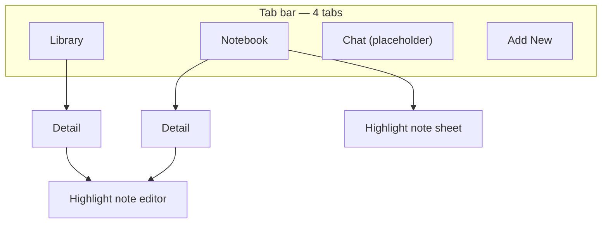

# Notebook Tab — Archive (**shipped**)

> **Status:** **Shipped** (2026-05-30). **Authority:** [`docs/decisions.md`](../decisions.md) row **2026-05-30** (Notebook tab IA + query rules), then **code** under `Phathom/Phathom/Views/Notebook/`.
>
> **Audience:** Historical design + implementation reference only. Agents cold-start from **code + decisions**, not this file.
>
> **Ephemeral mock** `notebook-tab-static.html` was removed after ship.

**Related code:** [`MainTabView.swift`](../../Phathom/Phathom/Views/MainTabView.swift) · [`NotebookTab.swift`](../../Phathom/Phathom/Views/Notebook/NotebookTab.swift) · [`NotebookItemGroup.swift`](../../Phathom/Phathom/Views/Notebook/NotebookItemGroup.swift) · [`NotebookHighlightsQuery.swift`](../../Phathom/Phathom/Services/NotebookHighlightsQuery.swift) · [`HighlightCardView.swift`](../../Phathom/Phathom/Views/Detail/HighlightCardView.swift) · [`HighlightNoteEditSheet.swift`](../../Phathom/Phathom/Views/Detail/HighlightNoteEditSheet.swift) · [`HighlightsNotesSection.swift`](../../Phathom/Phathom/Views/Detail/HighlightsNotesSection.swift) · [`DetailView.swift`](../../Phathom/Phathom/Views/Detail/DetailView.swift)

---

## Lifecycle & archive

**Archived** per ship checklist (2026-05-30). Do not restore to `docs/handoff/`.

---

## Problem

Highlights and highlight notes live **per item** on Detail. There is no cross-library view of “everything I marked,” so annotations are hard to review without opening each **ContentItem**.

## Solution

Add a **Notebook** tab: a feed of **ContentItem** groups (non-archived items that have highlights), each showing that item’s highlights stacked like Detail — cross-library review without repeated headers.

---

## Information architecture

Tab bar becomes **four tabs** (left → right):

| Tab | SF Symbol | Role |
|-----|-----------|------|
| Library | `photo.on.rectangle.angled` | Unchanged — browse, filter, search, triage |
| **Notebook** | **`highlighter`** | Cross-item highlight + note feed |
| Chat | `bubble.left.and.bubble.right` | Unchanged placeholder (Phase 3 RAG) |
| Add New | `plus` | Unchanged |



- **Settings** stays Library gear only — no Settings on Notebook.
- Notebook owns its own `NavigationStack` (same pattern as [`RecentlyDeletedView.swift`](../../Phathom/Phathom/Views/Settings/RecentlyDeletedView.swift) pushing Detail).
- **MainTabView** tab `tag` values must be renumbered when Notebook is inserted.

---

## Data rules

| Rule | Detail |
|------|--------|
| List entity | One **`ContentItem`** group per list row (items that have ≥1 qualifying highlight) |
| Highlights shown | All highlights on that item **with or without** `userNote` |
| Exclude | **`ContentItem.isArchived == true`**; orphans (highlight with no `item`) |
| **Item order (v1)** | By **most recent** `highlight.createdAt` on the item — descending (item with latest annotation first) |
| **Within item** | **`highlightsSortedByOffset`** — same order as Detail [`HighlightsNotesSection`](../../Phathom/Phathom/Views/Detail/HighlightsNotesSection.swift) |
| Query | **`NotebookHighlightsQuery`** (or equivalent): fetch qualifying highlights, group by parent item, sort items + inner highlights; do not render from a flat global highlight list |
| Extensibility | Query helper owns sort/filter hooks for future Library-style controls — **not v1**, but don’t hardcode grouping in the view |

List rows must **not** load `sourceMarkdown`, `sourceContentHTML`, or other Detail-only fields.

---

## Row layout

Each **list row** = one parent item. Top → bottom:

### 1. Item header (tap → push Detail for parent item)

- Small **thumbnail** (~44–56 pt; reuse [`ThumbnailView`](../../Phathom/Phathom/Views/Library/ThumbnailFallback.swift) / library patterns).
- **`item.displayTitle`** — full title wraps (no line clamp), link/accent styling.
- Subtitle: **`displayHost`** for web; kind label for media/note. **No per-highlight timestamp** on the header (multiple highlights share one header).
- Optional tertiary: highlight count, e.g. **“2 highlights”** — only if it reads cleanly in implementation; not required v1.

### 2. Highlight stack (Detail-like)

- Vertical stack of **`HighlightCardView`** instances, **14 pt** spacing between cards (match Detail `HighlightsNotesSection`).
- One card per highlight on that item — same shared component as Detail (see [Shared highlight card](#shared-highlight-card-detail--notebook)).
- **Notebook list mode:** each card truncates quote **3 lines**, note **2 lines** (when present).
- **Detail mode:** no line limits (current behavior).
- **Per card tap** → note sheet for **that** highlight (C′).

---

## Shared highlight card (Detail + Notebook)

**Goal:** One SwiftUI view owns highlight card **look** (surface, rail, quote/note typography). Detail and Notebook differ only in **context** (section vs feed row) and **optional truncation** — not in colors, padding, or rail width.

### Refactor target (before or as part of Notebook ship)

Today the card lives as a **private** `highlightCard` inside [`HighlightsNotesSection.swift`](../../Phathom/Phathom/Views/Detail/HighlightsNotesSection.swift). Extract it:

| Piece | Responsibility | Used by |
|-------|----------------|---------|
| **`HighlightCardView`** (new, shared) | Quote + optional note, accent rail — one instance per highlight | Detail section **and** Notebook stack |
| **`HighlightsNotesSection`** | Section title, empty placeholder, `ForEach` → `HighlightCardView` | `DetailView` only |
| **`NotebookItemGroup`** (new) | Item header + `VStack` of `HighlightCardView` (offset order) | `NotebookTab` only |

**`HighlightNoteEditSheet`** — extract from `DetailView` to a shared file if not already; same sheet on Detail and Notebook (quote block at top should match `HighlightCardView` quote styling where reasonable).

### `HighlightCardView` API (sketch)

Keep the surface small — behavior stays in parents via closures:

```swift
struct HighlightCardView: View {
    let quotedText: String
    let userNote: String?
    var quotedLineLimit: Int? = nil   // nil = unlimited (Detail)
    var noteLineLimit: Int? = nil     // nil = unlimited (Detail)
    var onTap: () -> Void
}
```

| Call site | `quotedLineLimit` | `noteLineLimit` |
|-----------|-------------------|-----------------|
| Detail / `HighlightsNotesSection` | `nil` | `nil` |
| Notebook / each card in item group | `3` | `2` |

### What must stay identical

- Background `AppPalette.surface`, continuous corner radius **12**
- Leading **4 pt** `AppPalette.accent` rail
- Quote: `.subheadline`, `AppPalette.textSecondary`
- Note: `.subheadline`, `AppPalette.textPrimary` (when non-empty after trim)
- Inner spacing **8** between quote and note; card padding **14**

### What differs by surface (not in `HighlightCardView`)

| Concern | Detail | Notebook |
|---------|--------|----------|
| Section header “Highlights & Notes” | Yes | No |
| Parent item header | No (item is implicit) | Yes — **once per item** |
| Multiple highlights | Stacked in section | Stacked under same header |
| Highlight order | Source offset | Source offset (same) |
| Line limits | None | 3 / 2 per card |
| Tap handler | Card → note sheet on Detail | Card → note sheet on Notebook tab |

### Anti-patterns

- Do **not** copy-paste card VStack/overlay into `NotebookTab`.
- Do **not** fork quote/note colors or rail width for Notebook.
- If mock HTML card styles change, update **one** Swift component (`HighlightCardView`). Ephemeral static mock was removed after ship.

---

## Interactions (v1)

| Tap target | Action |
|------------|--------|
| Title / metadata / thumbnail | Push **`DetailView`** on Notebook stack |
| Highlight card (quote + note area) | Present **`HighlightNoteEditSheet`** on Notebook tab — **no navigation** |
| Swipe | **None** — remove highlight / delete note via sheet only |

From Detail opened via Notebook, **related-item** navigation should replace the Notebook stack path (mirror Library’s `onRelatedItemSelected` behavior).

Refresh list when highlights change via existing [`LibraryContentChangeNotifier`](../../Phathom/Phathom/Helpers/Notifications+Phathom.swift) (sheet already posts on save/delete).

---

## Tab chrome & empty state

**Library-lite shell:**

- Scroll **`largeTitle`** “Notebook” above the list (see Library `libraryChromeAboveList`).
- Inline navigation title “Notebook”.
- Toolbar **principal** “Phathom” (match Library).
- **No** search, filter bar, Select, or Settings in v1.

**Empty state (zero qualifying highlights):**

- Copy: **“No highlights yet”**
- Hint: highlight text in an article’s **Source** view on Detail.
- **No** cross-tab CTA buttons in v1.

---

## Performance notes

- **`List`** lazy-loads item groups; truncation on cards reduces layout cost.
- Query helper groups in one pass; avoid N+1 fetches per item when possible (fault `item` relationship from highlight fetch).
- Future **`.searchable`**: debounce like Library; don’t scan on every keystroke without it.

---

## Implementation sketch (non-binding)

Likely touch points — confirm in code before building:

| Module | Responsibility |
|--------|----------------|
| **`HighlightCardView`** (new, shared) | Single card UI — Detail + Notebook; line limits via parameters |
| **`HighlightsNotesSection`** | Refactor to compose `HighlightCardView`; keep section header + empty state |
| **`NotebookTab`** (new) | Shell, grouped query, list of item groups, sheets, `NavigationPath` → Detail |
| **`NotebookItemGroup`** (new) | Item header + highlight stack; header → Detail, each card → note sheet |
| **`MainTabView`** | Insert tab; order Library · Notebook · Chat · Add New |
| **`NotebookHighlightsQuery`** (new) | Fetch highlights, filter archived, **group by item**, sort items by latest highlight + highlights by offset |
| **`HighlightNoteEditSheet`** | Extract/share from Detail; quote block aligns with card quote styling |
| **`DetailView`** | Optional: `onRelatedItemSelected` when pushed from Notebook |

**Suggested file:** `Phathom/Phathom/Views/Detail/HighlightCardView.swift` (or `Views/Shared/` if you prefer cross-tab naming — colocate with section until a second consumer ships).

No schema changes expected — **`Highlight`** and **`ContentItem`** already model the data.

---

## Out of scope (v1)

- Search and Library-style filter/sort UI
- Swipe-to-delete on list rows
- Scroll-to-highlight in Source / highlight deep links
- Standalone **`ContentKind.note`** captures with no highlights (Notebook lists **items with highlights** only)
- Category/tags on Notebook rows
- Settings entry on Notebook tab
- Spotlight / notification deep link to a specific highlight
- RAG / Chat changes

---

## Next steps

1. ~~Design + static mock~~ — locked.
2. **Cold-start implementation** — [section below](#cold-start--build-this-feature).
3. **Ship** — archive this handoff + row in `decisions.md` per [Lifecycle & archive](#lifecycle--archive).

---

## Cold start — build this feature *(historical; shipped 2026-05-30)*

**Prompt for a new session (paste or paraphrase):**

> Notebook tab is **shipped**. Read [`docs/decisions.md`](../decisions.md) row **2026-05-30** and code under `Phathom/Phathom/Views/Notebook/`. This archived spec is reference only.

### Read order (minimal)

1. This handoff — full doc once.
2. [`HighlightsNotesSection.swift`](../../Phathom/Phathom/Views/Detail/HighlightsNotesSection.swift) — card to extract.
3. [`DetailView.swift`](../../Phathom/Phathom/Views/Detail/DetailView.swift) — `HighlightNoteEditSheet`, `onRelatedItemSelected` pattern.
4. [`LibraryTab.swift`](../../Phathom/Phathom/Views/Library/LibraryTab.swift) — `libraryChromeAboveList`, list/nav patterns.
5. [`RecentlyDeletedView.swift`](../../Phathom/Phathom/Views/Settings/RecentlyDeletedView.swift) — secondary stack pushing Detail.
6. [`MainTabView.swift`](../../Phathom/Phathom/Views/MainTabView.swift) — tab tags; **renumber** when inserting Notebook.
7. ~~Ephemeral mock~~ — removed after ship.

Skip [`docs/archive/`](../archive/). Do **not** implement RAG / Chat changes.

### Suggested build order

| Step | Work |
|------|------|
| 1 | **`HighlightCardView`** — extract from `HighlightsNotesSection`; wire section back |
| 2 | **`HighlightNoteEditSheet`** — extract to own file (if still private in Detail) |
| 3 | **`NotebookHighlightsQuery`** — fetch highlights (`!item.isArchived`), group by item, sort items by max `highlight.createdAt` desc, inner lists via `highlightsSortedByOffset` |
| 4 | **`NotebookItemGroup`** — header (tap → Detail) + stack of cards (tap → sheet) |
| 5 | **`NotebookTab`** — Library-lite chrome, empty state, `NavigationPath`, sheet state, `LibraryContentChangeNotifier` refresh |
| 6 | **`MainTabView`** — insert tab: Library `0`, Notebook `1`, Chat `2`, Add New `3`; icon `highlighter` |
| 7 | **`AddNewTab` preview / any hardcoded tab index** — update if references tag `2` for Add New |
| 8 | **`DetailView` from Notebook** — pass `onRelatedItemSelected` to replace nav path (mirror Library) |

Add new Swift files to the Xcode project if the target does not use folder-based auto-inclusion.

### Tab tag map (post-ship)

| Tag | Tab |
|-----|-----|
| 0 | Library |
| 1 | Notebook |
| 2 | Chat |
| 3 | Add New |

### Acceptance criteria (MVP)

- [ ] Four tabs in order; Notebook selected shows grouped list or empty state.
- [ ] Items with highlights only; archived parents excluded.
- [ ] Item order: most recent highlight on item first; highlights within item in source-offset order.
- [ ] One item header; multiple `HighlightCardView`s stacked with 14pt spacing.
- [ ] Item header tap → `DetailView` on Notebook stack; card tap → note sheet without navigation.
- [ ] Note sheet save/delete/remove updates Notebook list (existing notifier).
- [ ] Detail + Notebook use same `HighlightCardView` (no duplicated card styling).
- [ ] Notebook cards: quote 3-line / note 2-line truncation; Detail unlimited.
- [ ] No search, filters, swipe, Settings on Notebook tab.
- [ ] Library, Chat, Add New, existing Detail behavior unchanged (smoke).

### Verify

Per [`docs/agents/onboarding.md`](../agents/onboarding.md) and [`.cursor/rules/simulator-verify.mdc`](../../.cursor/rules/simulator-verify.mdc):

1. ReadLints on touched Swift.
2. `bash scripts/build-phathom.sh sim`
3. Manual sim: create/load highlights, open Notebook, tap header vs card, edit note, archive parent → item leaves Notebook.

Tests optional for v1 unless query helper is extracted with pure sorting/grouping logic worth unit testing.

### Hard invariants (do not break)

- **`SharedLlamaInference.withSession`** — Notebook has no Llama calls.
- **No schema changes** unless migration plan + user approval.
- **Scope** — no RAG, no Chat expansion, no scroll-to-highlight in Source.

---

## Decision log (design session 2026-05-30)

| # | Decision |
|---|----------|
| 1 | ~~One row = one `Highlight`~~ → **One list row = one `ContentItem`** with stacked highlights |
| 2 | Tab order: Library · Notebook · Chat · Add New; icon `highlighter` |
| 3 | ~~Flat newest-first highlight feed~~ → **Items** by latest `highlight.createdAt` desc; **within item** = source offset (Detail parity) |
| 4 | Item header → Detail; each card → note sheet on Notebook (C′) |
| 5 | Item header: thumbnail + title + host (no per-highlight timestamp on header) |
| 6 | Library-lite chrome; empty state copy only |
| 7 | Truncate quote (3) / note (2) per card in Notebook; full text in sheet |
| 8 | No swipe actions v1 |
| 9 | Exclude archived items / orphan highlights at fetch |
| 10 | **`HighlightCardView`** shared by Detail + Notebook; truncation via params only |
| 11 | Item title in header wraps fully (no line clamp) |
| 12 | **2026-05-30 revision:** group by item (Detail-like stack), not repeated headers per highlight |
