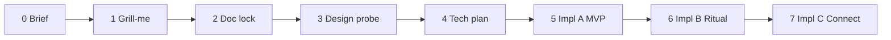

# Focus Stack — Multi-Session Delivery Playbook

> **Purpose:** Orchestrate discovery → design → delivery across **cold-start agent sessions** with repeatable handoffs. **Agents: read this file first** when resuming Focus Stack work.
>
> **Product spec:** [`focus-stack.md`](focus-stack.md) · **Glossary:** [`CONTEXT.md`](../../CONTEXT.md) · **Invariants:** [`docs/decisions.md`](../decisions.md) (2026-06-08 row)

---

## Cold-start read order (agents)

Read **in order**; do not implement until **Current phase** and **Gate** allow it.

| # | File | Why |
|---|------|-----|
| 1 | **This file** (`focus-stack-delivery.md`) | Phase status, session log, **next session prompt** |
| 2 | [`focus-stack.md`](focus-stack.md) | Product brief, user stories, open questions |
| 3 | [`CONTEXT.md`](../../CONTEXT.md) | Canonical terms only |
| 4 | [`docs/decisions.md`](../decisions.md) | Locked invariants (2026-06-08 Focus row) |
| 5 | [`AGENTS.md`](../../AGENTS.md) | Scope guardrails |
| 6 | Design mocks (if Phase 3+) | `docs/archive/design-mocks/focus-stack-*.html` when they exist |
| 7 | Swift sources | **Only** when implementing (Phase 5+) |

**Skills by phase:** [`grill-me`](../../.cursor/skills/grill-me/SKILL.md) (Phase 1) · [`design-mock-probe`](../../.cursor/skills/design-mock-probe/SKILL.md) (Phase 3) · [`review-plan`](../../.cursor/skills/review-plan/SKILL.md) (after probes / before tech plan) · [`simulator-verify.mdc`](../../.cursor/rules/simulator-verify.mdc) (Phase 5+)

**Hard rule:** Do **not** implement Swift, expand Chat/RAG, or lock canonical mocks until the phase gate for that work is **Done** (see [Delivery phases](#delivery-phases)).

---

## Delivery phases

Each phase has an **exit gate**. Do not advance without user sign-off unless this doc marks the gate **Done**.



| Phase | Name | Primary output | Exit gate |
|:-----:|------|----------------|-----------|
| **0** | Product brief | [`focus-stack.md`](focus-stack.md) + roadmap doc touch | Brief approved; `decisions.md` row; agent docs updated |
| **1** | Grill-me | Resolved open questions → decisions table in brief | User confirms all v1 open questions locked |
| **2** | Doc consolidation | Brief + `CONTEXT.md` + `decisions.md` reflect grill output | No remaining `TBD` on v1 scope in brief |
| **3** | Design probe (verification) | Canonical HTML mocks + **verified** UX § in brief | User approves mocks in Safari; **grill decisions confirmed or revised** where probe exposes gaps; forks deleted |
| **4** | Technical planning | `focus-stack-implementation.md` (or § in brief): schema, migration, file list, slices | User approves plan; no schema change without escalation note |
| **5** | Implementation A (MVP) | Shipped code: Focus tab, membership, cap, swap, outcomes (Ref/Takeaway/Release) | Build + tests green; `decisions.md` append; manual QA checklist |
| **6** | Implementation B | Stale nudge, Revisit, weekly ritual, filters | Same verify ladder as Phase 5 |
| **7** | Implementation C | Connect, Thread, thread-scoped assist (optional) | Scoped separately after MVP ships |

**Implementation sub-phases** map to [Phased rollout in brief](focus-stack.md#phased-rollout).

---

## Session types

| Type | When | Agent mode | User role |
|------|------|------------|-----------|
| **Discovery** | Phase 0 | Brainstorm, product brief | Steer goals, validate pillars |
| **Grill** | Phase 1 | One question at a time ([`grill-me`](../../.cursor/skills/grill-me/SKILL.md)) | Answer; pick forks |
| **Doc pass** | Phase 2 | Edit brief + `decisions.md` + `CONTEXT.md` | Approve locked text |
| **Design** | Phase 3 | Main: **verify** grill locks against visuals; revise decisions if needed; subagent: HTML ([`design-mock-probe`](../../.cursor/skills/design-mock-probe/SKILL.md)) | Review in Safari; approve or fork decisions |
| **Tech plan** | Phase 4 | Schema, migrations, file map, risks | Approve before code |
| **Build** | Phase 5+ | Incremental Swift; verify ladder | QA, merge approval |
| **Wrap-up** | End of any session | **Mandatory** [closeout](#end-of-session-closeout-mandatory) | Copy next-session prompt |

---

## Living status

**Last updated:** 2026-06-14 (Session 8 — Phase A+ Library long-press shipped)

| Phase | Status | Notes |
|:-----:|:------:|-------|
| 0 Brief | **Done** | [`focus-stack.md`](focus-stack.md) · doc touch complete |
| 1 Grill-me | **Done** | 10 questions locked 2026-06-09 |
| 2 Doc lock | **Done** | `focus-stack.md` · `CONTEXT.md` · `decisions.md` **2026-06-09** row |
| 3 Design probe | **Done** | Canonical mocks approved Safari 2026-06-09; Detail Focus row + library icon chrome locked |
| 4 Tech plan | **Done** | [`focus-stack-implementation.md`](focus-stack-implementation.md) approved + review edits |
| 5 Impl A | **Done** | **A0–A10** shipped · manual QA signed off 2026-06-09 |
| 6 Impl B | **Done** | **B1–B5** shipped · **Next:** Phase B manual QA (implementation.md §10) |
| 7 Impl C | Pending | Connect / Thread — v2 |

### Phase 5 slice tracker

| Slice | Status | Notes |
|:-----:|:------:|-------|
| A0 | **Done** | `PhathomSchemaV5`, models, V4→V5 migration smoke |
| A1 | **Done** | `FocusStackService`, `FocusCalendar`, archive hook |
| A2 | **Done** | Focus tab replaces Chat (`ChatTab` deleted) |
| A3 | **Done** | Focus list, reorder, nav to Detail |
| A4 | **Done** | Detail Focus toggle + remove-without-outcome |
| A5 | **Done** | Outcome sheets + flows; Cancel = abort |
| A6 | **Done** | Cap swap sheet |
| A7 | **Done** | Library scope icon — vertically centered, **22pt** trailing inset (`screenHorizontal`) |
| A8 | **Done** | `lastTouchedAt` — Detail `onAppear` + `createHighlightFromWebView` |
| A9 | **Done** | Backup export/import **format v4** + cap reject + tests |
| A10 | **Done** | Detail focus closure indicator (last outcome subline) |

### Phase 6 slice tracker

| Slice | Status | Notes |
|:-----:|:------:|-------|
| B1 | **Done** | `FocusStalePresentation` + row tint / leading bar / **Untouched N days** meta |
| B2 | **Done** | Inline stale nudge banner — Keep / Complete / Remove |
| B3 | **Done** | Library revisit **clock** icon (22pt secondary; scope wins) |
| B4 | **Done** | Revisit sheet — preset date labels, compact custom picker |
| B5 | **Done** | Weekly Focus check-in banner; ISO-week dismiss; Go to Library |

### Phase A+ slice tracker

| Slice | Status | Notes |
|:-----:|:------:|-------|
| A+1 | **Done** | Library long-press context menu — Add · Done in Focus · Remove; swap sheet + `focusOutcomeFlow` |

### Decisions locked so far

| Topic | Decision |
|-------|----------|
| Product priority | Focus Stack **before** Chat/RAG tab |
| Pillars | Closing loop · resolution · small/intentional · action not accumulation |
| `ReadStatus` | **Orthogonal** to Focus; `filed` = shelf, not cognitive done |
| v1 surface | **Focus tab** replaces **Chat** in tab row; Library keeps Type · Status · Category only (no Focus segment/filter) |
| v1 outcomes | Reference · Takeaway · Revisit · Release |
| v2 | Connect + Thread |
| Chat/RAG | **Frozen until Focus Phase A**; Chat tab → Focus tab; standalone Chat may **never** ship |
| Cap | **7** fixed; header count; force swap (Release-only) |
| Takeaway | `FocusOutcome` log; pin → `Highlight.userNote` sync |
| Revisit | Signal only; **trailing clock icon** (22pt secondary); no notification v1 |
| In Focus (Library) | **Trailing scope icon** (22pt paprika); **vertically centered** in row; **22pt** inset from right (`screenHorizontal`); mutually exclusive with revisit due |
| Add/remove Focus | **Detail Focus row** toggle (primary); Library **long-press** Add · Done in Focus · Remove (**A+1** shipped); **no** leading swipe |
| Stale nudge + row tint | **≥7d** untouched while in Focus; progressive **`staleIntensity`**; re-add resets clock (Phase B) |
| Reference | Category sheet if uncategorized only |
| Outcome sheet Cancel | **Abort** — stay in Focus (smoke fix 2026-06-09; supersedes grill “dismiss = Release”) |
| Past focus closure (v1) | Detail **last outcome** subline when not in Focus (**A10**); no processed-focus gallery |

### Still open (Phase 1 grill-me)

**None** — consolidated into brief + `decisions.md` **2026-06-09**.

---

## Session log

Newest session **first**. Agent append on every wrap-up.

### Session 8 — 2026-06-14

**Goal:** Phase A+ — Library long-press Focus context menu.

**Done:**
- **A+1:** `LibraryTab` context menu on `libraryItemRow` — Add to Focus · Done in Focus · Remove from Focus
- Reused `FocusStackService`, `FocusSwapSheet` (`focusSwapIncomingItem`), `focusOutcomeFlow`
- Docs: `focus-stack-implementation.md` §7b · `decisions.md` **2026-06-14** row · delivery status

**Verify:** `bash scripts/build-phathom.sh sim` · `bash scripts/test-phathom.sh` (agent)

**Manual UAT:** User — 8-item checklist (implementation.md §7b / plan Verification)

**Not done:** Phase C Connect / Thread

**Blockers:** None.

**Next session:** Phase C gate (separate) or other product work per user.

---

### Session 5 closeout — 2026-06-09

**Trigger:** User passed A8 smoke; requested handoff.

**Done (Phase 5 slices A0–A8):**
- **A0:** `PhathomSchemaV5`, `FocusEntry`, `FocusOutcome`, migration smoke, Share extension builds
- **A1:** `FocusStackService`, `FocusCalendar`, 16 service tests, archive drops `focusEntry`
- **A2:** Focus tab (`scope` icon); `ChatTab` removed
- **A3:** `FocusStackRow`, list reorder, swipe Complete, Detail nav
- **A4:** Detail Focus toggle; cap blocked until swap path
- **A5:** Outcome sheets (Ref/Takeaway/Revisit/Release); **Cancel = abort** (smoke fix)
- **A6:** `FocusSwapSheet`; toggle-at-cap → swap (Release-only on swapped item)
- **A7:** Library trailing **scope** in `GalleryListRow` — vertically centered; **22pt** right inset
- **A8:** `touchFocusEngagementIfNeeded` on Detail `onAppear`; highlight hook in `createHighlightFromWebView`

**Verify:** `bash scripts/build-phathom.sh sim` green · `bash scripts/test-phathom.sh` green · `FocusStackServiceTests` 16/16 · user manual smoke A0–A8 passed

**Not done:** **A9** backup v4 · **A10** closure indicator · Phase A sign-off · Phase B

**Uncommitted work:** Full Focus Stack implementation (30+ modified/new Swift files + handoff/docs). No commit (user did not request).

**Blockers:** None.

**Next session:** Slice **A9** — `LibraryBackupService` format **v4** + round-trip tests + `decisions.md` append.

---

### Session 4 — 2026-06-09

**Goal:** Phase 4 technical planning.

**Done:**
- Created [`focus-stack-implementation.md`](focus-stack-implementation.md) (schema V5, service, slices A0–A9 / B1–B6 / A+)
- Fork locks: revisit clock → B3; long-press → A+; Phase B required for Focus v1 complete
- Plan review edits applied; user approved

**Not done:** Swift implementation (Phase 5 A0+).

**Next session:** Phase 5 slice **A0** — `PhathomSchemaV5` + models + migration smoke.

---

### Session 3 closeout — 2026-06-09

**Trigger:** User approved lock — Detail Focus row + harmonized library icons + stale progressive tint.

**Done:**
- Canonical mocks: tab · detail · sheets · library-chrome
- Brief UX § locked (Detail Focus row, entry/exit points, Library integration)
- Grill table: **5b**, **6b**, **6c** revised; Phase 3 **Done** in brief delivery table
- `decisions.md` Phase 3 probe row; `CONTEXT.md` Focus row + Due for revisit
- Design-mocks README → canonical locked

**Not done:** Phase 4 tech plan · Swift implementation.

**Next session:** Phase 4 technical planning.

---

### Session 2 closeout — 2026-06-09

**Trigger:** User requested wrap-up after Phase 2.

**Closeout completed:** session log · living status · next-session prompt (Phase 3 verification) · agentmemory. No commit (user did not request).

**Uncommitted work (9 files):** `AGENTS.md`, `CONTEXT.md`, `README.md`, `docs/agents/domain.md`, `docs/agents/onboarding.md`, `docs/decisions.md`, `docs/handoff/phase-3-rag-chat.md`, `docs/handoff/focus-stack.md` (modified); `docs/handoff/focus-stack-delivery.md` (new/untracked).

**Next session:** Phase 3 design probe (verification — may revise grill locks).

---

### Session 2 — 2026-06-09

**Goal:** Phase 1 grill-me + Phase 2 doc consolidation.

**Done:**
- Grill-me: all 10 questions (+ Q5b, Q6b) locked via structured picks
- Notable pivot: **Focus tab replaces Chat** (not Library segment)
- Phase 2: `focus-stack.md` v1 spec cleanup; `CONTEXT.md` glossary; `decisions.md` **2026-06-09** row; `README.md`, `phase-3-rag-chat.md`, `onboarding.md`; delivery status
- User clarified: Phase 3 probe = **verification** (look + may change locked decisions)

**Not done:** Design probe, tech plan, implementation.

**Blockers:** None.

---

### Session 1 closeout — 2026-06-08

**Trigger:** User requested wrap-up.

**Closeout completed:** session log · living status · next-session prompt · agentmemory. No new product decisions. No commit (user did not request).

**Uncommitted work (8 files):** `AGENTS.md`, `CONTEXT.md`, `README.md`, `docs/agents/domain.md`, `docs/agents/onboarding.md`, `docs/decisions.md`, `docs/handoff/phase-3-rag-chat.md`, `docs/handoff/focus-stack.md` (modified); `docs/handoff/focus-stack-delivery.md` (new).

**Next session:** Phase 1 grill-me.

---

### Session 1 — 2026-06-08

**Goal:** Discover missing feature; produce product brief; doc touch.

**Done:**
- Brainstormed Focus Stack / commitment loop vs Chat/RAG
- Expanded Connect (v2) and `filed` + Focus alignment
- Created [`focus-stack.md`](focus-stack.md)
- Updated `CONTEXT.md`, `decisions.md`, `AGENTS.md`, `README.md`, `phase-3-rag-chat.md`, `docs/agents/domain.md`, `docs/agents/onboarding.md`
- User requested multi-session delivery playbook → [`focus-stack-delivery.md`](focus-stack-delivery.md)
- Wired playbook into `AGENTS.md`, `README.md`, `CONTEXT.md`, `onboarding.md`, `domain.md`, `decisions.md`, `focus-stack.md`

**Not done:** Grill-me, design probe, tech plan, implementation.

**Wrap-up:** Closeout protocol established; next-session prompt prepared below.

**Blockers:** None.

---

## End-of-session closeout (mandatory)

When the user wants to **wrap up** or **hand off**, the agent **must** complete every item before ending.

### Checklist

- [x] **1. Session log** — Append entry to [Session log](#session-log) (goal, done, not done, blockers)
- [x] **2. Living status** — Update [Living status](#living-status) phase table + “Last updated” date
- [x] **3. Decisions** — If grill/design locked choices: update [Decisions locked](#decisions-locked-so-far) + [`focus-stack.md`](focus-stack.md); append **`decisions.md`** row when invariant-worthy
- [x] **4. Open questions** — Strike or move resolved items in brief; add new ones if discovered
- [x] **5. Glossary** — [`CONTEXT.md`](../../CONTEXT.md) if new canonical terms
- [x] **6. Mocks** — If Phase 3 work: note canonical mock path(s); delete non-canonical forks
- [x] **7. Tech plan** — If Phase 4 started: create/update implementation doc
- [x] **8. Next session prompt** — Rewrite [Next session prompt](#next-session-prompt) below (copy-paste ready)
- [x] **9. Git** — Commit **only if user asked**; otherwise leave dirty state noted in session log
- [x] **10. Agentmemory** — `memory_save` if major direction/decision (optional but recommended)

*Last closeout: 2026-06-09 (Session 5).*

### What not to do on wrap-up

- Do not leave “next steps” only in chat — **must** be in this file’s prompt block
- Do not advance phase status to **Done** without user sign-off for that phase’s gate
- Do not start implementation in a grill/design session unless user explicitly reprioritizes

---

## Next session prompt

**Copy everything in the box below** into the first message of the next cold-start session (user or agent).

```
Resume Focus Stack work on Phathom.

Read in order:
1. docs/handoff/focus-stack-delivery.md (status + slice tracker + this prompt)
2. docs/handoff/focus-stack.md (v1 UX § — reference)
3. CONTEXT.md + docs/decisions.md (Focus + RAG deferral rows)
4. docs/handoff/focus-stack-implementation.md (slice history + QA §10)
5. Swift sources only when implementing follow-ups

Current status: Focus v1 shipped (Phases A + B). Phase A+ Library long-press shipped (A+1).

Next work (pick one gate):
- Phase C Connect / Thread (separate gate)
- Other product work per user

Do NOT implement open RAG / Chat tab unless explicitly directed (phase-3-rag-chat.md deferred).

Tab bar: Library · Notebook · Focus · Add New (Chat placeholder removed).
```

---

## Artifacts index

| Artifact | Path | When |
|----------|------|------|
| Product brief | [`focus-stack.md`](focus-stack.md) | Phase 0+ |
| **This playbook** | [`focus-stack-delivery.md`](focus-stack-delivery.md) | Always |
| Implementation plan | [`focus-stack-implementation.md`](focus-stack-implementation.md) | Phase 4 **Done** · Phase 5+ |
| Design mocks (canonical) | [`focus-stack-ad-tab-a.html`](../archive/design-mocks/focus-stack-ad-tab-a.html) · [`focus-stack-ad-detail-a.html`](../archive/design-mocks/focus-stack-ad-detail-a.html) · [`focus-stack-ad-sheets-a.html`](../archive/design-mocks/focus-stack-ad-sheets-a.html) · [`focus-stack-ad-library-chrome-a.html`](../archive/design-mocks/focus-stack-ad-library-chrome-a.html) | Phase 3 **Done** |
| Decision log | [`docs/decisions.md`](../decisions.md) | When invariants lock |
| Deferred RAG | [`phase-3-rag-chat.md`](phase-3-rag-chat.md) | Reference only |

---

## References

- [`focus-stack.md`](focus-stack.md)
- [`phase-3-rag-chat.md`](phase-3-rag-chat.md) — deferred
- UI evolution closeout pattern: [`ui-evolution-implementation-plan.md`](../archive/ui-evolution-implementation-plan.md) § Post-phase closeout
