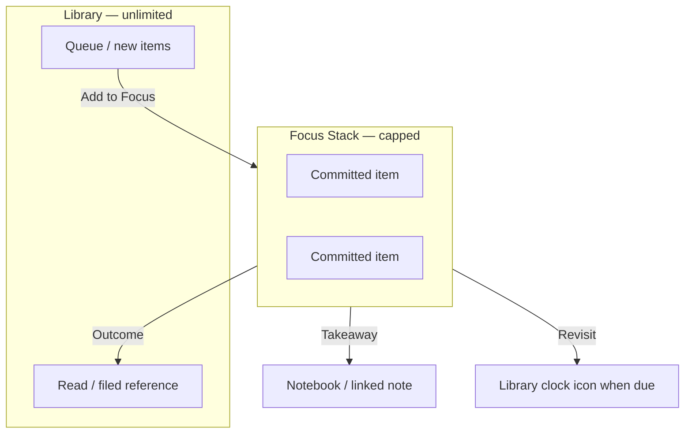

# Focus Stack — Product Brief & Hand-off

> **Status:** **v1 shipped** (Implementation Phases A + B). See **[`focus-stack-delivery.md`](focus-stack-delivery.md)** for session log, slice tracker, and follow-ups (**A+**, **Phase C**).

> **Agents:** On cold start, read **`focus-stack-delivery.md` first**, then this file. On wrap-up, run the [closeout checklist](focus-stack-delivery.md#end-of-session-closeout-mandatory).

> **Supersedes (for priority):** Standalone **Chat tab / Phase 3 RAG** as the next major product bet. Chat/RAG may return later as **thread-scoped assist** on Focus outcomes — see [Relationship to Phase 3 Chat](#relationship-to-phase-3-chat-rag).

**Canonical names:** **Focus Stack** (surface) · **Focus commitment** (membership) · **Focus outcome** (closure) · **Thread** (v2 Connect container) — use exactly in issues, tests, and schema discussions. Glossary: [`CONTEXT.md`](../../CONTEXT.md).

---

## Executive summary

Phathom excels at **capture**, **organize**, and **annotate**. It does not yet help users **decide what matters now** or **close the loop** after reading.

**Focus Stack** is a small, capped list of articles the user has explicitly committed to engage with. It sits between the infinite capture queue (Library) and the passive highlight archive (Notebook). Entering Focus means *I intend to read or act on this.* Leaving Focus uses a lightweight **outcome** — not just another `ReadStatus` change.

**North star:** committed items reach an outcome within ~14 days.

**Design pillars (user-validated):** closing the loop · resolution · small and intentional · action not accumulation.

---

## Problem statement

> Knowledge workers using Phathom can save and annotate more than they can process. Without a bounded commitment surface and a post-read closure loop, saved articles become **decision debt** — occupying mental space without a path to resolution.

### Observed pain

| Pain | Manifestation |
|------|----------------|
| **Queue rot** | `new` (and sometimes `read`) items accumulate; no forcing function |
| **Post-interaction void** | Read + highlighted + maybe filed — no “now what?” |
| **False closure** | `filed` reads as “done” but often means “on the shelf” |
| **Priority without mechanism** | Mental ranking with no app expression |

---

## Goals

### Primary

1. Reduce time-to-engagement on high-value saves
2. Make “done” mean something beyond `read` or `filed`
3. Surface stale commitments without shame-based nagging
4. Complement Library, Notebook, and (future) thread-scoped assist

### Non-goals (v1)

- Replacing Library as the capture warehouse
- **Library `All | Focus` segment or Focus filter** (Focus list lives on **Focus tab** only)
- Auto-ranking entire library by AI priority
- Post-capture “Add to Focus?” prompts
- Task manager (assignees, due dates, notification spam)
- Replacing Categories or Tags
- Spaced-repetition flashcard system (possible v2 extension)
- Implementing **Connect / Thread** entity (v2)
- **Chat tab / standalone RAG** (frozen until Focus Phase A ships; may never return as a tab — see below)

---

## Core concept

### Two libraries, one warehouse

| Surface | Role | Size |
|---------|------|------|
| **Library** | Warehouse — all captures, searchable, filterable | Unlimited |
| **Focus Stack** | Workbench — explicit commitments | Capped at **7** (fixed v1) |
| **Notebook** | Highlight archive — what you marked | Unlimited feed |



### Three orthogonal layers

Do **not** conflate these:

| Layer | Question | Mechanism |
|-------|----------|-----------|
| **Triage** | Where is this item in library workflow? | `ReadStatus`: `new` · `read` · `filed` |
| **Commitment** | Am I committed to it **now**? | Focus membership |
| **Resolution** | How did I close that commitment? | Focus outcome |

### Three kinds of “done”

1. **Triage done** — `read` or `filed` (seen; maybe shelved)
2. **Commitment done** — left Focus with an outcome
3. **Cognitive done** — takeaway written, thread resolved, or conscious Release

An item can be triage-done but not cognitive-done (classic **shelf rot** on `filed` references).

---

## `ReadStatus` and Focus — alignment

`ReadStatus` and Focus are **orthogonal**, not redundant.

### What `filed` means (shipped)

- User finished **library triage**; often paired with **Category**
- **Organizational** terminal state — “on the shelf”
- Does **not** imply full digestion, no future questions, or cognitive closure

### `filed` + Focus combinations

| ReadStatus | In Focus? | Meaning |
|------------|-----------|---------|
| `new` | Yes | Committed unread — priority in capped stack |
| `read` | Yes | Open loop — engaged, not resolved |
| `filed` | No | **Default shelf** — healthy reference, no active commitment |
| `filed` | Yes | **Re-activated reference** — live inquiry (Scenario C) |

**Rule:** `filed` without Focus = fine. Focus without changing `filed` = fine. Filing via swipe **without** Focus remains a fast triage path.

### Outcome → typical `ReadStatus` (suggestions only; user can override)

| Outcome | Typical ReadStatus | Notes |
|---------|-------------------|-------|
| **Reference** | → `filed` | Category sheet **only if uncategorized**; else remove from Focus |
| **Takeaway** | `read` or `filed` | User choice |
| **Revisit** | unchanged | Leaves Focus; resurface later |
| **Release** | unchanged | Drops commitment only |
| **Connect** (v2) | often stays `filed` | Thread link matters more than status |

### Rot types Focus addresses

| Rot type | Items | Focus mechanism |
|----------|-------|-----------------|
| **Ingest rot** | `new`, some `read` | Cap + promote-from-queue ritual |
| **Open-loop rot** | `read` + highlights, not filed | Focus + Takeaway / Connect |
| **Shelf rot** | `filed`, esp. with highlights | Revisit + resurface; re-activate into Focus when project goes live |

**Copy guidance:** teach “`filed` = on the shelf” not “`filed` = done with article.”

---

## Focus outcomes (v1)

| Outcome | User meaning | System behavior |
|---------|--------------|-----------------|
| **Reference** | Good as-is; shelve it | Remove from Focus; Category sheet **only if uncategorized** |
| **Takeaway** | I learned something worth keeping | `FocusOutcome` log + optional highlight `userNote` sync on pin → Notebook provenance |
| **Revisit** | Not done; come back later | Remove from Focus; schedule resurface (1w / 1m / custom). Due → trailing **clock icon** on Library row; user re-adds manually. |
| **Release** | No longer matters | Remove from Focus; Library unchanged |

Outcome sheet: one screen, skippable with sensible default; not a guilt modal.

### Connect (v2) — deferred

**Connect** = *this article feeds an ongoing line of inquiry*, not just my shelf.

| | Takeaway | Reference | Connect |
|--|----------|-----------|---------|
| Closure | Insight captured | Shelved | Inquiry continues |
| Leaves Focus | Yes | Yes | Yes |
| New structure | Note / Notebook | Category | **Thread** membership |

**Thread** (working name): named inquiry over time — member articles, highlights, takeaways; optional tag/category seed. **Epistemic container**, not a task list.

**Flow (v2):** Complete Focus item → Connect → pick/create Thread → item joins membership.

**Chat/RAG evolution:** thread-scoped assist (“synthesize these 4 items”, “what’s unresolved?”) — not open-ended corpus chat. May extend existing `ChatThread` / new model — **TBD at technical planning**.

---

## User personas (lightweight)

| Persona | Need |
|---------|------|
| **Alex — Curator** | Saves heavily; needs weekly “pick N” + cap tradeoffs |
| **Sam — Deep reader** | Highlights heavily; needs post-read takeaway / synthesis |
| **Jordan — Project researcher** | Filed references; re-activates into Focus when project is live |

---

## User stories

### Epic 1 — Commit to Focus

| ID | Story |
|----|-------|
| F-01 | Add to Focus from **Detail Focus row** toggle; optional Library context menu |
| F-02 | See Focus capacity; cap forces prioritize |
| F-03 | Reorder Focus stack |
| F-04 | Remove from Focus via Detail toggle off (no outcome) |

### Epic 2 — Work from Focus

| ID | Story |
|----|-------|
| F-05 | Focus view: committed items only — title, days-in-focus, read status, summary snippet |
| F-06 | Tap Focus item → Detail; return path preserves Focus context |
| F-07 | Days-in-focus visible |
| F-08 | Stale nudge (**7+ days** untouched **while in Focus**): Keep / Complete / Remove |

### Epic 3 — Close the loop

| ID | Story |
|----|-------|
| F-09 | “Done in Focus” → outcome sheet |
| F-09a | Outcome sheet **Cancel** / swipe-dismiss → abort (stay in Focus); **Release** row only for Release |
| F-10 | Takeaway: 1–3 sentences or pin highlight |
| F-11 | Revisit: schedule resurface |
| F-12 | Reference: Category sheet when uncategorized only |
| F-12a | Detail **focus closure indicator** when not in Focus — latest `FocusOutcome` (no processed-focus gallery v1) |

### Epic 4 — Rituals

| ID | Story |
|----|-------|
| F-13 | Weekly in-app Focus reset: review stack + pick N from queue (optional, dismissible) |
| F-14 | Promote-from-queue during reset |

### Epic 5 — Library integration

| ID | Story |
|----|-------|
| F-15 | Library rows: trailing **scope** icon (in Focus) or **clock** icon (revisit due) — icon-only, 22pt |
| F-16 | ~~Library Focus segment/filter~~ **Cut v1** — Focus tab only; Library keeps Type · Status · Category |
| F-17 | Notebook links takeaway provenance to Focus outcome |

### Epic 6 — Assist (post-v1 / LLM)

| ID | Story |
|----|-------|
| F-18 | On add-to-Focus: surface existing summary (no new inference required) |
| F-19 | Suggest “bundle” related items by tag overlap |
| F-20 | Draft Takeaway from highlights (editable; local LLM) |

---

## Narrative scenarios

### A — Queue rot → weekly commitment

Alex saves 8 articles Sunday. Monday commute: Focus tab header shows *3 of 7 · 4 open — pick what matters this week.* Adds 3. Thursday: finishes one → **Takeaway** → leaves Focus. Sunday: stale nudge on 8-day item → Release one, keep one.

### B — Read but not finished

Sam read + highlighted last month, `read`, not filed. Adds to Focus → **Takeaway** with pinned highlight → closure.

### C — Filed reference re-activated

Jordan filed kitchen article in `kitchen-remodel` last fall. Spring: project live → adds `filed` item to Focus. After visit: **Connect** (v2) or **Takeaway** / **Revisit** / **Reference**. `filed` = shelf location; Focus = attention now.

### D — Cap forces tradeoff

Stack full (7/7). Add eighth → swap sheet lists all 7 with days-in-focus → user picks one → **Release** (swap-only; no outcome sheet) → new item enters. Cancel = add aborted.

---

## UX (v1 — grill + probe locked)

> **Phase 3 probe locked 2026-06-09.** Canonical mocks: [`focus-stack-ad-tab-a.html`](../archive/design-mocks/focus-stack-ad-tab-a.html) · [`focus-stack-ad-detail-a.html`](../archive/design-mocks/focus-stack-ad-detail-a.html) · [`focus-stack-ad-library-chrome-a.html`](../archive/design-mocks/focus-stack-ad-library-chrome-a.html) · [`focus-stack-ad-sheets-a.html`](../archive/design-mocks/focus-stack-ad-sheets-a.html).

### Tab bar

**Library · Notebook · Focus · Add New** — **Focus tab replaces Chat.** Library unchanged as warehouse (Type · Status · Category filters only; no Focus segment).

### Focus tab

- Header: `N of 7` + open-slot copy; committed items only (**no ghost rows**)
- Row: title · host/kind · days-in-focus · `ReadStatus` (secondary) · summary line · highlight count · **Untouched N days** meta + progressive stale tint when eligible (Phase B — see [Stale treatment](#stale-treatment-phase-b))
- Reorder; swipe Complete → outcome sheet

### Stale treatment (Phase B)

**Meaning (user):** *I committed to this while in Focus, but I haven't opened it or added a highlight in a while — time to re-decide.* Not an error state; pairs with nudge (Keep / Complete / Remove). **Days-in-focus** is tenure display only.

**Clock (`FocusEntry.lastTouchedAt`):**

- Scoped to **current Focus membership** — Detail open or new highlight **since add** only; pre–add-to-Focus activity does **not** count.
- On add: set **`lastTouchedAt = addedAt`** (new `FocusEntry` row).
- On leave Focus for **any** reason (Release, swap-out, outcome, manual remove): delete `FocusEntry`. **Re-add** (including after swap) creates a **new** membership → clock **starts over** at `addedAt`.

**When stale:** `daysUntouched ≥ 7`, where `daysUntouched` = whole days from `lastTouchedAt` to now (calendar-day semantics — match app date formatting elsewhere).

| In Focus | Last touch while in Focus | Stale? |
|----------|---------------------------|--------|
| 12 days | 8 days ago | Yes |
| 5 days | 8 days ago (before add) | No |
| 12 days | 6 days ago | No |

**Progressive row tint (Focus tab list):** visual intensity ramps with days untouched — no tint below 7 days. Design reference: [`focus-stack-ad-tab-a.html`](../archive/design-mocks/focus-stack-ad-tab-a.html) **Stale ramp** frame.

| Input | Rule |
|-------|------|
| `daysUntouched` | Whole days since `lastTouchedAt` |
| `staleIntensity` | `min(Double(daysUntouched - 6) / 7.0, 1.0)` — **0…1**; **0** when `daysUntouched < 7` |
| Left accent bar | System orange (or semantic warning), **opacity = staleIntensity**, **~3pt** leading edge |
| Row background wash | Same hue, **opacity ≈ staleIntensity × 0.22** (tune in SwiftUI; mock uses this ratio) |
| Meta line | Show **Untouched N days** (secondary/warning tone) when `daysUntouched ≥ 7`; omit below threshold |
| Cap | `staleIntensity` tops out at **1.0** (e.g. 13+ days untouched) |

**SwiftUI sketch (implementers):**

```swift
// On FocusEntry — compute once per row render
let daysUntouched = calendarWholeDays(since: entry.lastTouchedAt, to: now)
let staleIntensity = daysUntouched >= 7
    ? min(Double(daysUntouched - 6) / 7.0, 1.0) : 0

// Row chrome when staleIntensity > 0:
// - overlay leading Rectangle (~3pt).fill(Color.orange.opacity(staleIntensity))
// - background Color.orange.opacity(staleIntensity * 0.22)
// - meta: "Untouched \(daysUntouched) days" when daysUntouched >= 7
```

**Nudge (Phase B):** separate banner/sheet at threshold — see [`focus-stack-ad-sheets-a.html`](../archive/design-mocks/focus-stack-ad-sheets-a.html). Row tint and nudge share the same `daysUntouched` / membership rules; nudge copy does **not** show α or debug values.

### Detail — Focus row

Add/remove Focus on **Detail** uses the same **hairline row** pattern as **Category** (see shipped `DetailView` + mock [`focus-stack-ad-detail-a.html`](../archive/design-mocks/focus-stack-ad-detail-a.html)):

| Element | Spec |
|---------|------|
| **Placement** | After **Read status** segmented control; before **Category** row |
| **Label** | **Focus** — 17pt bold left (`hairline-row-label` / Category parity) |
| **Control** | **`Toggle`** right — system switch; paprika when on |
| **Off** | Not in Focus — toggle off |
| **On** | In Focus — toggle on; show **Done in Focus** hairline capsule in bottom action stack (above Summarize again) |
| **Nav** | Back + Share only — **no** Focus icon in toolbar |

Toggle add at cap **7/7** → swap sheet (Release-only) before membership created. Toggle off = remove without outcome (F-04 mistake path).

**Focus closure indicator:** When **not** in Focus and the item has ≥1 `FocusOutcome`, show read-only copy under the Focus row — latest outcome by `completedAt` (e.g. `Takeaway · completed 3 days ago`). **15pt secondary.** Hidden while in Focus. v1 has **no** tab or list for all processed focus items; this line + outcome-specific surfaces (`filed`, highlight note, revisit clock) are the closure signals.

### Outcome sheet — Cancel vs Release

| Action | Behavior |
|--------|----------|
| **Cancel** (toolbar) or swipe-dismiss | Abort — item **stays in Focus** |
| **Release** row | Leave Focus + append Release outcome |
| Takeaway / Revisit sub-flow Cancel | Return to outcome picker; no completion |

### Entry points

- **Detail Focus row** — primary add/remove (`Toggle`)
- **Library long-press** — optional context menu: **Add to Focus** / **Remove from Focus** (v1 stretch OK to ship with Detail-only)
- **Not v1:** Library **leading swipe** for Focus (leading edge = **ReadStatus** only, shipped Mail-style)
- Bulk: not v1

### Exit points

- Detail: **Done in Focus** (when toggle on) → outcome sheet
- Detail: toggle **off** → remove without outcome
- Focus tab swipe: Complete → outcome sheet
- At cap: swap sheet → **Release** only (or cancel add)
- Stale nudge (Phase B): Keep / Complete / Remove

### Library integration

- **In Focus:** trailing **scope/target icon** only — **22×22**, paprika (`AppPalette.accent`); VoiceOver “In Focus”
- **Due for revisit:** trailing **clock icon** only — **22×22**, secondary/muted; VoiceOver “Revisit due”
- **Mutually exclusive** — never both on one row (in Focus ⊕ due for revisit)
- **No** text pill, **no** “Due” label on row chrome — icon vocabulary harmonized
- Mock: [`focus-stack-ad-library-chrome-a.html`](../archive/design-mocks/focus-stack-ad-library-chrome-a.html)

---

## Conceptual data model (not implementation spec)

```
FocusEntry (active membership — max 7)
├── contentItemID
├── addedAt: Date
├── sortOrder: Int
└── lastTouchedAt: Date       // Engagement while in *this* membership: Detail open or new highlight since add; init = addedAt

FocusOutcome (append-only log — v1)
├── contentItemID
├── completedAt: Date
├── outcome: reference | takeaway | revisit | release
├── takeawayText: String?
├── linkedHighlightID: UUID?   // Takeaway + pin → also sync highlight.userNote
└── scheduledResurfaceAt: Date?  // Revisit only; due → Library trailing clock icon

Thread (v2 — Connect)
├── id, topic, createdAt
├── member ContentItems
├── optional sourceTags / category seed
└── takeaways / highlights (aggregated view)
```

**Invariant:** max **7** active Focus entries (fixed v1; not user-configurable until post-MVP validation).

**Pipeline:** `ProcessingStatus` unchanged — Focus is user layer only.

---

## Design principles

1. **Explicit over inferred** — user adds to Focus; no auto-fill from AI rank
2. **Cap creates clarity** — scarcity is the feature
3. **Closure over status** — outcomes > another label
4. **No guilt inbox** — stale nudges = re-decision, not punishment
5. **Local-first** — commitment data on-device
6. **Reuse surfaces** — Detail, Notebook, Category filing sheet
7. **Orthogonal to `ReadStatus`** — Focus is not a fourth read status

---

## Relationship to Phase 3 Chat / RAG

| Phase 3 spec (2026) | Focus-era direction |
|---------------------|---------------------|
| Chat tab = primary “Deep Dive” | **Removed from tab bar** — Focus tab replaces Chat; assist may be thread-scoped later |
| New chat = multi-select tags | Thread from **Connect** + optional tag seed (v2) |
| Open-ended RAG Q&A | **Thread-scoped assist** on bounded corpus |
| Conversation starters | Closure prompts across thread members |

**Do not implement** Chat/RAG until **Focus Phase A (MVP)** ships. **Focus tab replaces Chat** in tab row. Existing `ChatThread` / `ChatMessage` schema may remain; standalone Chat tab **may never return** — thread-scoped assist is the likely evolution if Chat ships at all.

See [`phase-3-rag-chat.md`](phase-3-rag-chat.md) status banner.

---

## Phased rollout

### Phase A — MVP

- `FocusEntry` + cap **7** (force swap, Release-only)
- **Focus tab** (replaces Chat): list, `N of 7` header, reorder
- Add/remove: **Detail Focus row** toggle; optional Library context menu
- Outcomes: Reference · Takeaway · Release (+ Revisit date storage; clock icon surfacing may ship A or B)
- `FocusOutcome` log; Takeaway pin → `Highlight.userNote` sync
- Days-in-focus; Library trailing **scope** icon when in Focus
- Detail **last focus outcome** line when not in Focus (slice **A10**)

**Out of Phase A v1:** Processed-focus history gallery; Library row badge for past outcomes (scope = active membership only).

### Phase B — Ritual + staleness

- Stale nudge + **progressive row tint** — see [Stale treatment](#stale-treatment-phase-b); `daysUntouched ≥ 7`; intensity `min((daysUntouched − 6) / 7, 1)`
- Weekly reset prompt (in-app, dismissible)
- Revisit due **clock icon** on Library rows (may ship A or B)
- Notebook text-only takeaway provenance (stretch)

### Phase C — Connect + assist

- Thread entity + Connect outcome
- LLM-drafted Takeaway from highlights
- Bundle-related suggestion
- Thread-scoped RAG assist (re-scoped Phase 3)

---

## Success signals

| Signal | Healthy direction |
|--------|-------------------|
| Stack utilization | Active users hold ~3–7 items, not 0 or always full |
| Days-in-Focus before outcome | Decreases over time |
| Outcome mix | Reference / Takeaway / Revisit — not 95% Release |
| `new` age | Fewer items `new` > 30d without ever entering Focus |

On-device / qualitative — no analytics SDK.

---

## Risks and mitigations

| Risk | Mitigation |
|------|------------|
| Another inbox to ignore | Hard cap + stale prompts + weekly ritual |
| `ReadStatus` confusion | Clear copy; Focus ≠ fourth status |
| Outcome fatigue | Skippable sheet; smart defaults |
| Tab clutter | Focus replaces Chat slot; Library stays warehouse-only |
| Task-manager creep | No assignees/due dates in v1 |

---

## Grill-me decisions (locked)

| # | Topic | Decision |
|---|-------|----------|
| 1 | **Default cap** | **7** fixed for v1 — not user-configurable in Settings until post-MVP validation. |
| 1b | **Empty slots UI** | **Header count only** — e.g. `3 of 7` + open-slot copy on **Focus tab**. List shows committed items only; **no ghost rows**. Swap sheet (when full) lists current stack. |
| 2 | **Full stack (7/7)** | **Force swap** — no silent overflow; cap is hard invariant. |
| 2b | **Swap sheet** | Shown on every add-at-cap. Lists all 7 (title, days-in-focus, read status). User picks one to remove or cancels add. |
| 2c | **Swap removal** | **Release only** — capacity trade, not closure ritual. Full outcomes stay on **Done in Focus** / stale nudge. No "Complete…" shortcut on swap sheet v1. |
| 3 | **Post-capture Focus prompt** | **No v1** — no auto-suggest after Save (Add New / Share). Focus entry stays explicit Library/Detail action only. |
| 3b | **Weekly ritual** | **Yes, separate** (Phase B) — optional in-app reset; dismissible; never blocks capture flow. |
| 4 | **Takeaway storage** | **`FocusOutcome` append-only log** — source of truth for all outcomes (`takeawayText`, optional `linkedHighlightID`, `completedAt`). |
| 4b | **Takeaway + pin** | On completion: log row + **one-time denormalize** into linked highlight's `userNote` (Notebook reuse). Highlight note may diverge after later edits — outcome log keeps completion snapshot. |
| 4c | **Takeaway text-only** | Log row only — **Detail** shows latest takeaway; no synthetic highlight. Notebook provenance for text-only = Phase A stretch. |
| 4d | **Rejected** | No new note kind. No `ContentItem` takeaway field. Media/note items use text-only path (highlight create is web-only today). |
| 5 | **Revisit resurface** | **Signal only** — no auto re-insert. User manually **Add to Focus** (swap if 7/7). `scheduledResurfaceAt` on Revisit `FocusOutcome`. |
| 5b | **Due-for-revisit surfacing** | **Trailing clock icon only** (22pt, secondary) on Library All rows when `scheduledResurfaceAt` ≤ now. **No** text pill. Mutually exclusive with in-Focus scope icon. No Revisit segment/filter. Mock: [`focus-stack-ad-library-chrome-a.html`](../archive/design-mocks/focus-stack-ad-library-chrome-a.html). |
| 6 | **Focus surface (v1)** | **Dedicated Focus tab** replaces **Chat** in tab row: **Library · Notebook · Focus · Add New**. Chat tab removed for now; Chat/thread assist returns in a later update. |
| 6b | **Library + Focus** | **No Focus filter or segment in Library** — Type · Status · Category only. Focus list on Focus tab. **In Focus:** trailing **scope icon** (paprika, 22pt). **No** leading swipe for Focus. |
| 6c | **Add/remove Focus** | **Primary:** Detail **Focus** hairline row + **Toggle** (Category parity; after Read status). **Optional:** Library long-press context menu. **Rejected:** Library leading swipe (ReadStatus owns leading edge). Mock: [`focus-stack-ad-detail-a.html`](../archive/design-mocks/focus-stack-ad-detail-a.html). |
| 7 | **Revisit notification** | **In-app only** — Library trailing clock icon when due. No local or push notification v1. |
| 8 | **Reference + Category** | Category filing sheet **only when item is uncategorized**. Already categorized → remove from Focus, no sheet. |
| 9 | **Stale threshold + row tint** | **Stale** = **7+ days** without engagement **while in current Focus membership** — from **`FocusEntry.lastTouchedAt`** (Detail open or new highlight **since add** only). **Days-in-focus** is display-only. On add: **`lastTouchedAt = addedAt`**. **Leave Focus** (Release, swap-out, outcome, remove) deletes `FocusEntry`; **re-add** = new membership, clock resets. **Progressive tint** (Phase B Focus tab): `staleIntensity = min((daysUntouched − 6) / 7, 1)` on leading bar + row wash when `daysUntouched ≥ 7`; meta **Untouched N days**. Nudge: Keep / Complete / Remove. Implement: [Stale treatment §](#stale-treatment-phase-b) · mock [`focus-stack-ad-tab-a.html`](../archive/design-mocks/focus-stack-ad-tab-a.html). |
| 10 | **Chat / RAG freeze** | **No Chat/RAG implementation until Focus Phase A (MVP) ships.** Chat tab replaced by Focus; thread assist may return later — **open possibility: Chat never ships** as standalone tab. |

---

## Grill-me archive

All Phase 1 questions resolved **2026-06-09**. Canonical v1 spec: sections above + [`docs/decisions.md`](../decisions.md) **2026-06-09** row. Audit trail: [Grill-me decisions](#grill-me-decisions-locked).


---

## Delivery workflow

**Authoritative tracker:** [`focus-stack-delivery.md`](focus-stack-delivery.md) — phases, session log, closeout checklist, next-session prompt.

| Phase | Step | Status |
|:-----:|------|:------:|
| 0 | Product brief + doc touch | **Done** |
| 1 | Grill-me | **Done** |
| 2 | Doc consolidation from grill | **Done** |
| 3 | Design probe (verification) | **Done** |
| 4 | Technical planning | Pending |
| 5–7 | Implementation A / B / C | Pending |

---

## References

- [`CONTEXT.md`](../../CONTEXT.md) — glossary
- [`docs/decisions.md`](../decisions.md) — **2026-06-08** priority · **2026-06-09** v1 grill lock
- [`phase-3-rag-chat.md`](phase-3-rag-chat.md) — deferred RAG spec
- Shipped: [`ReadStatus`](../../Phathom/PhathomCore/Sources/PhathomCore/Enums.swift), [`LibraryTab`](../../Phathom/Phathom/Views/Library/LibraryTab.swift), [`NotebookTab`](../../Phathom/Phathom/Views/Notebook/NotebookTab.swift)
