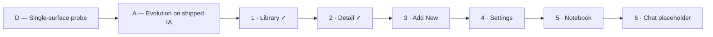

# App UI Evolution — Design Hand-off (Discovery)

> **Status:** **Design discovery — not shipped.** No Swift changes are authorized until this hand-off is explicitly green-lit for implementation.
>
> **Authority:** This document captures **locked design choices** from HTML mocks and review sessions. **Shipped behavior** remains **`Phathom/`** until implementation lands. On conflict: **code > [`docs/decisions.md`](../decisions.md) > this hand-off**.
>
> **Historical baseline:** The prior shipped refresh is archived in [`docs/archive/ui-design-refresh.md`](../archive/ui-design-refresh.md). This hand-off describes the **next evolution** across app surfaces (Library first, then Detail and remaining tabs), not a full IA rewrite.

**Session:** May 2026 · Path **D → A** · **Library + Detail locked** · **Add New next** (mode switcher pre-locked)

**Canonical mocks (implementation reference):** [Library — Search B](../../.design-mocks/library-ad-search-b-toolbar.html) · [Detail — Full hairline A](../../.design-mocks/detail-ad-full-hairline-a.html) — open locally in Safari; **ephemeral**, not committed by default

**Related code (current shipped):** [`LibraryTab.swift`](../../Phathom/Phathom/Views/Library/LibraryTab.swift) · [`DetailView.swift`](../../Phathom/Phathom/Views/Detail/DetailView.swift) · [`AddNewTab.swift`](../../Phathom/Phathom/Views/AddNew/AddNewTab.swift) · [`MainTabView.swift`](../../Phathom/Phathom/Views/MainTabView.swift) · [`AppPalette.swift`](../../Phathom/Phathom/Helpers/AppPalette.swift)

---

## 1. Goals

### North star (overarching)

**One cohesive, polished, high-end product feel across every surface** — unified layout rhythm, spacing, typography scale, and material language so Library, Detail, Notebook, and remaining tabs read as the same “expensive” daily app, not a patchwork of per-screen styles.

| Principle | What it means in practice |
|-----------|---------------------------|
| **Consistency** | Same **22px** horizontal rhythm, hairline vocabulary, section-header scale, and accent restraint everywhere probes land |
| **Polish** | Generous air, optically aligned type, hairline structure over filled-card density — editorial gallery, not cockpit or template UI |
| **Cohesion** | Decisions on one surface (e.g. Library gallery rows) propagate to related surfaces (Detail highlights, Notebook feed) unless explicitly forked |
| **Evolution, not rewrite** | Shipped IA, flows, and tab bar preserved — refine execution, not navigation graph |

### Surface goals

| Goal | Rationale |
|------|-----------|
| **Unified top chrome + spacing rhythm** | Reduce ad-hoc offsets and split identity (`Phathom` nav vs `Library` content title) |
| **Surface-by-surface probes** | Lock Library ✓, Detail ✓, then **Add New** (in progress), **Settings**, **Notebook**, **Chat placeholder** |
| **Preserve shipped tab bar** | iOS 26 liquid-glass floating pill, four tabs, SF symbols — see [§3.5](#35-tab-bar--preserved) |

**Explicit non-goals (discovery + implementation):** RAG / conversational Chat **functionality** ([`phase-3-rag-chat.md`](phase-3-rag-chat.md)), Share extension UI, CloudKit/sync CTAs.

**In scope for discovery mocks (HTML only):** all surfaces in [§2.1](#21-surface-probe-roadmap) — including Chat **placeholder shell** (visual/cohesion only, not Phase 3 behavior).

---

## 2. Process & probe path



| Step | Choice |
|------|--------|
| **Swing size** | **D → A** — probe one surface at a time, evolve tokens/layout; do not rethink tabs or nav graph |
| **Discovery artifact** | Static HTML in `.design-mocks/` (side-by-side frames where useful) |
| **Carry forward** | Each probe applies the same ideas locked on Library: editorial stack, hairline/gallery material, 22px rhythm, preserved tab bar, warm dark palette |

### 2.1 Surface probe roadmap

Ordered queue for HTML mocks and design review. **No Swift** until the full discovery pass (or per-surface green-light) is approved.

| # | Surface | Status | What the probe stress-tests | Shipped code entry |
|---|---------|--------|----------------------------|-------------------|
| **1** | **Library** | **Done** — decisions locked [§3](#3-locked-decisions-library) | Filters, Search B, gallery rows, bulk/select chrome, processing badges | [`LibraryTab.swift`](../../Phathom/Phathom/Views/Library/LibraryTab.swift) |
| **2** | **Detail** | **Done** — locked [§3.6](#36-locked-decisions-detail) | Full hairline A + Option **5** AI zone parent header | [`DetailView.swift`](../../Phathom/Phathom/Views/Detail/DetailView.swift) |
| **3** | **Add New** | **Next** — mode switcher pre-locked [§3.7](#37-add-new--pre-locked--mock-next) | Capture card material, form density, CTA; **22px rhythm** | [`AddNewTab.swift`](../../Phathom/Phathom/Views/AddNew/AddNewTab.swift) |
| **4** | **Settings** | Planned | Grouped list rhythm, model/backup rows, disclosure hierarchy, push from Library gear — align spacing and section headers with editorial system | [`SettingsTab.swift`](../../Phathom/Phathom/Views/Settings/SettingsTab.swift) |
| **5** | **Notebook** | Planned | Cross-item highlight feed, grouping by parent item — **inherit Detail A hairline highlight rows** (not filled cards) | [`NotebookTab.swift`](../../Phathom/Phathom/Views/Notebook/NotebookTab.swift) |
| **6** | **Chat (placeholder)** | Planned | Empty / coming-soon shell only — tab presence, copy tone, visual parity with other tabs; **not** RAG threads, bubbles, or retrieval UX ([`phase-3-rag-chat.md`](phase-3-rag-chat.md)) | [`ChatTab.swift`](../../Phathom/Phathom/Views/Chat/ChatTab.swift) |

**After all probes:** Consolidate tokens + section patterns into one implementation plan; optionally append UI rows to [`docs/decisions.md`](../decisions.md) when coding starts.

---

## 3. Locked decisions (Library)

### 3.1 Chrome pattern — **A + D (Editorial stack + Gallery list)**

| Layer | Decision |
|-------|----------|
| **Top actions** | Minimal row: **Select** (leading), **Search** + **Settings** (trailing). No persistent search field in the editorial stack. |
| **Screen title** | Large left-aligned **Library** (`~34pt`, semibold, tight tracking) below the actions row — screen owns the title, not the system nav brand. |
| **List material** | **Gallery rows** — hairline dividers, **no filled card background**, 64×64 thumbs, generous vertical padding (`~19px`), content scrolls with editorial chrome. |
| **Horizontal rhythm** | **22px** (`--rhythm`) content inset; align title, filters, and row text to this grid. |

**Rejected chrome alternative:** **C — Compact brand bar** (`Phathom` wordmark bar, no screen title, filled card rows). Deleted mock; denser / less editorial.

### 3.2 Search — **Pattern B (toolbar icon)**

| State | Behavior |
|-------|----------|
| **At rest** | Magnifying glass in the top actions row (beside Settings). **No** in-stack search field. **No** SwiftUI `.searchable` drawer as the target UX. |
| **Active** | Search bar **pins** over the actions band (covers Select + icon row). **No layout shift** on title, filters, or list when search opens. |
| **Scroll** | Pinned bar behaves like **`position: fixed`**: title, filters, and rows **scroll underneath** the search bar (see canonical mock **Search active** frame). |
| **Field** | Placeholder: **`Search title, tags, source text`** (matches shipped search semantics). Accent-bordered nested field + leading magnifier; **Cancel** trailing. |
| **Dismiss** | **Cancel** is required. Tap-outside was explored but conflicts with scroll-under; resolve at implementation (e.g. keyboard dismiss, explicit Cancel only, or non-blocking dismiss gesture). |

**Rejected search alternative:** **A — Native drawer** (`.searchable`-style pull-down). Deleted mock; keeps extra chrome hidden but less aligned with editorial “quiet at rest” goal.

### 3.3 Filters — **Preserve shipped `LibraryFilterBar` layout**

Locked layout invariants (already implemented in code; mocks mirror screenshots):

| Invariant | Value |
|-----------|-------|
| **Label placement** | Static labels **above** value-only capsules (**Type**, **Status**, **Category**) |
| **Column split** | **27.5% / 27.5% / 45%** of usable row width (minus **10pt** gaps) |
| **Bar height** | **72pt** stable height |
| **Width anchor** | Category column sized so **`Uncategorized`** reads **without truncation** at a glance |
| **Picker UX** | **`popover`** attachment (not `Menu`) — preserve shipped pattern to avoid UIKit reparenting warnings |
| **Demo / mock state** | Type **Media**, Status **Read**, Category **Uncategorized** |

**Rejected filter alternatives:**

| Alternative | Why skip |
|-------------|----------|
| Equal thirds | Category truncates |
| Inline `Type: Media` chips | Label steals capsule width |
| Icon-only / collapsed filters | Hides applied state |
| Single “Filters (3)” chip | Extra tap; no at-a-glance values |

### 3.4 Gallery row content (Library list)

| Element | Spec |
|---------|------|
| **Thumb** | 64×64, 6pt radius, cover fit; fallback monogram on surface color |
| **Title** | 16pt medium, 2-line clamp, primary text |
| **Unread** | 7pt paprika dot beside title when `readStatus == new` |
| **Source line** | 13pt secondary, single-line ellipsis (domain / source label) |
| **Meta row** | Date (12pt muted) + processing badge when in-flight (`GENERATING`-style chip on `#401F12`) |
| **Separators** | 1px hairline `rgba(255,252,242,0.12)` between rows — **not** card fill |

**Behavior preserved from shipped (not visualized in mocks):** leading swipe read-state, trailing swipe archive, bulk select, Dive deeper footer, empty states, pipeline-driven badges.

### 3.5 Tab bar — **Preserved**

Do **not** redesign the tab bar in this evolution.

| Property | Shipped / mock alignment |
|----------|-------------------------|
| **Pattern** | iOS **26 liquid glass** floating inset pill |
| **Tabs** | Library · Notebook · Chat · Add new (4 tabs) |
| **Icons** | SF Symbols — `photo.on.rectangle.angled`, `highlighter`, `bubble.left.and.bubble.right`, `plus` |
| **Colors** | Paprika selected · floral white / dust unselected (`AppPalette` / `AppAppearance`) |
| **Selection** | Inner pill on active tab |
| **Scroll** | List content extends under bar; bottom inset ~**104px** so glass samples scrolling content |

Implementation reference: [`MainTabView.swift`](../../Phathom/Phathom/Views/MainTabView.swift), mock `.tab-bar-dock` / `.tab-bar-glass` CSS.

---

## 3.6 Locked decisions (Detail)

**Canonical mock:** [`.design-mocks/detail-ad-full-hairline-a.html`](../../.design-mocks/detail-ad-full-hairline-a.html)

### Material language — **A (Full hairline)**

| Layer | Decision |
|-------|----------|
| **Section material** | **No filled `#403d39` card wrappers** on highlights, summary, category, or actions — extend Library A+D hairline/gallery language |
| **Highlights** | Hairline rows + **4px left paprika accent bar**; quote + note; row separators — **not** `HighlightCardView` surface fill |
| **Summary** | Flush bullets under section header — no surface card |
| **Metadata** | Category + read status as **inline / hairline** rows (no category capsule box) |
| **Horizontal rhythm** | **22px** content inset (up from shipped 16px) |
| **Tags** | Chip pills on `#401F12` allowed; no enclosing surface card |
| **Actions** | Hairline-bordered full-width buttons (accent + neutral) |
| **Nav (pushed)** | Back chevron · center **Phathom** · share — preserve shipped pushed stack |
| **Section order** | Matches shipped `DetailView` — Hero → header → source → read status → category → highlights → **AI zone** → tags → summary → actions |
| **AI analysis zone break** | **Option 5 — Zone parent header** — **17pt bold** “AI analysis” owns zone; Tags / Summary / Key Figures use **15pt medium secondary** (`DetailAISubsectionHeader` tier). Hairline separates subsections. **Replace** shipped `DetailAIAnalysisDivider`. |

**Rejected Detail alternatives (mocks deleted):** Hybrid **B** (filled highlight/summary cards) · AI zone **2** (whisper label) · **7** (center interrupt) · **5+6** (accent rule).

### Detail — resolve at implementation

| Item | Status |
|------|--------|
| **Processing badge placement** | Not shown in mock — preserve shipped behavior |
| **`DetailAIAnalysisDivider.swift`** | Replace with zone parent header + demoted subsections when green-lit |

---

## 3.7 Add New — pre-locked + mock next

**Shipped entry:** [`AddNewTab.swift`](../../Phathom/Phathom/Views/AddNew/AddNewTab.swift) · **No HTML mock yet.**

### Locked before mock

| Layer | Decision |
|-------|----------|
| **Mode switcher** | **Keep shipped segmented pill** — Web · Note · Photo in bottom `captureModeBar` (surface outer shell, nested active pill). **Do not** flatten to hairline tabs or Library-style filter chips. |
| **Tighten pill** | Align to **22px** horizontal inset; preserve outer ~26pt radius + 4pt inner inset pattern; active segment on `surfaceNested`. |
| **Screen title** | Editorial **Save** large title + “Add to your library” subtitle — same hierarchy as Library screen-owned title. |
| **Modes / copy** | Preserve shipped mode labels, uppercase accent hints (`PASTE URL`, etc.), processing footnotes, Save CTA semantics. |

**Rejected Add New alternative:** Hairline / inline mode tabs — loses clear capture-mode IA.

### Open in Add New mock (grill + HTML)

| Item | Notes |
|------|-------|
| **Capture card material** | Shipped filled `#403d39` card + nested wells — probe hairline vs minimal surface under A |
| **CTA** | Shipped 50pt filled button — align with Detail hairline actions or keep accent fill |
| **Mode bar vs tab bar** | Bottom stack: mode pill above liquid-glass tab bar — spacing in mock |
| **Horizontal rhythm** | 16px shipped → **22px** target |

---

## 4. Visual tokens (evolution baseline)

Palette **unchanged** from shipped dark theme — refine **execution** (spacing, hairlines, type scale), not a mood shift.

| Token | Hex / value | Use |
|-------|-------------|-----|
| **Background** | `#252422` | Screen base (`AppPalette.background`) |
| **Surface** | `#403d39` | Capsules, thumbs fallback |
| **Accent** | `#eb5e28` | Select, Cancel, active tab, unread dot, search focus ring |
| **Text primary** | `#fffcf2` | Titles, capsule values |
| **Text secondary** | `#ccc5b9` | Labels, source line, inactive icons |
| **Chip / badge bg** | `#401F12` | Processing badge |
| **Hairline** | `rgba(255,252,242,0.12)` | Row dividers, pinned search bottom edge |

**Typography (mocks):** Geist in HTML for editorial probe. **Implementation default:** map scale to **SF Pro** with equivalent sizes/weights unless a separate typography decision lands.

**Design-taste baseline used during mocks:** variance **8**, motion **6**, density **4** (airy gallery, fluid but not cinematic).

---

## 5. Shipped vs target (Library only)

| Area | Shipped today | Target (this hand-off) |
|------|---------------|------------------------|
| **Chrome layout** | Fixed `VStack`: title + filters **above** `List`; list rows only in scroll | Title + filters + rows in **one scroll surface**; search **pins** over top band when active |
| **Nav identity** | `Phathom` in **navigation bar** principal + `Library` large title in content | Actions row + **screen-owned** `Library` title; **no** competing brand in the editorial band (system status bar only in mock) |
| **Search** | `.searchable` on `List` | Toolbar icon → **pinned overlay**; prompt unchanged |
| **Rows** | Filled card rows (`ContentCardRow`) | Hairline **gallery** rows, no card fill |
| **Filters** | `LibraryFilterBar` 27.5/27.5/45 | **Same** — layout locked |
| **Tab bar** | Liquid glass (runtime iOS 26) | **Same** |
| **Pipeline control** | Play/pause button beside title | **Not in mocks** — preserve behavior; placement TBD in editorial title row |

---

## 6. Mock inventory

Only **canonical** mocks retained for implementation reference. Exploratory / rejected mocks **deleted** after decisions locked.

| File | Role |
|------|------|
| **`library-ad-search-b-toolbar.html`** | **Canonical Library** — At rest + Search active; Search B, pinned bar, filters, gallery list, tab bar |
| **`detail-ad-full-hairline-a.html`** | **Canonical Detail** — full hairline A + Option 5 AI zone parent header |

**Deleted (2026-05-30 cleanup):** `library-ad-editorial-gallery.html` (stale search) · `detail-ad-hybrid-b.html` (rejected B) · `detail-ad-ai-zone-compare.html` (5 selected, applied to canonical) · ~~`library-c-compact-brand.html`~~ · ~~`library-ad-search-a-drawer.html`~~

**How to review:** Open canonical mocks in Safari. Library: scroll **Search active** frame for pinned-bar scroll-under. Detail: scroll Highlights → **AI analysis** zone header → demoted Tags/Summary.

---

## 7. Open items

### Discovery queue (mocks — no Swift)

| Surface | Status | Notes |
|---------|--------|-------|
| **Detail** | **Done** | Locked §3.6 — canonical `detail-ad-full-hairline-a.html` |
| **Add New** | **Next** | Mode pill **locked** §3.7; build HTML mock — capture card, CTA, 22px rhythm |
| **Settings** | Planned | Pushed stack; Recently Deleted and model rows |
| **Notebook** | Planned | Feed grouping + highlight cards |
| **Chat placeholder** | Planned | Shell/empty state only — defer all RAG UX to Phase 3 hand-off |

### Library-specific (resolve before or during Library implementation)

| Item | Status |
|------|--------|
| **Pipeline control placement** | Shipped; not shown in mocks — keep in title row unless Detail probe suggests otherwise |
| **System nav bar** | Mock omits `Phathom` center title — decide whether to drop, minimize, or retain for wayfinding when pushing Settings |
| **Search dismiss beyond Cancel** | Tap-outside vs scroll-under — pick one interaction model in SwiftUI |
| **Typography** | Geist (mock) vs SF (app) — optional follow-up |
| **Row component refactor** | `ContentCardRow` → gallery row styling; preserve swipe, selection, accessibility |

### Post-discovery (implementation)

| Item | Status |
|------|--------|
| **Cross-surface token sheet** | After all probes — single spacing/type reference |
| **Decisions log** | Append product-facing UI commitments to [`docs/decisions.md`](../decisions.md) when implementation starts |
| **Per-surface green-light** | User may approve Library-only implementation before other surfaces land |

---

## 8. Implementation guardrails (when green-lit)

1. **Scope:** Library surface first; do not expand to Chat/RAG.
2. **Filter bar:** Do not change 27.5/27.5/45 or label-above-capsule layout without explicit product sign-off.
3. **Tab bar:** Do not replace liquid-glass `TabView` pattern.
4. **Search semantics:** Keep `LibrarySearchService` integration, debounce, Dive deeper, and filter threading unchanged — UI swap only.
5. **List + popover:** Retain `LibraryFilterBar` popover pattern; retest with new scroll structure.
6. **Verify:** [`simulator-verify.mdc`](../../.cursor/rules/simulator-verify.mdc) after Swift changes.

**Suggested Swift touchpoints (future):**

- [`LibraryTab.swift`](../../Phathom/Phathom/Views/Library/LibraryTab.swift) — remove `.searchable`; toolbar search; scrollable chrome; pinned overlay
- [`ContentCardRow.swift`](../../Phathom/Phathom/Views/Library/ContentCardRow.swift) — gallery row material
- Optional small view: pinned search bar component (overlay + Cancel)

---

## 9. Decision log (chronological)

| Date | Decision |
|------|----------|
| 2026-05-30 | Path **D → A** — Library probe, evolution not IA rewrite |
| 2026-05-30 | Chrome **A+D** — editorial stack + gallery list; reject **C** compact brand |
| 2026-05-30 | Tab bar **preserved** — iOS 26 liquid glass floating pill |
| 2026-05-30 | Search **Pattern B** — toolbar icon; reject drawer **A** |
| 2026-05-30 | Search active: overlay covers actions row; **no layout shift** |
| 2026-05-30 | Search active: **pinned fixed** bar; library content **scrolls under** |
| 2026-05-30 | Filters: **keep shipped `LibraryFilterBar`** proportions; **Uncategorized** width anchor |
| 2026-05-30 | Discovery only — **no app commits** until explicit implementation approval |
| 2026-05-30 | Probe queue: **Detail → Add New → Settings → Notebook → Chat placeholder** (HTML mocks; same A+D language) |
| 2026-05-30 | **North star** — cohesive, polished, high-end feel; unified layout/spacing across all surfaces |
| 2026-05-30 | Detail material **A (full hairline)** locked; reject **B (hybrid)**; canonical mock `detail-ad-full-hairline-a.html` |
| 2026-05-30 | Notebook probe: inherit Detail **A** hairline highlight rows (not filled cards) |
| 2026-05-30 | Detail **AI analysis zone** — **Option 5** locked (zone parent header + demoted subsections); reject 2 · 7 · 5+6 |
| 2026-05-30 | Detail probe **complete** |
| 2026-05-30 | Add New: **keep segmented mode pill**, tightened to **22px** rhythm; reject hairline mode tabs |
| 2026-05-30 | Mock cleanup — retain **2 canonical** HTML files only (Library + Detail) |

---

## 10. Related documents

| Doc | Relationship |
|-----|--------------|
| [`docs/archive/ui-design-refresh.md`](../archive/ui-design-refresh.md) | Shipped v1 refresh — historical |
| [`docs/handoff/phase-3-rag-chat.md`](phase-3-rag-chat.md) | Chat/RAG — out of scope here |
| [`docs/decisions.md`](../decisions.md) | Product invariants — update when UI ships |

---

## 11. Cold start handoff (next session)

Copy-paste block for the next discovery session. **No Swift** until explicit green-light.

```
GOAL: Phathom UI evolution — HTML discovery mocks; Library + Detail locked; Add New mock next; NO Swift
ENV: iOS 26 / Swift 6 / SwiftUI | repo:phathom | branch:main | cwd:/Users/danjohnson/Local Documents/repos/phathom
STATE: docs/handoff/library-ui-evolution.md (authoritative) | AGENTS.md | .design-mocks/ (2 canonical mocks)
NORTH STAR: Cohesive, polished, high-end feel — unified 22px rhythm, hairline gallery material, restrained accent across all surfaces

LOCKED:
  - path D→A — single-surface probes; no IA rewrite
  - Library: chrome A+D, Search B toolbar, filters 27.5/27.5/45, gallery hairlines, tab bar preserved
  - Detail: full hairline A; AI zone Option 5 (17pt parent “AI analysis”, 15pt secondary subsections)
  - Notebook (planned): inherit Detail A hairline highlight rows
  - Add New: keep bottom segmented mode pill (Web/Note/Photo), tighten to 22px rhythm — NOT hairline tabs
  - tokens: #252422 bg #403d39 surface #eb5e28 accent 22px rhythm hairlines
  - discovery only — mocks ephemeral; Phathom/*.swift unchanged

CANONICAL MOCKS:
  - .design-mocks/library-ad-search-b-toolbar.html
  - .design-mocks/detail-ad-full-hairline-a.html

DONE: Library probe | Detail probe | Add New mode-switcher decision | mock cleanup (2 files remain)

NEXT:
  1. Read docs/handoff/library-ui-evolution.md §3.7
  2. Read AddNewTab.swift (captureCard, captureModeBar, save CTA)
  3. Build .design-mocks/add-new-ad-*.html — reuse CSS/tab-bar from library canonical
  4. Grill-me: capture card hairline vs surface fill; CTA hairline vs accent fill
  5. After Add New lock → Settings → Notebook → Chat placeholder → token sheet

AVOID:
  - Swift edits during discovery
  - Hairline mode tabs on Add New (rejected)
  - Filled cards on Detail (A locked)
  - Chat RAG UX (phase-3-rag-chat.md)
  - Recreating deleted exploratory mocks unless new fork needed

OPEN (Add New mock):
  - Capture card material under hairline A
  - CTA styling cohesion with Detail actions
  - Mode bar + tab bar vertical spacing
```
