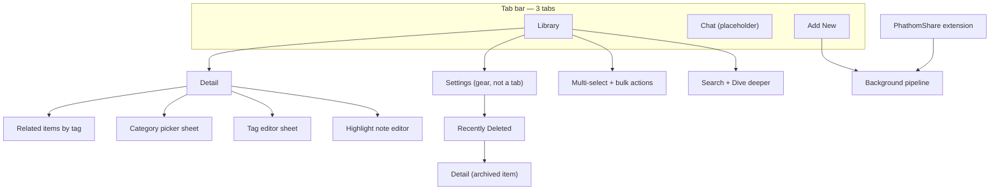

# UI Design Refresh — Handoff & Brief (Draft)

> **Status:** Design update brief **approved** (client kickoff 2026-05-24). §10 is normative for refresh work. Implement in phases per [§11](#11-phased-rollout--feed-forward); refresh is not complete until all phases ship.
>
> **Audience:** UI/UX designer, design-focused agent, or implementer planning a visual/IA refresh.
>
> **Authority:** [`docs/decisions.md`](../decisions.md) wins over this doc; mockup PNGs are reference only where they conflict with shipped UI.

**Related code:** [`MainTabView.swift`](../../Phathom/Phathom/Views/MainTabView.swift) · [`LibraryTab.swift`](../../Phathom/Phathom/Views/Library/LibraryTab.swift) · [`DetailView.swift`](../../Phathom/Phathom/Views/Detail/DetailView.swift) · [`AddNewTab.swift`](../../Phathom/Phathom/Views/AddNew/AddNewTab.swift) · [`ChatTab.swift`](../../Phathom/Phathom/Views/Chat/ChatTab.swift) · [`SettingsTab.swift`](../../Phathom/Phathom/Views/Settings/SettingsTab.swift) · [`AppPalette.swift`](../../Phathom/Phathom/Helpers/AppPalette.swift)

**Visual references (may be stale):** [main-screen.PNG](../assets/main-screen.PNG) · [detail-screen.PNG](../assets/detail-screen.PNG)

---

## 1. Product context

**Phathom** is a **local-first iOS “personal brain.”** Users capture links, notes, and photos into a private on-device library. **On-device AI** (Llama.cpp GGUF models) summarizes, tags, and extracts structured facts. Nothing syncs to the cloud.

| Principle | Design implication |
|-----------|-------------------|
| Privacy-first | No account UI, sync indicators, or cloud CTAs |
| Status transparency | Pipeline state must be visible — local LLM is slow |
| Utility over friction at capture | Share sheet and Add New should stay minimal |
| Focused review | Detail is the deep-read surface until Chat ships |
| Resource awareness | Processing may pause (thermal/battery); avoid “instant AI” cues |

**Platform:** iPhone-first (iPhone 16 Pro+ target). **Current UI:** forced dark mode via `preferredColorScheme(.dark)` and custom `AppPalette`.

**Roadmap context:** **Chat / RAG** is Phase 3 — tab exists but is a placeholder. Do not assume Chat UX is in scope unless the design brief expands it.

---

## 2. Information architecture

| Surface | Role |
|--------|------|
| **Library** | Primary home — browse, filter, search, triage, bulk ops |
| **Detail** | Deep read on one item — AI output, tags, source, highlights |
| **Add New** | In-app capture (web URL, markdown note, photo) |
| **Chat** | **Not built** — placeholder for Phase 3 “Deep Dive” RAG chat |
| **Settings** | Pushed from Library gear — models, backup, Recently Deleted |
| **Share extension** | Minimal “Saving…” UI — capture from other apps |

**Navigation:** `TabView` → per-tab `NavigationStack`. Library pushes Detail via `NavigationPath` + `UUID`. Settings is a `NavigationLink`, not a tab.

**Deep links:** Spotlight and in-app notifications switch to Library tab and push Detail.

---

## 3. Design system (shipped)

Defined in [`AppPalette.swift`](../../Phathom/Phathom/Helpers/AppPalette.swift) and [`AppAppearance.swift`](../../Phathom/Phathom/Helpers/AppAppearance.swift).

| Token | Hex | Usage |
|-------|-----|--------|
| Background | `#252422` | Screen base (carbon black) |
| Surface | `#403d39` | Cards, bars, form rows (charcoal brown) |
| Surface nested | `#353330` | Secondary blocks, bulk bar buttons |
| Text primary | `#fffcf2` | Titles, body (floral white) |
| Text secondary | `#ccc5b9` | Subtitles, metadata (dust grey) |
| Text tertiary | dust @ 72% | Timestamps, chevrons |
| Accent | `#eb5e28` | CTAs, selected tab, links, highlight rail (spicy paprika) |
| Meta chip bg | `#401F12` | Processing status badges |
| Tag chip bg | `#0B0A0A` | Tag pills on detail |

**Typography:** System SwiftUI — `.largeTitle.bold()` Library hero, `.headline.bold()` section headers, `.subheadline` metadata.

**Shape language:** Continuous rounded rects (~12–14pt radius), capsules for filters/chips/badges.

**Reusable components (code):**

| Component | File |
|-----------|------|
| Library row | `ContentCardRow.swift` |
| Processing badge | `ProcessingStatusBadge` in `ContentCardRow.swift` |
| Filter capsules | `LibraryFilterBar.swift` |
| Tag chips + flow | `TagChipsView.swift`, `FlowLayout.swift` |
| Thumbnail fallback | `ThumbnailFallback.swift` |
| Markdown theme | `DetailMarkdownTheme.swift` |

---

## 4. Content model (what UI represents)

### Content kinds

| Kind | User meaning |
|------|----------------|
| **Web** | URL — scraped text + optional markdown source |
| **Note** | User markdown |
| **Media** | Photo — optional AI description |

### Processing status (system — user observes, rarely sets)

| Internal | User label |
|----------|------------|
| `pending` | Queued |
| `scraping` | Fetching source |
| `embedding` | Preparing analysis |
| `summarizing` | Generating summary |
| `extracting` | Extracting details |
| `tagging` | Creating tags |
| `completed` | *(no badge)* |
| `failed` | Needs attention |

Labels/icons: [`ProcessingStatusPresentation.swift`](../../Phathom/Phathom/Helpers/ProcessingStatusPresentation.swift). Badges are tappable when actionable (kick queue, retry failed).

### Read status (user triage)

| Status | Meaning |
|--------|---------|
| **New** | Unread — accent dot on library row |
| **Read** | Seen |
| **Filed** | Filed for reference — often paired with **Category** |

Labels/swipes: [`ReadStatusPresentation.swift`](../../Phathom/Phathom/Helpers/ReadStatusPresentation.swift).

### Tags vs categories

| Concept | Cardinality | Source | UI role |
|---------|-------------|--------|---------|
| **Tags** | Many per item | AI + user edit | Topic labels; “Related by tags”; tag tap → related sheet |
| **Category** | Zero or one | User | Structural filing; library Category filter; kebab-case stored, sentence-case displayed |

Category display: [`CategoryDisplayFormatter.swift`](../../Phathom/PhathomCore/Sources/PhathomCore/CategoryDisplayFormatter.swift).

---

## 5. Screen inventory

### 5.1 Main tab shell (`MainTabView`)

- Three tabs: **Library** · **Chat** · **Add new**
- Tab bar: charcoal bg, dust unselected, paprika selected
- **Archive undo snackbar** — bottom inset on Library only (~3s): archived message + **Undo**; copy references Recently Deleted (48h retention)

### 5.2 Library (`LibraryTab`)

**Chrome above list:**

1. Large title **“Library”** + optional **play** when queued/failed items exist (manual pipeline kickoff)
2. **`LibraryFilterBar`** — three columns (27.5% / 27.5% / 45%): **Type**, **Status**, **Category** — popover pickers, capsule triggers; filters persist (`@AppStorage`)
3. `.searchable` — prompt: “Search title, tags, source text”

**List sections:**

- **Matches** — filtered + search hits
- **Related by tags** — when search active; optional **“Dive deeper”** (sparkles) — on-device LLM rerank when query ≥3 chars and primary model configured

**Row (`ContentCardRow`):** 76pt thumbnail, title (+ unread dot), processing badge *or* host/summary line, timestamp.

**Interactions:**

| Gesture | Action |
|---------|--------|
| Tap | Open Detail |
| Leading swipe | Mark New / Read / File (File may open CategoryPicker) |
| Trailing swipe | Archive |
| Toolbar Select | Multi-select → bottom bar: Mark as… + Archive |

**Toolbar:** Select/Done (leading) · “Phathom” (principal) · Settings gear (trailing; filled when model ready)

**Empty:** “No items yet” / “No matches”

### 5.3 Detail (`DetailView`)

**Target section order (IA change — approved):**

1. Hero (~200pt) — thumbnail/fallback; web: **Visit Site** capsule
2. Processing status chip
3. Header — host (web), editable title, **source-content snippet** (summary snippet as today)
4. **Source Content** — promoted above triage/AI blocks; collapsible; web uses selectable WKWebView markdown HTML
5. Reading status — segmented: New | Read | Filed
6. Category — display + Edit → sheet
7. Highlights & Notes — quoted text + optional user note (web source selection)
8. Tags — chips, Edit, tap → RelatedItemsSheet
9. AI Summary — bullets in surface card; placeholder while processing
10. Extracted Key Figures — label/value pairs
11. Actions — Summarize again, Regenerate tags, Archive (or Restore if archived)

**Rationale:** Reader-first — source and annotation before metadata and AI synthesis. Note body (note kind) stays with source block when present. Failed section remains when applicable (after status chip or inline with source — implementer discretion, same visibility).

**Legacy order (for diff awareness):** hero → status → title → note → failed → read status → category → summary → tags → extracts → highlights → actions → source.

### 5.4 Add New (`AddNewTab`)

**Primary use:** reader-app pattern — **Web URL capture first**; Notes secondary. Media is **not** a design priority (implementation incomplete).

Target feel: fast URL paste + save; minimal chrome; reader-app adjacency (Matter / Instapaper), not a heavy form. Returns to Library on success (current behavior unless phase notes say otherwise).

**Refresh priority:** High — same phase family as Library/Detail polish.

### 5.5 Chat (`ChatTab`)

Placeholder: *“Deep Dive coming in a future update.”*

**Phase 3 intent** (not implemented): thread list, tag-scoped new chat, iMessage-style bubbles, streaming, citations → Detail. Spec: [`phase-3-rag-chat.md`](phase-3-rag-chat.md).

### 5.6 Settings (`SettingsContent`)

Form sections:

| Section | Contents |
|---------|----------|
| AI Models | Primary + optional tagging GGUF; file pickers, test, health indicators |
| Library | Recently Deleted (count badge), reset web processing queue |
| Backup | Export / import JSON |
| About | Version, build, privacy line |

**Recently Deleted:** archived list, 48h countdown, swipe restore/delete, rows open Detail.

### 5.7 Share extension (`PhathomShare`)

Minimal: “Saving…” → auto-dismiss. URLs, text, images → shared SwiftData. No custom branding.

---

## 6. Key user flows

| Flow | Steps | UX note |
|------|--------|---------|
| Silent capture | Share → save → dismiss | Zero friction |
| Review library | Filter/search → Detail | Show pipeline state |
| Triage | Swipe or bulk mark | Mail-like; File → category |
| Research | Detail → tag → related items | Tags as navigation |
| Annotate | Source → select → highlight + note | Web only |
| Archive | Swipe/detail/bulk → undo | Soft delete, 48h |
| Configure AI | Settings → GGUF from Files | Power-user surface |
| Semantic search | Search → Dive deeper | Two-stage: local then LLM |

---

## 7. Known UI debt / refresh opportunities

| Area | Issue | Brief direction |
|------|--------|-----------------|
| **Overall POV** | Clean and task-focused but **generic** — reads as incremental/computer-built, not a unified aesthetic vision | Define a **design point of view** first (tokens, type, spacing, card language), then apply consistently |
| Library chrome | Large title + 3 filter columns + search + sections | Light IA + POV-aligned components; no functional change to filters/search |
| Detail hierarchy | AI blocks before source/highlights | **Restructure** — source + highlights before tags/summary (§5.3) |
| Add New | Standard `Form` | Reader-app capture UX; web-first |
| Settings | Dense model/backup copy | **Visual alignment only**; progressive disclosure (show what’s needed, expand for context) — no model UX or copy model changes |
| Chat tab | Placeholder | Keep as-is |
| Tags vs categories | Two org concepts | **No copy or model changes** — distinguish via layout/hierarchy only if needed |
| Mockups | Phase 1 PNGs outdated | Brief + implemented UI supersede PNGs |

---

## 8. Out of scope (unless brief expands)

- Cloud sync / accounts
- RAG Chat implementation (Phase 3) — unless designing ahead for tab shell
- Voice memo capture
- iPad / macOS layouts
- Onboarding / paywall

---

## 9. Deliverables (this refresh)

**Output:** An **updated design brief in this document** (tokens, components, key-frame descriptions, phase notes) — **not** a separate Figma file unless added later.

Per phase, append to §11:

1. Design POV statement + token deltas
2. Component rules (cards, chips, filters, sections)
3. Screen-level acceptance notes
4. Feed-forward decisions for the next phase

Implementation may proceed directly from the brief into SwiftUI.

---

## 10. Design update brief

> **Approved** 2026-05-24. Normative for UI refresh work.

### Goals

- Establish a clear **design point of view** — sophisticated, clean, engaging, focused — then apply it consistently (not incremental “computer-built” polish).
- **Visual cohesion + refined elegance** across Library, Detail, Add New, Settings — task-focused, unobtrusive, lightweight flows with appropriate depth.
- **Light IA adjustments:** Detail section reorder (reader-first); Library/shell chrome refinement.
- **Elevate Add New** as reader-app capture (web-first).
- Preserve **power-reader / researcher** workflow without changing data model or core behaviors.

### Non-goals

- Explicit **copy changes** for tags/categories/onboarding.
- **Schema or triage model changes** (ReadStatus, Category, Tags behavior unchanged).
- Chat / Deep Dive implementation (placeholder tab only).
- Light mode — **dark-only**, refined palette.
- Settings as tab; gear on Library stays.
- Model picker **logic/copy** changes — alignment and disclosure only.
- Media capture UX priority (implementation not done).
- Cloud, accounts, sync UI.

### Target user & primary jobs-to-be-done

| Persona | Jobs |
|---------|------|
| **Primary:** power reader / researcher | Capture URL → triage → search → **read source** → highlight → relate via tags → skim AI summary/extracts when needed |

Add New: **web like a reader app**; notes secondary.

### Aesthetic point of view (client direction)

| Attribute | Intent |
|-----------|--------|
| **Quality bar** | Apple-native quality — clean, engaging, sophisticated |
| **Feel** | Focused and lightweight; flows feel easy without feeling empty |
| **Tone** | Editorial/refined dark UI; warm palette retained but **systematized** (type scale, spacing rhythm, surface hierarchy) |
| **Avoid** | Generic “AI app” aesthetic, decorative chrome, visual noise that competes with content |

**Design POV must be written explicitly in Phase 0** (see §11) before screen work — one paragraph + token sheet that all phases inherit.

### Scope (screens / flows)

| Surface | Priority | Notes |
|---------|----------|--------|
| **Library** | High | POV + light IA; address “generic” feel via unified components |
| **Detail** | High | **Section reorder** (§5.3); reader-first hierarchy |
| **Add New** | High | Reader-app web capture; notes secondary |
| **Main shell** | Medium | Tab bar, snackbar, nav chrome |
| **Settings / Recently Deleted** | Medium | Visual alignment; **progressive disclosure** pattern (match recent Settings improvements) |
| **Chat** | None | Placeholder only |
| **Share extension** | Out of scope | |

### Visual direction

| Decision | Choice |
|----------|--------|
| Mode | Dark-only; refine warm palette |
| References | Apple-native + reader apps; agent proposes cohesive POV |
| Processing UX | Keep granular status chips |
| Tags vs categories | Same functionality; hierarchy/layout only if helpful — **no new copy** |
| Settings | Progressive disclosure — relevant info first, expand for detail |

### IA decisions (locked)

| Decision | Choice |
|----------|--------|
| Tabs | Library · Chat (placeholder) · Add new |
| Settings | Gear on Library |
| Detail order | §5.3 (source + highlights before AI blocks) |
| Capture | Web-first reader pattern |

### Constraints (must not break)

- Local-only; no cloud UI
- Granular processing chips
- SwiftData fields and triage behaviors
- Share extension minimal capture
- Bulk select + archive undo ([`library-bulk-selection.md`](library-bulk-selection.md))
- [`docs/decisions.md`](../decisions.md)

### Success criteria (client)

Refresh is **not done** until **all phases** (§11) ship. Overall bar:

- **Apple quality** — clean, engaging, sophisticated, focused
- UX feels **lightweight but appropriate** — not stripped, not heavy
- Unified **point of view** visible across Library, Detail, Add New, Settings
- Power-user flows intact or improved (filter, search, swipe, source read, highlight)
- No accessibility regression (contrast, Dynamic Type)

### Deliverable format

**This document** — brief sections updated per phase; no Figma requirement.

---

## 11. Phased rollout + feed-forward

Phased delivery with **iteration and sign-off per phase** before the next. Each phase ends by appending **Feed-forward** bullets to this section (decisions the next phase must inherit).

| Phase | Focus | Exit criteria |
|-------|--------|---------------|
| **0 — POV & tokens** | Design POV paragraph; type scale; spacing; surface/elevation rules; chip/card/snackbar spec | Token sheet + component rules documented below; client OK to proceed |
| **1 — Library + shell** | Library list, filter bar, search sections, toolbar, tab bar, archive snackbar | Library feels on-POV; feed-forward logged |
| **2 — Detail restructure** | Section reorder §5.3; source/highlights prominence; visual pass all sections | Detail reader-first; feed-forward logged |
| **3 — Add New** | Web-first reader capture UX | Capture flow on-POV; feed-forward logged |
| **4 — Settings alignment** | Settings + Recently Deleted; progressive disclosure polish | Full refresh complete per success criteria |

**Agent discretion:** Order is fixed at 0→1→2→3→4; within a phase, component order can flex. Do not skip Phase 0.

### Phase 0 — POV & tokens

_TBD at implementation kickoff._

### Feed-forward log

| After phase | Decisions for next phase |
|-------------|-------------------------|
| _none yet_ | — |
