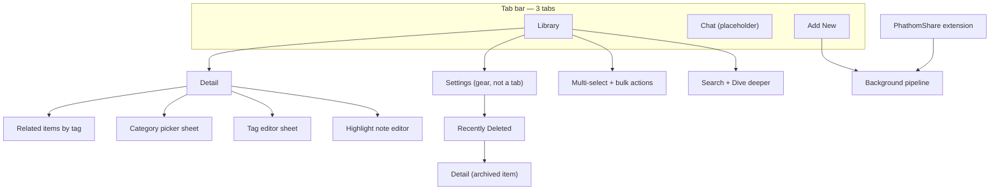

# UI Design Refresh — Handoff & Brief (Draft)

> **Status:** Design update brief **approved** (client kickoff 2026-05-24). Detail **§5.3 IA reorder** shipped in **`DetailView`**. §10 remains normative for remaining work (Library/shell/Add New/Settings + **§12** design system gate). Implement in phases per [§11](#11-phased-rollout--feed-forward).
>
> **Audience:** UI/UX designer, design-focused agent, or implementer planning a visual/IA refresh.
>
> **Authority:** [`docs/decisions.md`](../decisions.md) wins over this doc; mockup PNGs are reference only where they conflict with shipped UI.

**Related code:** [`MainTabView.swift`](../../Phathom/Phathom/Views/MainTabView.swift) · [`LibraryTab.swift`](../../Phathom/Phathom/Views/Library/LibraryTab.swift) · [`DetailView.swift`](../../Phathom/Phathom/Views/Detail/DetailView.swift) · [`AddNewTab.swift`](../../Phathom/Phathom/Views/AddNew/AddNewTab.swift) · [`ChatTab.swift`](../../Phathom/Phathom/Views/Chat/ChatTab.swift) · [`SettingsTab.swift`](../../Phathom/Phathom/Views/Settings/SettingsTab.swift) · [`AppPalette.swift`](../../Phathom/Phathom/Helpers/AppPalette.swift)

**Visual references (may be stale):** [main-screen.PNG](../assets/main-screen.PNG) · [detail-screen.PNG](../assets/detail-screen.PNG)

---

## 1. Product context

**Phathom** is a **local-first iOS “personal brain.”** Users capture links, notes, and photos into a private on-device library. **On-device AI** (Llama.cpp GGUF models) summarizes, tags, and extracts structured facts. Nothing syncs to the cloud.

| Principle | Design implication |
|-----------|-------------------|
| Privacy-first | No account UI, sync indicators, or cloud CTAs |
| Status transparency | Pipeline state must be visible — local LLM is slow |
| Utility over friction at capture | Share sheet and Add New should stay minimal |
| Focused review | Detail is the deep-read surface until Chat ships |
| Resource awareness | Processing may pause (thermal/battery); avoid “instant AI” cues |

**Platform:** iPhone-first (iPhone 16 Pro+ target). **Current UI:** forced dark mode via `preferredColorScheme(.dark)` and custom `AppPalette`.

**Roadmap context:** **Chat / RAG** is Phase 3 — tab exists but is a placeholder. Do not assume Chat UX is in scope unless the design brief expands it.

---

## 2. Information architecture

| Surface | Role |
|--------|------|
| **Library** | Primary home — browse, filter, search, triage, bulk ops |
| **Detail** | Deep read — **§5.3 order:** hero → snippet → Source → highlights → tags → AI summary → actions |
| **Add New** | In-app capture (web URL, markdown note, photo) |
| **Chat** | **Not built** — placeholder for Phase 3 “Deep Dive” RAG chat |
| **Settings** | Pushed from Library gear — models, backup, Recently Deleted |
| **Share extension** | Minimal “Saving…” UI — capture from other apps |

**Navigation:** `TabView` → per-tab `NavigationStack`. Library pushes Detail via `NavigationPath` + `UUID`. Settings is a `NavigationLink`, not a tab.

**Deep links:** Spotlight and in-app notifications switch to Library tab and push Detail.

---

## 3. Design system — baseline (shipped)

> **This section is inventory only.** Phase 0 must produce the **complete target design system** in [§12](#12-design-system-specification-required-output). Implementation maps tokens to [`AppPalette.swift`](../../Phathom/Phathom/Helpers/AppPalette.swift) and [`AppAppearance.swift`](../../Phathom/Phathom/Helpers/AppAppearance.swift).

Defined today in [`AppPalette.swift`](../../Phathom/Phathom/Helpers/AppPalette.swift) and [`AppAppearance.swift`](../../Phathom/Phathom/Helpers/AppAppearance.swift).

| Token | Hex | Usage |
|-------|-----|--------|
| Background | `#252422` | Screen base (carbon black) |
| Surface | `#403d39` | Cards, bars, form rows (charcoal brown) |
| Surface nested | `#353330` | Secondary blocks, bulk bar buttons |
| Text primary | `#fffcf2` | Titles, body (floral white) |
| Text secondary | `#ccc5b9` | Subtitles, metadata (dust grey) |
| Text tertiary | dust @ 72% | Timestamps, chevrons |
| Accent | `#eb5e28` | CTAs, selected tab, links, highlight rail (spicy paprika) |
| Meta chip bg | `#401F12` | Processing status badges |
| Tag chip bg | `#0B0A0A` | Tag pills on detail |

**Typography:** System SwiftUI — `.largeTitle.bold()` Library hero, `.headline.bold()` section headers, `.subheadline` metadata.

**Shape language:** Continuous rounded rects (~12–14pt radius), capsules for filters/chips/badges.

**Reusable components (code):**

| Component | File |
|-----------|------|
| Library row | `ContentCardRow.swift` |
| Processing badge | `ProcessingStatusBadge` in `ContentCardRow.swift` |
| Filter capsules | `LibraryFilterBar.swift` |
| Tag chips + flow | `TagChipsView.swift`, `FlowLayout.swift` |
| Thumbnail fallback | `ThumbnailFallback.swift` |
| Markdown theme | `DetailMarkdownTheme.swift` |

---

## 4. Content model (what UI represents)

### Content kinds

| Kind | User meaning |
|------|----------------|
| **Web** | URL — scraped text + optional markdown source |
| **Note** | User markdown |
| **Media** | Photo — optional AI description |

### Processing status (system — user observes, rarely sets)

| Internal | User label |
|----------|------------|
| `pending` | Queued |
| `scraping` | Fetching source |
| `embedding` | Preparing analysis |
| `summarizing` | Generating summary |
| `extracting` | Extracting details |
| `tagging` | Creating tags |
| `completed` | *(no badge)* |
| `failed` | Needs attention |

Labels/icons: [`ProcessingStatusPresentation.swift`](../../Phathom/Phathom/Helpers/ProcessingStatusPresentation.swift). Badges are tappable when actionable (kick queue, retry failed).

### Read status (user triage)

| Status | Meaning |
|--------|---------|
| **New** | Unread — accent dot on library row |
| **Read** | Seen |
| **Filed** | Filed for reference — often paired with **Category** |

Labels/swipes: [`ReadStatusPresentation.swift`](../../Phathom/Phathom/Helpers/ReadStatusPresentation.swift).

### Tags vs categories

| Concept | Cardinality | Source | UI role |
|---------|-------------|--------|---------|
| **Tags** | Many per item | AI + user edit | Topic labels; “Related by tags”; tag tap → related sheet |
| **Category** | Zero or one | User | Structural filing; library Category filter; kebab-case stored, sentence-case displayed |

Category display: [`CategoryDisplayFormatter.swift`](../../Phathom/PhathomCore/Sources/PhathomCore/CategoryDisplayFormatter.swift).

---

## 5. Screen inventory

### 5.1 Main tab shell (`MainTabView`)

- Three tabs: **Library** · **Chat** · **Add new**
- Tab bar: charcoal bg, dust unselected, paprika selected
- **Archive undo snackbar** — bottom inset on Library only (~3s): archived message + **Undo**; copy references Recently Deleted (48h retention)

### 5.2 Library (`LibraryTab`)

**Chrome above list:**

1. Large title **“Library”** + optional **play** when queued/failed items exist (manual pipeline kickoff)
2. **`LibraryFilterBar`** — three columns (27.5% / 27.5% / 45%): **Type**, **Status**, **Category** — popover pickers, capsule triggers; filters persist (`@AppStorage`)
3. `.searchable` — prompt: “Search title, tags, source text”

**List sections:**

- **Matches** — filtered + search hits
- **Related by tags** — when search active; optional **“Dive deeper”** (sparkles) — on-device LLM rerank when query ≥3 chars and primary model configured

**Row (`ContentCardRow`):** 76pt thumbnail, title (+ unread dot), processing badge *or* host/summary line, timestamp.

**Interactions:**

| Gesture | Action |
|---------|--------|
| Tap | Open Detail |
| Leading swipe | Mark New / Read / File (File may open CategoryPicker) |
| Trailing swipe | Archive |
| Toolbar Select | Multi-select → bottom bar: Mark as… + Archive |

**Toolbar:** Select/Done (leading) · “Phathom” (principal) · Settings gear (trailing; filled when model ready)

**Empty:** “No items yet” / “No matches”

### 5.3 Detail (`DetailView`)

**Implemented section order** (reader-first Detail IA):

1. Hero (~200pt) — thumbnail/fallback; web: **Visit Site** capsule
2. Processing status chip
3. **Processing failed** card — only when `status == .failed` (retry, reason)
4. Header — host (web), editable title, **snippet** (`sourceMarkdown`/raw preview — same helpers as before), timestamp
5. **Source Content** — collapsible (default collapsed); web: WKWebView + highlights; **note**: markdown body merged here under same header (“Source Content”). Non-web/non-note raw fallback unchanged.
6. Reading status — segmented: New | Read | Filed
7. Category — display + Edit → sheet
8. Highlights & Notes — quoted text + optional user note (web source selection)
9. Tags — chips, Edit, tap → RelatedItemsSheet
10. AI Summary — bullets in surface card; placeholder while processing
11. Extracted Key Figures — label/value pairs
12. Actions — Summarize again, Regenerate tags, Archive (or Restore if archived)

**Rationale:** Reader-first — source and annotation before metadata and AI synthesis. Note `.note` body only under Source Content (no separate “Note” card).

### 5.4 Add New (`AddNewTab`)

**Primary use:** reader-app pattern — **Web URL capture first**; Notes secondary. Media is **not** a design priority (implementation incomplete).

Target feel: fast URL paste + save; minimal chrome; reader-app adjacency (Matter / Instapaper), not a heavy form. Returns to Library on success (current behavior unless phase notes say otherwise).

**Refresh priority:** High — same phase family as Library/Detail polish.

### 5.5 Chat (`ChatTab`)

Placeholder: *“Deep Dive coming in a future update.”*

**Phase 3 intent** (not implemented): thread list, tag-scoped new chat, iMessage-style bubbles, streaming, citations → Detail. Spec: [`phase-3-rag-chat.md`](phase-3-rag-chat.md).

### 5.6 Settings (`SettingsContent`)

Form sections:

| Section | Contents |
|---------|----------|
| AI Models | Primary + optional tagging GGUF; file pickers, test, health indicators |
| Library | Recently Deleted (count badge), reset web processing queue |
| Backup | Export / import JSON |
| About | Version, build, privacy line |

**Recently Deleted:** archived list, 48h countdown, swipe restore/delete, rows open Detail.

### 5.7 Share extension (`PhathomShare`)

Minimal: “Saving…” → auto-dismiss. URLs, text, images → shared SwiftData. No custom branding.

---

## 6. Key user flows

| Flow | Steps | UX note |
|------|--------|---------|
| Silent capture | Share → save → dismiss | Zero friction |
| Review library | Filter/search → Detail | Show pipeline state |
| Triage | Swipe or bulk mark | Mail-like; File → category |
| Research | Detail → tag → related items | Tags as navigation |
| Annotate | Source → select → highlight + note | Web only |
| Archive | Swipe/detail/bulk → undo | Soft delete, 48h |
| Configure AI | Settings → GGUF from Files | Power-user surface |
| Semantic search | Search → Dive deeper | Two-stage: local then LLM |

---

## 7. Known UI debt / refresh opportunities

| Area | Issue | Brief direction |
|------|--------|-----------------|
| **Overall POV** | Clean and task-focused but **generic** — reads as incremental/computer-built, not a unified aesthetic vision | Define a **design point of view** first (tokens, type, spacing, card language), then apply consistently |
| Library chrome | Large title + 3 filter columns + search + sections | Light IA + POV-aligned components; no functional change to filters/search |
| Detail (visual only) | §5.3 **IA shipped** — tokens/layout still baseline `AppPalette` | Apply §12 to Detail surfaces when Phase 0 completes |
| Add New | Standard `Form` | Reader-app capture UX; web-first |
| Settings | Dense model/backup copy | **Visual alignment only**; progressive disclosure (show what’s needed, expand for context) — no model UX or copy model changes |
| Chat tab | Placeholder | Keep as-is |
| Tags vs categories | Two org concepts | **No copy or model changes** — distinguish via layout/hierarchy only if needed |
| Mockups | Phase 1 PNGs outdated | Brief + implemented UI supersede PNGs |

---

## 8. Out of scope (unless brief expands)

- Cloud sync / accounts
- RAG Chat implementation (Phase 3) — unless designing ahead for tab shell
- Voice memo capture
- iPad / macOS layouts
- Onboarding / paywall

---

## 9. Deliverables (this refresh)

**Output:** An **updated design brief in this document** — including a **complete design system** ([§12](#12-design-system-specification-required-output)) — plus phase notes and feed-forward log. **Not** a separate Figma file unless added later.

### Required artifacts

| Artifact | When | Section |
|----------|------|---------|
| **Complete design system** | Phase 0 (gate) | §12 — all subsections filled; no TBD |
| Design POV statement | Phase 0 | §12.1 |
| Per-phase screen acceptance notes | Phases 1–4 | §11 phase blocks |
| Feed-forward decisions | End of each phase | §11 log |
| SwiftUI token mapping notes | Phase 0 + final | §12.15 |

Implementation proceeds from §12 into SwiftUI (`AppPalette`, shared styles, components).

Per phase, also append:

1. Component usage deltas (if any new rules)
2. Screen-level acceptance checklist
3. Feed-forward bullets for the next phase

---

## 10. Design update brief

> **Approved** 2026-05-24. Normative for UI refresh work.

### Goals

- Establish a clear **design point of view** — sophisticated, clean, engaging, focused — then apply it consistently (not incremental “computer-built” polish).
- **Visual cohesion + refined elegance** across Library, Detail, Add New, Settings — task-focused, unobtrusive, lightweight flows with appropriate depth.
- **Detail IA:** reader-first §5.3 scroll order **[shipped]**; remaining Detail work is **§12 visuals** after Phase 0.
- **Light IA adjustments (remaining):** Library/shell chrome refinement.
- **Elevate Add New** as reader-app capture (web-first).
- Preserve **power-reader / researcher** workflow without changing data model or core behaviors.

### Non-goals

- Explicit **copy changes** for tags/categories/onboarding.
- **Schema or triage model changes** (ReadStatus, Category, Tags behavior unchanged).
- Chat / Deep Dive implementation (placeholder tab only).
- Light mode — **dark-only**, refined palette.
- Settings as tab; gear on Library stays.
- Model picker **logic/copy** changes — alignment and disclosure only.
- Media capture UX priority (implementation not done).
- Cloud, accounts, sync UI.

### Target user & primary jobs-to-be-done

| Persona | Jobs |
|---------|------|
| **Primary:** power reader / researcher | Capture URL → triage → search → **read source** → highlight → relate via tags → skim AI summary/extracts when needed |

Add New: **web like a reader app**; notes secondary.

### Aesthetic point of view (client direction)

| Attribute | Intent |
|-----------|--------|
| **Quality bar** | Apple-native quality — clean, engaging, sophisticated |
| **Feel** | Focused and lightweight; flows feel easy without feeling empty |
| **Tone** | Editorial/refined dark UI; warm palette retained but **systematized** (type scale, spacing rhythm, surface hierarchy) |
| **Avoid** | Generic “AI app” aesthetic, decorative chrome, visual noise that competes with content |

**Design POV must be written explicitly in Phase 0** (see §11) before screen work — one paragraph + token sheet that all phases inherit.

### Scope (screens / flows)

| Surface | Priority | Notes |
|---------|----------|--------|
| **Library** | High | POV + light IA; address “generic” feel via unified components |
| **Detail** | Medium–High | IA done (§5.3); **§12 polish** pending Phase 0 |
| **Add New** | High | Reader-app web capture; notes secondary |
| **Main shell** | Medium | Tab bar, snackbar, nav chrome |
| **Settings / Recently Deleted** | Medium | Visual alignment; **progressive disclosure** pattern (match recent Settings improvements) |
| **Chat** | None | Placeholder only |
| **Share extension** | Out of scope | |

### Visual direction

| Decision | Choice |
|----------|--------|
| Mode | Dark-only; refine warm palette |
| References | Apple-native + reader apps; agent proposes cohesive POV |
| Processing UX | Keep granular status chips |
| Tags vs categories | Same functionality; hierarchy/layout only if helpful — **no new copy** |
| Settings | Progressive disclosure — relevant info first, expand for detail |

### IA decisions (locked)

| Decision | Choice |
|----------|--------|
| Tabs | Library · Chat (placeholder) · Add new |
| Settings | Gear on Library |
| Detail IA | §5.3 **implemented** (`DetailView`; failed after chip; source + highlights before AI blocks) |
| Capture | Web-first reader pattern |

### Constraints (must not break)

- Local-only; no cloud UI
- Granular processing chips
- SwiftData fields and triage behaviors
- Share extension minimal capture
- Bulk select + archive undo ([`library-bulk-selection.md`](library-bulk-selection.md))
- [`docs/decisions.md`](../decisions.md)

**Design POV must be written explicitly in Phase 0** (see §11) before screen work — one paragraph in §12.1 plus the full design system in §12.

### Success criteria (client)

Refresh is **not done** until **all phases** (§11) ship **and §12 is complete**. Overall bar:

- **Apple quality** — clean, engaging, sophisticated, focused
- UX feels **lightweight but appropriate** — not stripped, not heavy
- Unified **point of view** visible across Library, Detail, Add New, Settings
- **Complete design system documented** — color, type, spacing, components; implementable without guesswork
- Power-user flows intact or improved (filter, search, swipe, source read, highlight)
- No accessibility regression (contrast, Dynamic Type)

### Deliverable format

**This document** — §12 design system + phase updates; no Figma requirement.

---

## 11. Phased rollout + feed-forward

Phased delivery with **iteration and sign-off per phase** before the next. Each phase ends by appending **Feed-forward** bullets to this section (decisions the next phase must inherit).

| Phase | Focus | Exit criteria |
|-------|--------|---------------|
| **0 — Design system** | POV + **complete §12** (colors, type, spacing, components) | §12 fully specified; client OK; no screen code until signed off |
| **1 — Library + shell** | Apply §12 to library list, filters, search, toolbar, tab bar, snackbar | Library on-system; feed-forward logged |
| **2 — Detail** | IA §5.3 **done** (`DetailView`) · §12 **visual polish** after Phase 0 | IA done; Detail tokens/layout when §12 applied |
| **3 — Add New** | Web-first capture using §12 form/button rules | Capture on-system; feed-forward logged |
| **4 — Settings alignment** | Settings + Recently Deleted; §12 disclosure patterns | §12 reflected in code; success criteria met |

**Agent discretion:** Order is fixed at 0→1→2→3→4. **Do not skip Phase 0.** Phases 1–4 must not invent tokens or component styles outside §12 — propose §12 amendments instead.

### Phase 0 — Design system

**Gate:** Fill [§12](#12-design-system-specification-required-output) completely before Phase 1.

Deliverables:

1. §12.1 Design POV (one short paragraph + 3–5 design principles)
2. §12.2–§12.14 — every token and component rule specified with values
3. §12.15 — mapping to SwiftUI / `AppPalette` / `AppAppearance`
4. Baseline diff note: what changes vs §3 shipped inventory

_Status: TBD at implementation kickoff._

### Phase 2 — Detail (**IA complete**)

Reader-first §5.3 shipped in [`DetailView.swift`](../../Phathom/Phathom/Views/Detail/DetailView.swift) — canonical order documented in **[§5.3](#53-detail-detailview)**. Remaining Detail work under this refresh is **§12 token/style application** once Phase 0 completes.

### Feed-forward log

| After phase | Decisions for next phase |
|-------------|-------------------------|
| **Phase 2** | Detail IA frozen at §5.3; Phase 3+ must not regress scroll order without new decision row. Implement §12 on Detail surfaces with Library/Phase 1. |

---

## 12. Design system specification (required output)

> **Normative target.** Phase 0 **must** replace every `_TBD_` with concrete values. **Detail §5.3 IA is already shipped** in `DetailView`; Phases 0–4 then apply §12 visuals across surfaces (including Detail polish). Phases **1**, **3**, **4**, and Detail **visual pass** adopt tokens from §12 rather than inventing ad hoc UI.
>
> **Format:** Semantic tokens first (e.g. `text.primary`), then hex/pt values, then **Usage** (where applied in Phathom).

### 12.1 Design point of view

_TBD — One paragraph describing the aesthetic thesis. Plus 3–5 numbered principles (e.g. “Content leads chrome,” “Warm dark, not OLED black”)._

### 12.2 Color palette

**Semantic color tokens** (dark mode only):

| Token | Hex / value | Usage |
|-------|-------------|--------|
| `background.primary` | _TBD_ (baseline `#252422`) | Screen base |
| `background.secondary` | _TBD_ | Grouped areas, tab bar |
| `surface.primary` | _TBD_ (baseline `#403d39`) | Cards, list rows |
| `surface.secondary` | _TBD_ (baseline `#353330`) | Nested blocks, bulk bar buttons |
| `surface.inset` | _TBD_ | Text fields, wells |
| `text.primary` | _TBD_ (baseline `#fffcf2`) | Titles, body |
| `text.secondary` | _TBD_ (baseline `#ccc5b9`) | Subtitles, metadata |
| `text.tertiary` | _TBD_ | Timestamps, hints |
| `text.onAccent` | _TBD_ | Label on accent fills |
| `accent.primary` | _TBD_ (baseline `#eb5e28`) | CTAs, selected tab, links, highlight rail |
| `accent.muted` | _TBD_ | Subtle accent tints (optional) |
| `border.subtle` | _TBD_ | Card strokes, snackbar outline |
| `chip.meta` | _TBD_ (baseline `#401F12`) | Processing status badge bg |
| `chip.tag` | _TBD_ (baseline `#0B0A0A`) | Tag pill bg |
| `status.success` | _TBD_ | Restore, ready indicators |
| `status.warning` | _TBD_ | Archive swipe, missing model |
| `status.destructive` | _TBD_ | Delete, forget model |
| `unread.indicator` | _TBD_ | Library unread dot |
| `thumbnail.fallback` | _TBD_ | Placeholder thumbnail cycle (see §12.2.1) |

#### 12.2.1 Thumbnail placeholder hues

_TBD — Ordered hex list for deterministic placeholders (baseline in `AppPalette.thumbnailHexCycle`)._

#### 12.2.2 Contrast & accessibility

_TBD — Minimum contrast ratios for `text.primary` on `background.primary`, `text.secondary` on `surface.primary`, accent on surfaces. WCAG AA target for body text._

### 12.3 Typography

**Font:** System (SF Pro) unless POV specifies otherwise.

| Style token | SwiftUI mapping | Size / weight | Line spacing | Usage |
|-------------|-----------------|---------------|--------------|--------|
| `type.largeTitle` | `.largeTitle.bold()` | _TBD_ | _TBD_ | Library hero |
| `type.title` | `.title.bold()` | _TBD_ | _TBD_ | Detail editable title |
| `type.headline` | `.headline.bold()` | _TBD_ | _TBD_ | Section headers |
| `type.body` | `.body` | _TBD_ | _TBD_ | Source, summary bullets |
| `type.subheadline` | `.subheadline` | _TBD_ | _TBD_ | Host, snippets, form labels |
| `type.subheadline.emphasis` | `.subheadline.weight(.semibold)` | _TBD_ | _TBD_ | Toolbar actions, button labels |
| `type.caption` | `.caption` | _TBD_ | _TBD_ | Timestamps, badge text |
| `type.caption.emphasis` | `.caption.weight(.semibold)` | _TBD_ | _TBD_ | Processing chip |
| `type.footnote` | `.footnote` | _TBD_ | _TBD_ | Snackbar, settings footer |

**Rules:**

- _TBD — Max lines for library title, secondary line, etc._
- _TBD — Dynamic Type: which styles scale vs cap at `large` accessibility size_
- _TBD — Markdown body theme reference (`DetailMarkdownTheme`)_

### 12.4 Spacing & layout

**Base unit:** _TBD_ (recommend 4pt grid).

| Token | Value | Usage |
|-------|-------|--------|
| `space.xxs` | _TBD_ | Tight inline (chip icon gap) |
| `space.xs` | _TBD_ | Row internal gaps |
| `space.sm` | _TBD_ | Card padding compact |
| `space.md` | _TBD_ | Default card padding, section gap |
| `space.lg` | _TBD_ | Detail section spacing |
| `space.xl` | _TBD_ | Screen horizontal margin |
| `space.screenHorizontal` | _TBD_ (baseline 16) | Scroll content inset |
| `space.sectionGap` | _TBD_ (baseline 24) | Detail `VStack` spacing |
| `space.filterBarHeight` | _TBD_ (baseline 72) | Library filter bar |

**Layout rules:**

- _TBD — Library filter column fractions or replacement layout_
- _TBD — Hero height (baseline 200pt)_
- _TBD — Thumbnail sizes (library 76pt, etc.)_
- _TBD — Safe area / tab bar inset for bulk bar and snackbar_

### 12.5 Radius & shape

| Token | Value | Usage |
|-------|-------|--------|
| `radius.card` | _TBD_ (baseline 14 continuous) | Content cards, snackbar |
| `radius.chip` | _TBD_ | Capsule / filter value |
| `radius.button` | _TBD_ | Primary/secondary buttons |
| `radius.thumbnail` | _TBD_ | Library/detail thumbnails |
| `radius.sheet` | _TBD_ | Sheets (system default or custom) |

### 12.6 Elevation & surfaces

Dark UI uses **surface hierarchy**, not shadows.

| Level | Token | Rule |
|-------|-------|------|
| 0 | `background.primary` | Full bleed |
| 1 | `surface.primary` | Cards on background |
| 2 | `surface.secondary` | Nested inside cards |
| 3 | `surface.inset` | Inputs, wells |

_TBD — When to use stroke (`border.subtle`) vs surface step alone._

### 12.7 Buttons

| Variant | Fill | Text | Height / padding | Usage |
|---------|------|------|------------------|--------|
| **Primary** | `accent.primary` | `text.onAccent` | _TBD_ | Visit Site, Save |
| **Secondary** | `surface.secondary` or stroke | `text.primary` | _TBD_ | Summarize again, bulk bar |
| **Plain / link** | none | `accent.primary` | _TBD_ | Edit, Done, toolbar text |
| **Destructive** | none or tinted fill | `status.destructive` | _TBD_ | Archive, Forget model, Delete |
| **Icon** | none | `accent` or `text.secondary` | _TBD_ | Play kickoff, gear, share |

**States:** _TBD — disabled opacity, pressed scale/opacity (if any)._

**Minimum touch target:** _TBD_ (recommend 44pt).

### 12.8 Chips & badges

| Component | Shape | Colors | Typography | Notes |
|-----------|-------|--------|------------|--------|
| **Processing status** | Capsule | `chip.meta` + icon | `type.caption.emphasis` | Keep granular labels §4 |
| **Filter value** | Capsule | _TBD_ | _TBD_ | LibraryFilterBar trigger |
| **Tag** | Capsule / rounded rect | `chip.tag` | _TBD_ | Detail + related sheet |
| **Unread dot** | Circle 8pt | `unread.indicator` | — | Library row |
| **Read status swipe** | — | per `ReadStatusPresentation` tints | — | Align with §12.2 status colors |

### 12.9 Cards & list rows

**ContentCardRow:**

- _TBD — Padding, thumbnail size, corner radius, background token_
- _TBD — Plain vs card chrome (`ContentCardRowChrome`)

**Detail section cards** (summary, highlights):

- _TBD — Padding, radius, optional accent rail (highlights)

**Snackbar (archive undo):**

- _TBD — Match §12.7 secondary + `radius.card` + stroke rule

### 12.10 Form controls

| Control | Spec |
|---------|------|
| **Segmented** (read status, Add New type) | _TBD — tint, background, height_ |
| **TextField** | _TBD — plain style, title field, URL field |
| **TextEditor** | _TBD — note capture min height, placeholder style |
| **Picker / popover** | _TBD — filter panels, list row highlight |
| **DisclosureGroup** | _TBD — Settings model sections (reference pattern) |
| **Toggle / checkbox** | _TBD — if used |

### 12.11 Navigation chrome

| Element | Spec |
|---------|------|
| **Tab bar** | _TBD — background, selected/unselected colors (baseline charcoal / dust / paprika)_ |
| **Navigation bar** | _TBD — background, title, inline vs large title usage |
| **Toolbar buttons** | _TBD — Select, Done, Edit placement and style |
| **Search bar** | _TBD — `.searchable` styling on dark background |

### 12.12 Feedback & motion

| Pattern | Spec |
|---------|------|
| **Snackbar** | _TBD — duration, layout (see MainTabView undo)_ |
| **Alerts / confirmations** | System default; _TBD — tint_ |
| **Loading / skeleton** | _TBD — Dive deeper placeholders, summary pending |
| **Motion** | _TBD — source expand chevron; prefer subtle; respect Reduce Motion |

### 12.13 Icons

- **Set:** SF Symbols only.
- _TBD — Weight rules (semibold for toolbar/chips?)_
- _TBD — Tab bar icons (baseline: photo.on.rectangle.angled, bubble, plus)

### 12.14 Content-specific patterns

| Pattern | Spec |
|---------|------|
| **Hero** | _TBD — height, Visit Site button (§12.7 primary capsule)_ |
| **Source / WKWebView** | _TBD — inset, selection highlight color_ |
| **Highlight card** | _TBD — 4pt accent rail, quote vs note typography_ |
| **Extracts** | _TBD — label/value layout_ |
| **Empty states** | _TBD — typography, vertical padding_ |

### 12.15 SwiftUI implementation map

| Design token / component | Code target |
|--------------------------|-------------|
| Colors | `AppPalette` (+ rename plan if any) |
| UIKit chrome | `AppAppearance.configureIfNeeded()` |
| Markdown | `DetailMarkdownTheme` |
| Shared button styles | _TBD — e.g. `PhathomButtonStyle` enum/file_ |
| Shared spacing | _TBD — e.g. `PhathomSpacing` enum_ |

**Migration rule:** Phases 1–4 replace hardcoded values in Views with §12 tokens; avoid one-off hex in View files.

### 12.16 Design system completion checklist

Phase 0 is complete only when all are checked:

- [ ] §12.1 POV + principles written
- [ ] §12.2 All semantic colors defined (+ contrast note)
- [ ] §12.3 Full type scale + Dynamic Type rule
- [ ] §12.4 Spacing tokens + key layout constants
- [ ] §12.5 Radius tokens
- [ ] §12.6 Surface hierarchy documented
- [ ] §12.7 All button variants
- [ ] §12.8 All chip/blob variants
- [ ] §12.9 Card/row/snackbar rules
- [ ] §12.10 Form controls used in app
- [ ] §12.11 Navigation chrome
- [ ] §12.12 Feedback/motion
- [ ] §12.13 Icons
- [ ] §12.14 Content patterns (hero, source, highlights)
- [ ] §12.15 SwiftUI map agreed
- [ ] No `_TBD_` remains in §12
