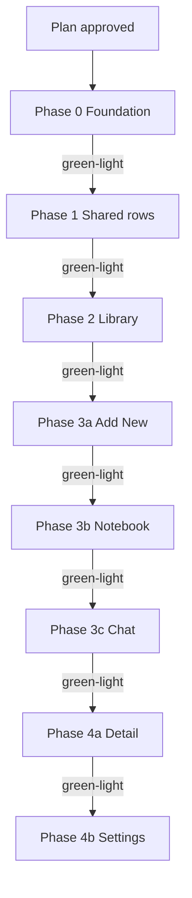

# UI Evolution — Implementation Plan

> **Status:** **Phase 0 shipped** (May 2026). **Next session:** green-light **Phase 1** ([§6](#6-phase-1--shared-row-components)). Phases 2–4b: one phase per session unless user re-confirms.
>
> **Authority:** **`Phathom/` code** > [`docs/decisions.md`](../decisions.md) > **this plan** > [`library-ui-evolution.md`](library-ui-evolution.md) > [`.design-mocks/`](../../.design-mocks/)
>
> **North star:** 22px rhythm · hairline gallery · editorial screen titles · filled cards for form/config only · preserved liquid-glass tab bar

**Discovery inputs:** Locked surfaces [§3–§3.10](library-ui-evolution.md) · [token sheet](ui-evolution-token-sheet.md) · six canonical HTML mocks (visual reference) · shipped [`Phathom/Phathom/Views/`](../../Phathom/Phathom/Views/)

**Anti-pattern:** Do not implement by walking `library-ui-evolution.md` surface-by-surface as a checklist. Follow phases below — shared foundation and rows first, then surfaces by dependency.

---

## 1. Mocks → SwiftUI + agent inference

HTML mocks are **visual reference only**. **Ship target is SwiftUI** in `Phathom/`. Extended prose: hand-off [§2.2](library-ui-evolution.md#22-html-mocks--swiftui-target) · [§2.3](library-ui-evolution.md#23-agent-inference-mocks-are-not-exhaustive).

### 1.1 What to translate

| Take from mocks | Do **not** port from HTML |
|-----------------|---------------------------|
| Spacing rhythm (22pt inset), palette, type scale, section order | DOM structure, CSS class names, Geist font |
| Hairline vs fill **decisions**, enabled/disabled CTA states | Device chrome (status bar, Dynamic Island, side-by-side frames) |
| Drawn states (Search active, pipeline in actions row, etc.) | Literal CSS (`position: fixed`, `backdrop-filter` copy-paste) |
| Look and feel alignment | Mock lorem / example URLs as product strings |

**SwiftUI idioms:** `TabView` liquid glass · `.safeAreaInset` · `NavigationStack` · `DisclosureGroup` · `LibraryFilterBar` **popover** (not `Menu`) · overlays for pinned search · `TextField`/`TextEditor`.

**Typography:** Geist in mocks → **SF Pro** at [token sheet](ui-evolution-token-sheet.md) sizes/weights.

**Behavior vs look:** Mock and **shipped code** disagree on **behavior** → code wins until hand-off updates. Mocks govern **look and feel** only.

Use *align with mock + locked §3* — not *port HTML* or *implement the mock*.

### 1.2 When the mock is silent

Sheets, modals, popovers, swipes, and navigation pushes are **not** fully drawn in HTML. Infer **in order**:

1. Locked **§3** table for the surface ([§3–§3.10](library-ui-evolution.md)).
2. **Shipped Swift** for that surface — preserve semantics unless hand-off changes UX.
3. **Related locked surface** (e.g. Detail highlight row → Notebook; Detail back → Settings).
4. [`docs/decisions.md`](../decisions.md).

| Rule | Action |
|------|--------|
| **Mock silent ≠ cut feature** | Shipped has it; hand-off does not reject → **keep behavior**; restyle to north star. |
| **Mock silent + out of scope** | Do not add (Chat RAG, Notebook search, etc.). |
| **Mock silent + unresolved** | Nearest locked surface + north star; note in PR if ambiguous. |
| **Cross-surface editors** | Tag edit, category, read status, summarize/archive — **Detail + Settings** only. |

**Unmocked examples (preserve + restyle):**

- **Library:** swipe read/archive, bulk bar, category picker sheet, Dive deeper, empty states, deep-link → Detail
- **Detail:** tag edit, category picker, highlight note sheet, related items, share, WebView hero
- **Settings:** model importers, test inference, export/import dialogs, Recently Deleted push
- **Add New:** `PhotosPicker`, save validation, mode pill above tab bar

**Material tie-breaker:** Browse/gallery → hairline, no fill. Form/config → filled `#403d39`. Primary capsule CTA → Add New Save only; Detail actions → hairline-bordered.

---

## 2. Planning locks (May 2026)

| Decision | Locked choice |
|----------|---------------|
| Library nav | **Drop `Phathom` principal**; Detail push keeps center **Phathom** |
| Search dismiss | **Cancel** exits; **keyboard dismiss** only while active; no tap-outside |
| Pipeline control | **Actions row** trailing, before Search ([§3.2.1](library-ui-evolution.md#321-pipeline-control--actions-row-trailing)) |
| Rollout | **Per-phase green-light** before Swift |
| Typography | SF Pro at token-sheet scale — **fixed pt sizes** on editorial/zone chrome (`EditorialScreenTitle`, `ZoneSectionHeader`); not Dynamic Type–scaled (intentional editorial lock; revisit only on a11y audit) |

---

## 3. Rollout policy



**Gate:** User says **green-light Phase N** before Swift for that phase only.

**Verify ladder** ([`simulator-verify.mdc`](../../.cursor/rules/simulator-verify.mdc)):

1. ReadLints on touched `.swift`
2. `bash scripts/build-phathom.sh sim`
3. `bash scripts/test-phathom.sh` (full `PhathomTests`; `--grep` subset OK for UI-only)

**Manual sim (required):** Library search overlay · filter popovers · bulk select · Settings disclosure states (Configured / Primary unset / Missing file).

After each shipped phase: append UI commitments to [`docs/decisions.md`](../decisions.md).

---

## 4. Phase summary

| Phase | Goal | Depends on |
|-------|------|------------|
| **0** | Tokens + shared chrome primitives | Plan approved |
| **1** | Extract row/control types (no surface swap) | 0 |
| **2** | Library — unified scroll, Search B, gallery | 0, 1 |
| **3a** | Add New tab | 0 |
| **3b** | Notebook tab | 0, 1 |
| **3c** | Chat placeholder | 0 |
| **4a** | Detail push | 0, 1 |
| **4b** | Settings push | 0 |

---

## 5. Phase 0 — Foundation

**Goal:** `AppSpacing`, `AppPalette.hairline`, editorial/zone header helpers.

**Files:**

- `Phathom/Phathom/Helpers/AppSpacing.swift` — `screenHorizontal = 22`, gaps from [token sheet §3](ui-evolution-token-sheet.md#3-spacing--layout-rhythm)
- [`AppPalette.swift`](../../Phathom/Phathom/Helpers/AppPalette.swift) — `hairline`
- `Phathom/Phathom/Views/Shared/EditorialScreenTitle.swift`
- `Phathom/Phathom/Views/Shared/ZoneSectionHeader.swift` — reuse/extend [`DetailAISubsectionHeader`](../../Phathom/Phathom/Views/Detail/DetailSectionHeader.swift) for child tier
- `Phathom/Phathom/Views/Shared/DetailBackBarButton.swift`
- Register new files in **`Phathom.xcodeproj`** target `Phathom`

**Risks:** Low.

**Green-light:**

- [x] `AppSpacing.screenHorizontal == 22`
- [x] `AppPalette.hairline` defined
- [x] Shared views compile; Xcode target updated
- [x] No tab surface layout changes

### Phase 0 → wiring contracts {#phase-0-wiring-contracts}

Shared views **defer layout the parent owns** — wire in the owning phase below.

| Component | Owned by shared view | **Call site owns** (phase) |
|-----------|-------------------|---------------------------|
| **`EditorialScreenTitle`** | 34pt semibold title + **`editorialTitleBottom` (28pt)** | Horizontal **`AppSpacing.screenHorizontal`** · **top inset** (Library **~12pt** → Phase 2; Settings **~4pt** → Phase 4b; others per mock) |
| **`ZoneSectionHeader`** | 17pt **semibold** title + optional 15pt subtitle | **8pt** gap before grouped content (Settings Phase 4b) · subsection tier stays **`DetailAISubsectionHeader`** (Phase 4a) |
| **`DetailBackBarButton`** | Accent chevron, `.plain`, default `dismiss()` | Toolbar placement · **~44pt** min row / vertical padding per mock · optical check vs system back (Phase 4a Detail, Phase 4b Settings) |

**Typography tie-breakers (Phase 4+):**

- Zone parent weight: **semibold** (token sheet §4) — not §3.6 prose “bold”.
- Settings editorial title bottom: **28pt** (`AppSpacing.editorialTitleBottom`) — not settings mock `section-gap` (24px).
- `filterColumnSplit` (27.5 / 27.5 / 45): stays in **`LibraryFilterBar`** only — see `AppSpacing` comment; do not add CGFloat constants (Phase 2).

---

## 6. Phase 1 — Shared row components

**Goal:** New types only — **no call-site swaps** until owning phase.

**Extract (keep existing types until wired):**

| New type | Source / notes |
|----------|----------------|
| `HairlineHighlightRow` | §3.6/§3.8 — 4px bar, italic quote, uppercase **Note**; line-limit params |
| `GalleryListRow` | Library gallery — hairline, 64×64 thumb (shipped `ContentCardRow` uses 76) |
| `LibraryPipelineControlButton` | From [`LibraryTab`](../../Phathom/Phathom/Views/Library/LibraryTab.swift) — wire Phase 2 |
| `PinnedLibrarySearchBar` | Shell — wire Phase 2 |

**Wiring schedule:**

| Component | Call site | Phase |
|-----------|-----------|-------|
| `GalleryListRow` | `LibraryTab` | 2 |
| `ContentCardRow` | `RelatedItemsSheet`, `RecentlyDeletedView` | Unchanged |
| `HairlineHighlightRow` | `HighlightsNotesSection` | 4a |
| `HairlineHighlightRow` | `NotebookItemGroup` | 3b |
| `HighlightCardView` | `HighlightNoteEditSheet` preview | 4a |

**Green-light:**

- [ ] New types compile + in Xcode target
- [ ] Shipped surfaces visually unchanged
- [ ] Wiring schedule honored (no early swaps)

---

## 7. Phase 2 — Library (highest risk)

**Goal:** Align with [`library-ad-search-b-toolbar.html`](../../.design-mocks/library-ad-search-b-toolbar.html) + [§3.1–§3.2.1](library-ui-evolution.md#3-locked-decisions-library) — SwiftUI, not HTML port.

**Primary file:** [`LibraryTab.swift`](../../Phathom/Phathom/Views/Library/LibraryTab.swift)

**Tasks:**

- Remove `.searchable`; **net-new Search** in actions row → pinned overlay
- Actions row: Select · Pipeline · Search · Settings (Done during bulk edit)
- Drop `Phathom` principal + duplicate `navigationTitle("Library")`
- Unified scroll (chrome + rows); keep `LibraryFilterBar` **popover**
- Wire **`EditorialScreenTitle("Library")`** — **`AppSpacing.screenHorizontal`** + **~12pt top** on editorial block (mock `screen-title` margin-top)
- 22pt inset; `GalleryListRow`; pipeline in actions row
- Search: Cancel exits; keyboard dismiss only while active

**Preserve (inference §1.2):** [`LibrarySearchService`](../../Phathom/Phathom/Services/LibrarySearchService.swift), Dive deeper, swipes, bulk select, filter 27.5/27.5/45, Settings push, category sheet, deep links.

**Risks:** High — scroll-under search, edit mode, popovers, `navPath`, bulk inset + tab bar ~104pt.

**Green-light:**

- [ ] At rest + Search active align with mock + §3
- [ ] Unmocked flows work (swipes, bulk, category sheet, pipeline)
- [ ] Cancel / keyboard dismiss correct
- [ ] No `LibrarySearchService` semantic changes

---

## 8. Phase 3a — Add New

**Goal:** [§3.7](library-ui-evolution.md#37-locked-decisions-add-new) — 22px inset, capsule Save, drop hints.

**File:** [`AddNewTab.swift`](../../Phathom/Phathom/Views/AddNew/AddNewTab.swift)

**Tasks:** inset 16→22 · Save capsule · remove `processingHint` · Note editor no placeholder · Web/Photo placeholders per §3.7

**Preserve:** mode pill, capture save rules, tab bar inset (inference §1.2).

**Green-light:** Six mock states · capsule Save states · no processing footnotes.

---

## 9. Phase 3b — Notebook

**Goal:** [§3.8](library-ui-evolution.md#38-locked-decisions-notebook) — editorial scroll, hairline highlights, inter-group rules.

**Files:** [`NotebookTab.swift`](../../Phathom/Phathom/Views/Notebook/NotebookTab.swift), [`NotebookItemGroup.swift`](../../Phathom/Phathom/Views/Notebook/NotebookItemGroup.swift)

**Tasks:** `EditorialScreenTitle` · drop nav duplicate · surface-appropriate **top inset** per mock · `HairlineHighlightRow` (3/2 limits) · header thumb 48→64 · title paprika→primary · inter-group hairline only · inset 22

**Preserve:** [`NotebookHighlightsQuery`](../../Phathom/Phathom/Services/NotebookHighlightsQuery.swift), Detail push, [`HighlightNoteEditSheet`](../../Phathom/Phathom/Views/Detail/HighlightNoteEditSheet.swift), empty copy.

**Green-light:** No paprika parent title · 64×64 thumb · separator rules · empty copy unchanged.

---

## 10. Phase 3c — Chat placeholder

**Goal:** [§3.9](library-ui-evolution.md#39-locked-decisions-chat-placeholder) — editorial **Chat** + two-tier copy.

**File:** [`ChatTab.swift`](../../Phathom/Phathom/Views/Chat/ChatTab.swift)

**Out of scope:** [`phase-3-rag-chat.md`](phase-3-rag-chat.md)

**Tasks:** `EditorialScreenTitle("Chat")` · **`AppSpacing.screenHorizontal`** · top inset per mock · two-tier empty copy

**Green-light:** Editorial title in scroll · left-aligned copy · no fake chat UI.

---

## 11. Phase 4a — Detail

**Goal:** [§3.6](library-ui-evolution.md#36-locked-decisions-detail) — hairline material, AI zone Option 5, 22px inset.

**Files:** [`DetailView.swift`](../../Phathom/Phathom/Views/Detail/DetailView.swift), [`DetailAIAnalysisDivider.swift`](../../Phathom/Phathom/Views/Detail/DetailAIAnalysisDivider.swift), section views, [`HighlightNoteEditSheet`](../../Phathom/Phathom/Views/Detail/HighlightNoteEditSheet.swift)

**Tasks:** `HairlineHighlightRow` in highlights + sheet preview · replace divider with **`ZoneSectionHeader`** (semibold parent, not §3.6 “bold”) · **`DetailBackBarButton`** if replacing system back — verify chevron + **~44pt** row in sim · hairline sections · processing badge placement preserved

**Preserve:** back · **Phathom** center · share · section order · all sheets/flows (inference §1.2).

**Green-light:** No filled highlight/summary cards · AI zone Option 5 · highlight tap + edit sheet.

---

## 12. Phase 4b — Settings

**Goal:** [§3.10](library-ui-evolution.md#310-locked-decisions-settings) — editorial **Settings**, back-only push, demoted zone headers.

**File:** [`SettingsTab.swift`](../../Phathom/Phathom/Views/Settings/SettingsTab.swift) (`SettingsContent` — pushed from Library)

**Tasks:** **`EditorialScreenTitle("Settings")`** — **`AppSpacing.screenHorizontal`**, **~4pt top**, **28pt bottom** (token sheet, not mock 24px) · **`DetailBackBarButton`** back-only nav · **`ZoneSectionHeader`** zone headers + **8pt** gap before grouped card · 22px inset · filled grouped surfaces

**Preserve:** full IA, disclosures, importers, backup flows (inference §1.2; mock frames Configured / Primary unset / Missing file).

**Green-light:** Back-only nav · zone typography · all disclosure/sheet flows intact.

---

## 13. Out of scope

- Chat RAG ([`phase-3-rag-chat.md`](phase-3-rag-chat.md))
- Share extension UI · CloudKit/sync CTAs · tab bar redesign
- `LibraryFilterBar` column proportion change
- Literal HTML/CSS/DOM port

---

## 14. Related documents

| Doc | Role |
|-----|------|
| [`library-ui-evolution.md`](library-ui-evolution.md) | Locked §3 per-surface decisions |
| [`ui-evolution-token-sheet.md`](ui-evolution-token-sheet.md) | Tokens, material matrix, shared components |
| [`.design-mocks/README.md`](../../.design-mocks/README.md) | Mock inventory |
| [`docs/decisions.md`](../decisions.md) | Product invariants — update per shipped phase |
| [`AGENTS.md`](../../AGENTS.md) | Agent entry map |

**Canonical mocks:** `library-ad-search-b-toolbar` · `detail-ad-full-hairline-a` · `add-new-ad-filled-card-a` · `notebook-ad-hairline-feed-a` · `chat-ad-placeholder-a` · `settings-ad-grouped-a`

---

## 15. Cold start — Phase 1

Copy-paste for **new session** (Swift authorized for **Phase 1 only**).

```
GOAL: UI evolution Phase 1 — Shared row components. NO surface swaps.
ENV: iOS 26 / Swift 6 / SwiftUI | repo:phathom

READ (minimal):
  1. docs/handoff/ui-evolution-implementation-plan.md §6 + [Phase 0 wiring contracts](#phase-0-wiring-contracts)
  2. docs/handoff/ui-evolution-token-sheet.md §5–§7
  3. Phathom/Phathom/Views/Library/ContentCardRow.swift
  4. Phathom/Phathom/Views/Detail/HighlightCardView.swift (or HighlightsNotesSection)

CREATE / TOUCH:
  - HairlineHighlightRow.swift
  - GalleryListRow.swift
  - LibraryPipelineControlButton.swift
  - PinnedLibrarySearchBar.swift (shell only)
  - Phathom.xcodeproj — auto-sync via PBXFileSystemSynchronizedRootGroup

DO NOT: Wire into LibraryTab / Detail / Notebook (Phase 2+)
DO NOT: Chat RAG (phase-3-rag-chat.md)

VERIFY: ReadLints → bash scripts/build-phathom.sh sim → bash scripts/test-phathom.sh

GREEN-LIGHT DONE WHEN:
  - New types compile; Xcode target updated
  - Shipped surfaces visually unchanged
  - Wiring schedule honored (no early swaps)

THEN: Stop. Next session → green-light Phase 2 (Library).

AUTHORITY: code > decisions.md > this plan > library-ui-evolution.md > mocks
MOCKS: visual reference only — ship SwiftUI (plan §1)
```

### Archive — Phase 0 cold start

```
GOAL: UI evolution Phase 0 — Foundation (tokens + shared chrome). NO surface swaps.
... (Phase 0 complete — see §5 green-light)
```
